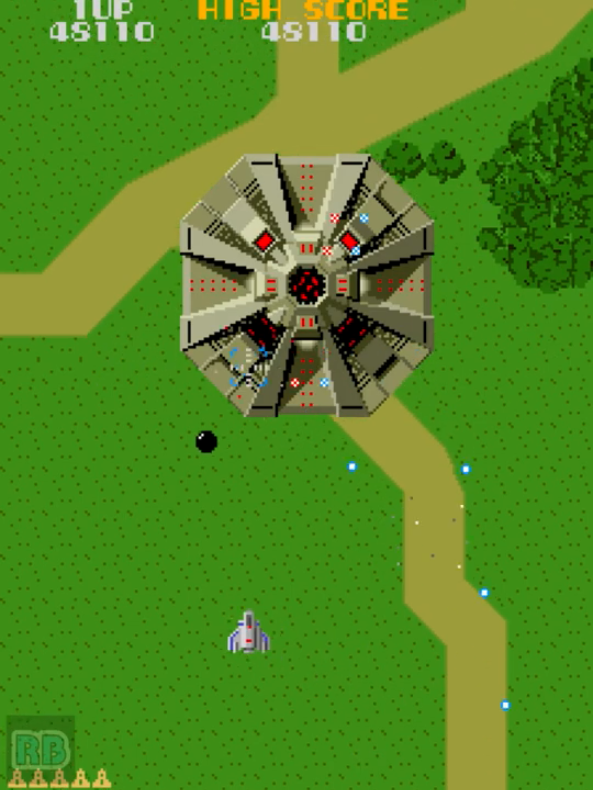
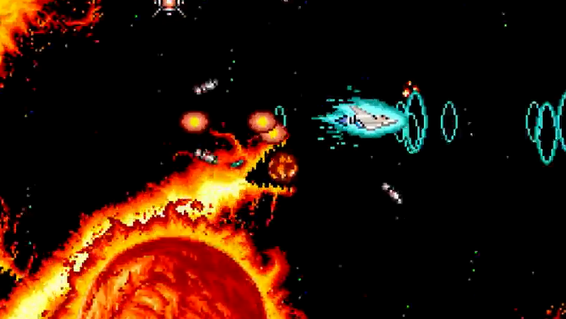
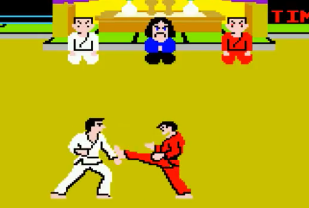

<figure>

</figure>

　以前からずっと、ゲームにとっていちばん大切な要素は「多様性」なんじゃないかと思っている。

　これは、ゲームの種類が多いとか、ジャンルが多いとか、そういう意味ではない。あるゲームをプレイする人がたくさんいれば、そのプレイヤーの数だけゲームの展開も多様になるという意味である。

　例えば、僕たちの知っているシューティングゲームに、**『ゼビウス』**という名作がある。昔からのゲームファンなら誰でも知っているゲームだ。**『ゼビウス』**は、次々に展開する広大なステージと、神秘的なデザインの多くのキャラクターが登場し、そのバックボーンとして与えられたストーリーと相まって、当時としては実に奥深いゲームだった。だがしかし、ゲームのプレイとしては、誰がプレイしてもそれほど変わらない。ザッパーとブラスターで敵を破壊して進む。それだけのゲームだ。いや、人によって微妙に敵を倒す順番が異なったり、登場する敵のパターンが変化したりはするかもしれない。でも、見ている人にもほとんどわからないぐらいの違いだ。

　これは別に、**『ゼビウス』**というゲームを批判する意味の話ではない。ただ単に、当時のゲームのスタイルとして、あまり多様性がないゲームだったと言うだけの話だ。

　数年後に**『グラディウス』**というゲームが登場する。これは、御存知の通り、プレイヤーが自分でパワーアップを選択し、自機を好きなように強化できるシューティングゲームだった。人によってはレーザーを装備して敵を一掃し、またある人はダブルを使って、天井に張り付いた敵を効率よく倒す。プレイヤーによって異なる攻略が生まれてくる。

　そう、これが僕の考える、ゲームにとって大切な「多様性」ということである。プレイする人によって、プレイする方法によって、そのプレイスタイルに豊かなバリエーションが生まれ得るゲーム。これこそが多様性のあるゲームである。そして、それがやはり面白いゲーム、ひいては奥深いゲームと言えるのではないかと思っている。

　やがて、**『グラディウスII』**というゲームが登場すると、今度はパワーアップゲージそのものが選択できるようになる。ここに至っては、まさに遊び方は十人十色である。好きなパワーアップゲージを選択し、好きなパワーアップを取得してゲームを進めることができる。やがて、**『グラディウス』**シリーズは、そのパワーアップゲージすらプレイヤーが好きな組み合わせでエディットできるようになり、より一層の多様性を手に入れることになる。

　その昔、**『空手道』**というゲームがあった。向かい合った2人の空手家が技を出し合い、相手を倒す格闘ゲームの元祖みたいなゲームだ。2人の空手家は、白と赤の道着で区別されるものの、根本的には同じキャラクターである。まったく同じ技、同じ力で戦うのだ。ところが、**『ストリートファイター』**時代になると、まったく異なるキャラクター同士で戦うようになる。ここにゲームとしての多様性が生まれる。

　つまり、プレイヤーに選択肢を与えることがゲームの多様性への第一歩であるのだ。格闘ゲームではキャラクターを選び、シューティングゲームでは自機やパワーアップゲージを選択する。また、レースゲームでは実在する車から好きなものを選んで乗ることができるようになる。ドリフトするもグリップするもプレイヤー次第だ。

　この多様性が、いかに効果的にプレイヤーに与えられるかが、ゲームの奥深さにつながっていくのではないだろうか。

　なんてことを常々考えていて、あまりまとまらないまま書いてしまった。この「ゲームの多様性」についてはまだまだ思うところがあって、もう少し自分の中でも考えを練り続けていこうと思っている。また何か思いついたら書いてみよう。
