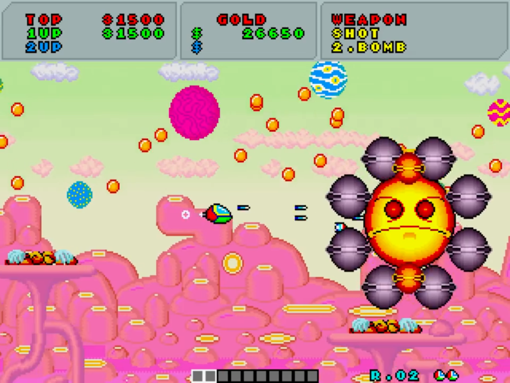
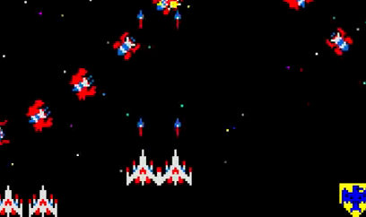
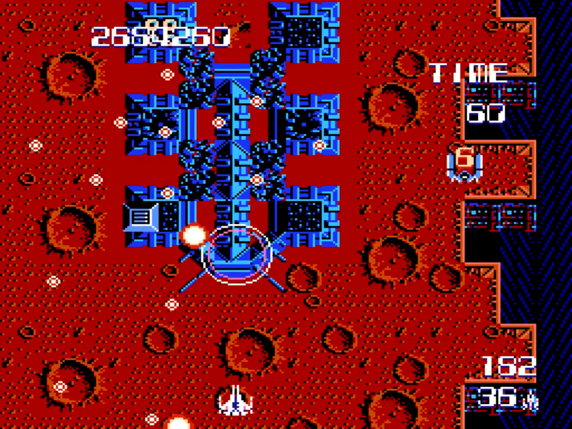
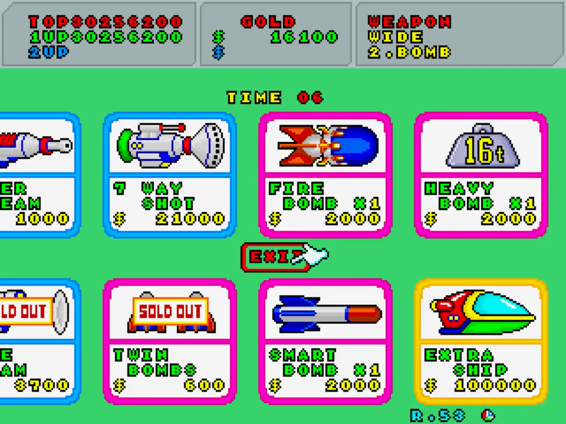

<figure>

</figure>

　先日、「ゲームの多様性」について書いた。今回は少し具体的なことを思いつくままに書いてみよう。書きながら考えているようなところもあるので、まとまらない感じはご容赦願いたい。

　前回は『ゼビウス』を引き合いに出して、『グラディウス』と比較して多様性の意味について考えてみた。では、シューティングゲームだけに限って言えばどうだろうか。

　少し時代をさかのぼると『ギャラガ』というゲームがあった。『ゼビウス』にパワーアップという要素は無いが、『ギャラガ』は自機が合体（デュアルファイター）することで弾が二連装になり、パワーアップする。では、『ギャラガ』には『ゼビウス』より多様性があると言えるのか。実は、これはあまり多様性とは言えない。なぜなら、『ギャラガ』におけるデュアルファイターは、ほぼすべてのプレイヤーが選択するパワーアップであり、デュアルファイターなしの戦いはあり得ないからだ。（もしかすると、当たり判定が小さい方がいいという人もいるかもしれないけど）これは多様性とは言わない。プレイヤーに選択が託されているようで、実は一択しか正解がないからである。スターフォースのパワーアップ（パーサー）もこれに当たる。

　しかし、そう考えると、前回多様性の例としてあげた『グラディウス』は、パワーアップゲージで任意に自機を強化するから多様性ありとしていいのか疑問が残る。つまり、ほとんどのプレイヤーはオプションとレーザーで武装し、それでゲームを攻略しているからだ。結局、行き着くところはレーザーを選ぶか、ダブルを選ぶか程度の差でしかない。「多様性がある』としながら、その実それほど幅広い選択が許されているわけではないのだ。『沙羅曼蛇』なども同様である。

　コンパイルのシューティングゲームに、『ザナック』という名作があった。これは、割と地味なメインショットと、0番〜7番のサブウェポンの組み合わせで戦う縦スクロールシューティングだ。このサブウェポンが、連続してパワーアップすることでどれも強力な武器となるのが『ザナック』の特徴である。結果として、どのサブウェポンを使ってもゲームを攻略することができ、このことが、人によってまったく違う攻略法を展開することを可能としていた。

　そう、これこそが多様性なのである。武器の選択ができても、結局万人が同じ攻略法に行き着くのでは、それは多様性ではない。シューティングではないが、テクノスジャパンの『ダブルドラゴン』では、パンチ、キック、ジャンプと多彩なアクションが存在しながら、なぜか肘打ちがすごく強力というゲームバランスを設定してしまったため、プレイする人はみんなして肘打ちを多用するゲームと化してしまった。一見、プレイヤーのできることが多くても、ゲームの調整次第では多様性が存在しなくなるという例だ。その点で、『ザナック』は多様性ある攻略を可能としたゲームと言える。

　セガの『ファンタジーゾーン』は、ゲーム中に集めたお金で、自機のパワーアップを購入するという、それまでにないシステムのシューティングゲームだった。このゲームも武器の種類が多い。メインショット系、ボム系と分けられた武器は実に多岐にわたり、そのどれもが強力。言ってみれば「使える」武器なのである。この多彩な武器を活かし、『ファンタジーゾーン』もプレイヤーによってバラエティに富んだ攻略ができるゲームになっていた。多くの弾を撃ち出す7-wayでオーソドックスに敵を殲滅する。レーザーで一点集中して速攻で攻撃する。自機の速度を上げ、ファイヤーボムという水平に撃ち出される貫通弾を追いかけて連続して敵を破壊する。実にいろいろな攻略があり、人のプレイを見るたびに驚かされるゲームだった。多様性の好例ではないだろうか。

　こうして見てみると、単にプレイヤーに選択を任せるだけでなく、その選択がゲーム内で効果的に作用する場合に多様性が生まれるのではないかという気がしてくる。見せかけだけの選択は、多様性につながらない。

　一方ここで、タイトーの『ダライアス』が頭に浮かんでくるのだが、長くなりそうなので、これについてはまた別の機会に考えよう。
