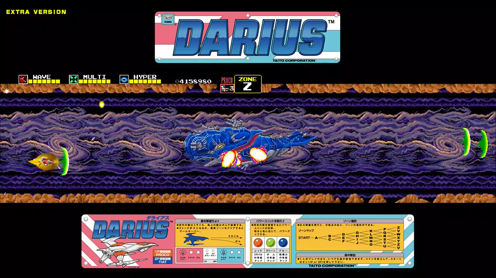
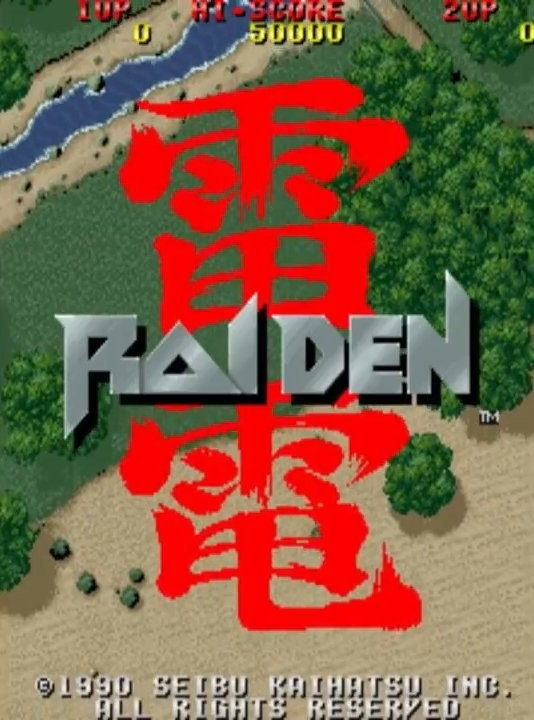
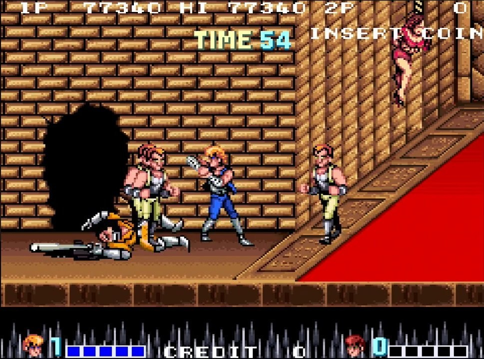
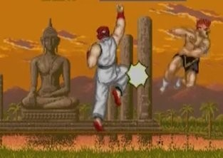

<figure>

</figure>

## ゲームにおいて多様性を表現する方法

　**『ダライアス』**というゲームは、自機のパワーアップに関しては多様性に乏しいと思っている。あ、前回の続き。

　**『ダライアス』**のパワーアップも一方通行で、とにかくアイテムを取って自機を強化するだけのパターンだ。ショットを、ミサイルで止めるか、レーザーという茨の道を乗り越えてウェーブまで強化するか、その違いだけだ。しかし、**『ダライアス』**にはコース選択という概念があった。ステージクリア後に分岐する通路によって、プレイするステージを選べるのだ。ここに**『ダライアス』**ならではの多様性が存在しているんじゃないだろうか。

　さて、ここまでまとめてみよう。ゲームにおける多様性には、遊ぶ人に選択肢が与えられていて、なおかつ、それがゲーム内で効果的に作用することが必要である。複数のゲームを見た場合、それがパワーアップであったり、面セレクトであったり、様々な方法で実現されていることがわかる。

## 多様性はゲームの面白さなのか？

　では、多様性があることが、すなわちゲームの面白さにつながるという結論でいいのだろうか。これがそうでもない。例えば、セイブ開発の**『雷電』**を思い出してほしい。シンプルなステージクリア型縦スクロールシューティングゲームで、パワーアップも拡散する赤ショットと、一点集中の青レーザーだけである。しかも、攻略的には敵が硬くならない赤ショット一択という、選択肢があるようで、無いも同然のゲームバランスだ。こうなってくると、多様性もへったくれもない。よほどの物好きでない限り、皆同じ攻略になるはずだ。じゃあ、**『雷電』**は面白くないゲームだったのか。決してそんなことはない。シューティングマニアからライトゲーマーまで支持を集め、その後、続編がリリースされ続ける人気タイトルとなった。

　それじゃあ、やっぱりゲームに多様性なんかいらないんじゃないの？　と、言いたくなるところである。そう言われてみると、先日例に出した**『ダブルドラゴン』**も、みんな肘打ちしながら、ゲームセンターではすごく人気のあったタイトルだ。

## ゲームの身体性

　実は、ここのところは、僕自身仮説を持っている。以前、はてなブログに「ゲームの身体性」という内容で記事を書いている。

[http://keigox68000.hatenablog.com/entry/2016/10/06/000000](http://keigox68000.hatenablog.com/entry/2016/10/06/000000)

　人は、体を動かし、画面の中のキャラクターを操作し、それが思い通りに動くことで、そこに面白さや気持ちよさを感じるんじゃないか、という考えである。例えば、**『ストリートファイター』**でコマンドを練習して、いつでも昇龍拳が出せるようになれば楽しい。**『R-TYPE』**でフォースの誘導を覚えて、敵を自由に倒せれば気持ちいい。そういうやつだ。ゲームに限らずとも、ピアノを練習して自由に演奏できるようになっても、けん玉で世界一周ができるようになっても、鉄棒で逆上がりができるようなっても、人はそういうものすべてが楽しいのだ。

　ギリシア語で遊びのことを「パイディア」と言うが、これは「子どもに関すること」を表す言葉が語源となっており、派生語として「踊る＝パイゾー」「スポーツ＝パイグマ」という言葉がある、ということがホイジンガの**『ホモ・ルーデンス』**で言及されている。これはすなわち、遊びが体を動かすことそのものに関連していることを表しているように思える。

　つまるところ、人は体を動かすことが楽しいのである。ゲームも、自分の動作の結果がうまくゲーム画面に反映されれば楽しいのだ。多様性がなくとも、身体性とゲームを上手に連結していれば、面白さにつながっていくのではないだろうか、というのが僕の仮説である。

　だから、必ずしもゲームの面白さが、すべて多様性に集約されるというつもりはない。体を動かし、それ自体を楽しむこと。そういう遊び方が人間にはあるのだろう。だからこそ、いわゆる作業ゲーと言われるゲームも楽しくプレイできるのだ。画面をフリックするだけのゲーム、タップするだけのゲーム、そういうソーシャルゲームが多くのユーザーに支持されるのも、同じ理由だろう。

　しかし、身体性だけで押すゲームはいつか飽きる。逆上がりもできるようになってしまえば、いつまでも回っているわけにはいかない。人は、新しい刺激やギミックを求めて、新たな楽しみを探すことだろう。このときに必要とされるのが、ずっと書いてきた多様性なんじゃないかと思っている。

　さて、思いつくままに書いてしまって全然まとまっていないのが心苦しいが、ゲームに奥深さ、プリミティブな楽しみからさらに一歩進んだところにある面白さ、そういうものを付加するための多様性。これについては、これからも考えていきたい。一旦今回の書き散らしはこれで終わりだが、また考えがまとまるようなら続きを書いてみたい。

[https://amazon.co.jp/dp/4122000254](https://amazon.co.jp/dp/4122000254)
