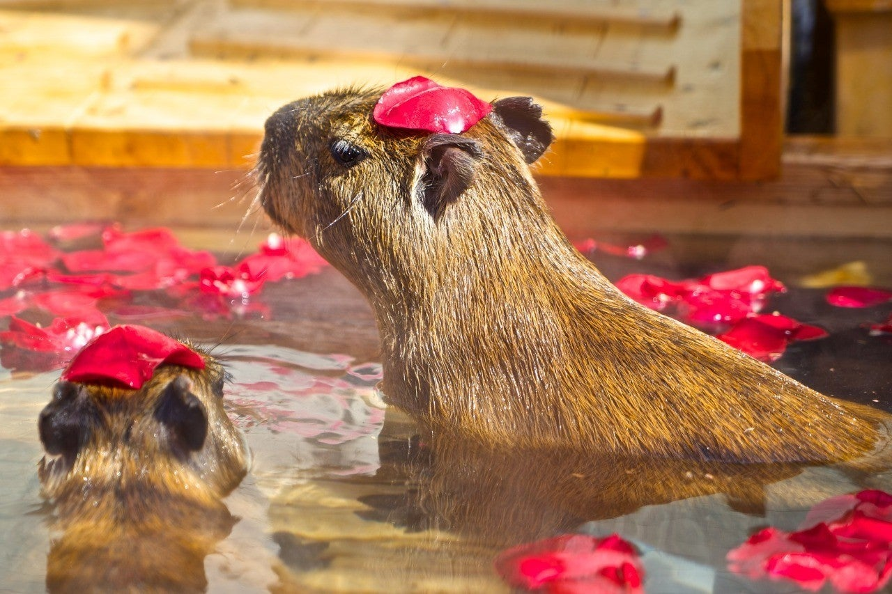
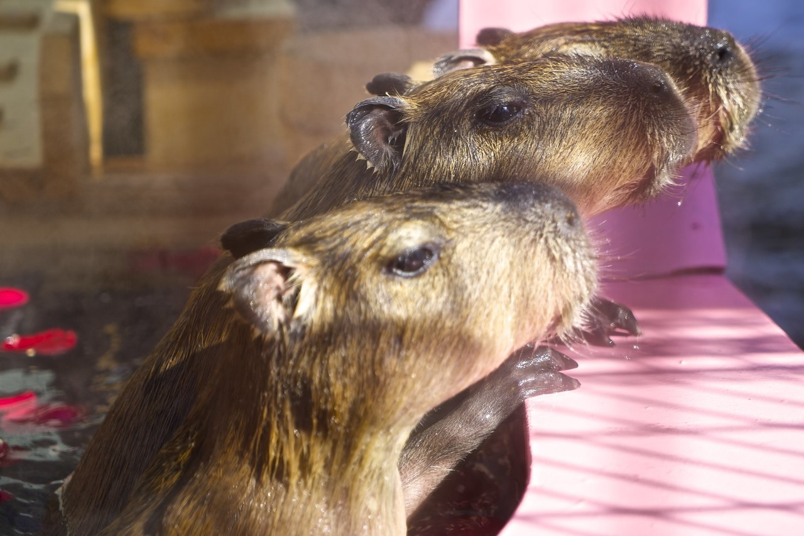
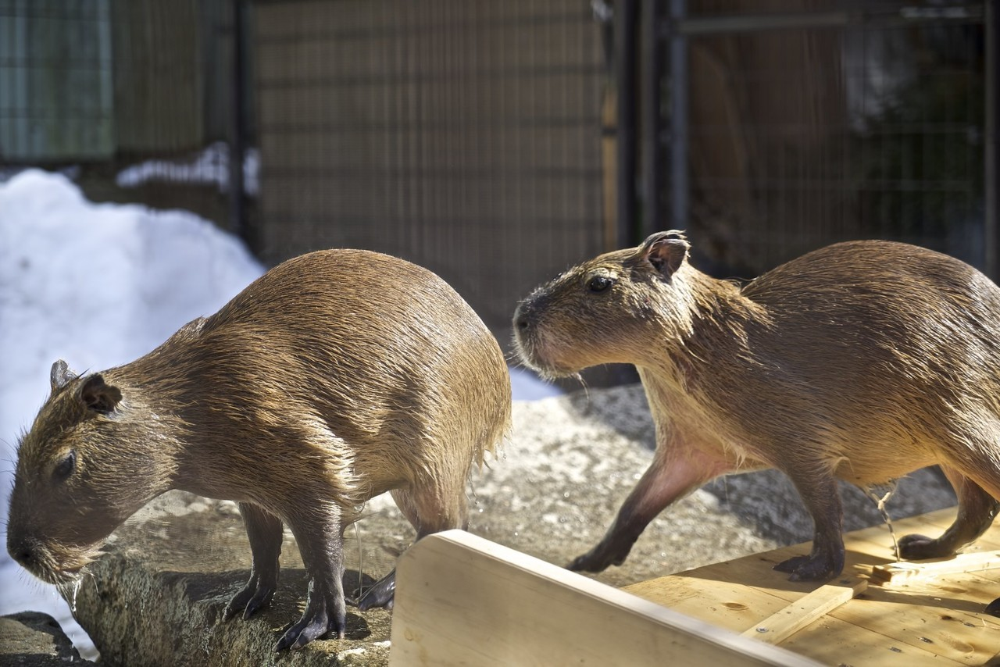
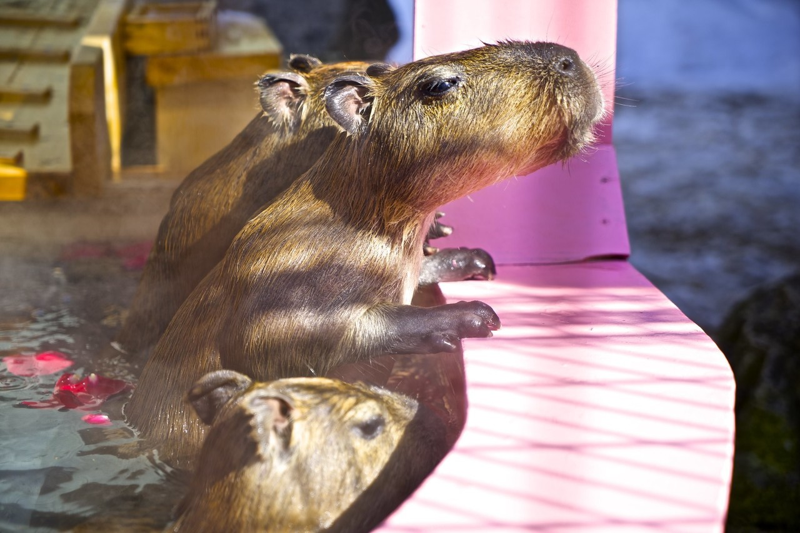

<figure>

</figure>

　noteで404ページに行き着いた際に表示される画像を募集するタグに乗ってみることにした。こういう面白いアイデアが出てくるので、noteは使っていてなかなか楽しい。

　写真は、数年前に撮影したカピバラ。近くの動物園で、冬になると温かいお湯に入浴するカピバラを見ることができるのだ。「カピバラ温泉」と題された企画で、休日には家族連れで見に来るお客さんも多いようだ。ちょっと寂れた地方の小さな動物園にしては、なかなかのヒット企画である。

　動物はどうしても動き回るので、シャッターチャンスが難しい。なるべく天気のいい日を選び、シャッター速度を速めにしてブレないように撮りたいところだ。それとあわせて、金網の向こうにいるカピバラを、いかに金網をフレームに入れずに撮影するかがポイントとなってくる。何枚か写真を載せてみたが、実は失敗写真はこの10倍ぐらい撮られている。

　以前はよく写真を撮りに出かけていたのだが、最近はすっかり出不精になっていけない。同時に、アクションカムを入手してから、動画を撮影する方に心を砕いていて、こういう瞬間を切り取る楽しみを忘れかけている気がする。また機会を作って、写真を撮りに行きたい。

#404美術館
