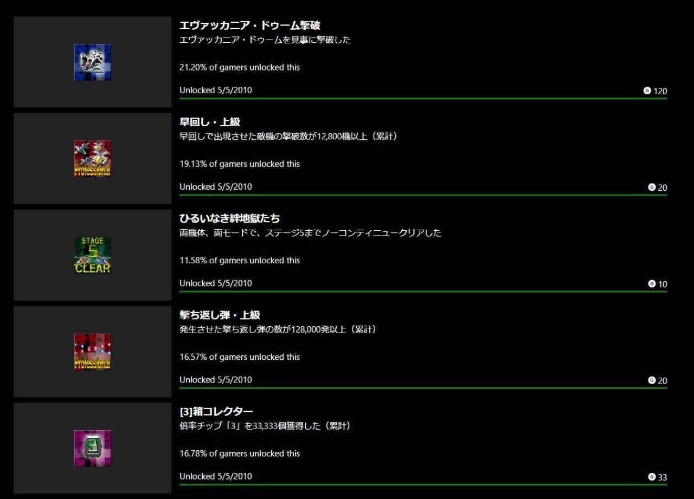
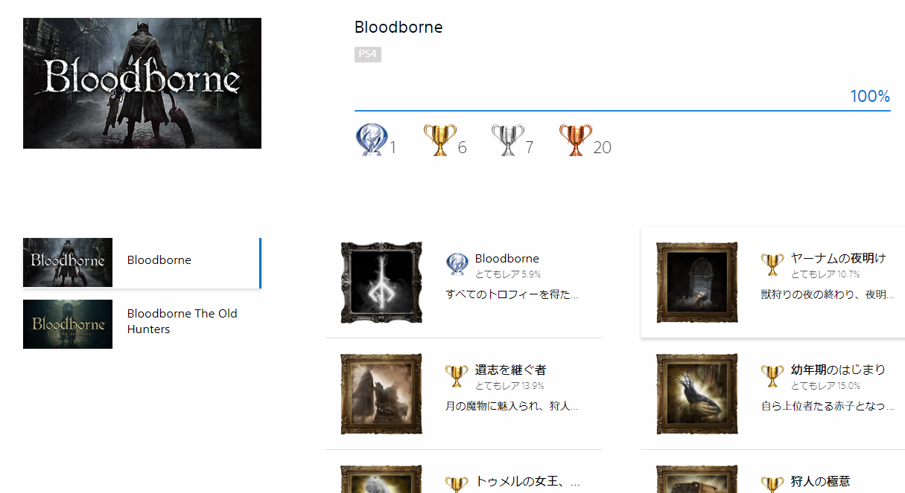
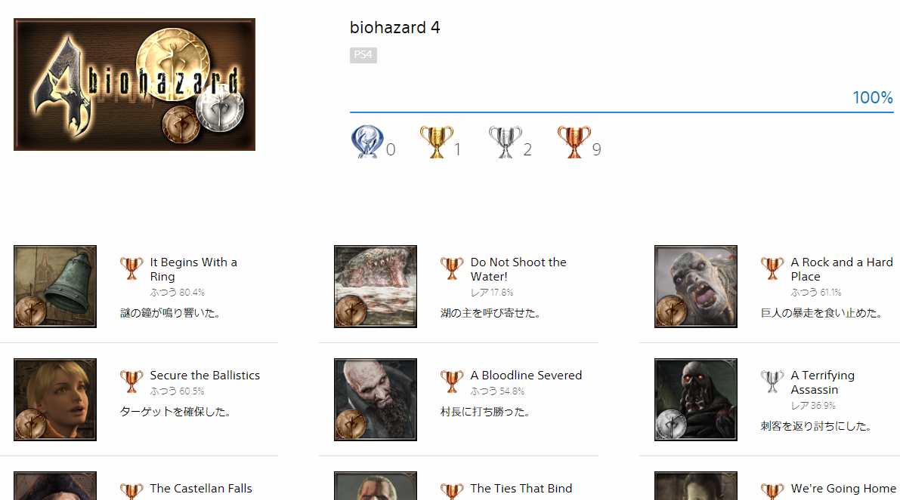

<figure>

</figure>

　いつの頃からか、トロフィー、実績などと称して、ゲームで一定の目標をクリアすることで、称号のようなものがもらえるシステムが一般的になってきた。トロフィーがなくても、レアアイテムやレアキャラクターを集めるために、やりこみをなかば強要するようなつくりにしてあるゲームがたくさん存在する。

　もちろん、ゲームメーカーとしては、高いお金を出してゲームソフトを買ってもらうのだから、数時間遊んで終わりでは、ユーザーに興味を持ってもらえないと危惧するのは無理もない。より、価格に見合ったゲーム体験をしてもらおうと、サービス精神旺盛、盛りだくさんのフィーチャを仕込んでゲームを作るわけだ。

　買う方にしたって同じである。このゲームを買ったらどれだけ遊べるだろう。1週間で飽きるゲームに数千円出すのはもったいないかな。そういう、娯楽コストパフォーマンスのような指数を頭の中で計算してゲームを選んでしまう。もしかしたら、このゲームを買えば向こう1ヶ月は楽しめるかも。いやいや、1年間遊べるゲームだってあるかもしれない。

　しかし、このプレイ時間費用対効果を計算することが、そもそも間違いの始まりである。そのゲームを始めたが最後、全部のアイテムを集めたくなってしまうのである。あるいは、すべてのキャラクターを探し出して仲間にしたくなるのである。ゲーム内に存在するイベントはあまねく体験しなければ気が済まないのである。気づいたら回収不可能になったイベントはどうすればいいのだろう。もう1周プレイするのか。いやいや、最初からやり直した方が完璧データが残せていいのではないか。うん、なんだか面倒くさくなってきたぞ……

　そう、疲れるのだ。あまりに山盛りにされたアイテム、イベントの数々。そのすべてを回収することができず、遊ぶ方は消化不良を起こしてしまう。楽しかったはずのゲームが、コンプリートを目指そうとするがために、なんだか気の進まない面倒な作業と化してしまう瞬間だ。本末転倒である。

　世の中のゲーマー諸君、もうコンプリートを目指すのはやめよう。用意された要素をすべて総ナメする必要はないのだ。自分が楽しく遊べる範囲で、限られた時間を使って、輝くようなゲーム体験をすることができれば、それが一番幸せではないか。ましてや、コンプリートのために初回プレイから攻略サイトを参照するようでは、もう何のためにゲームをやっているのかすらわからない。今目の前にあるゲームとの一期一会の出会いを大切にして、かけがいのない遊びを体験することが、どれだけ尊い経験であることか。

　そう考えて、いろいろコンプリートするのはやめた。健全なゲームプレイへの第一歩である。

　でもときどき、コンプ欲が頭をもたげてくる。このジレンマはゲーマーとして一生続くのかもしれない。

