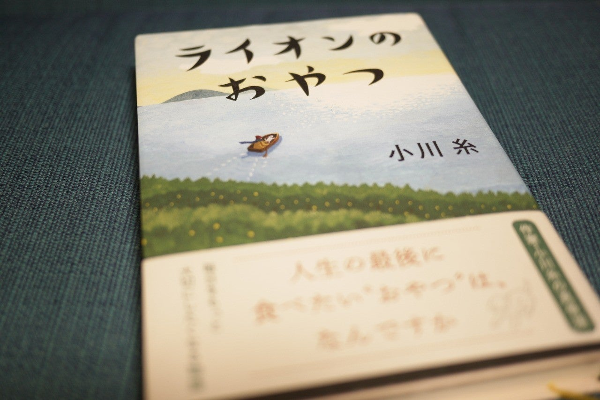

<figure>

</figure>

　物語のあらすじとか全然前知識なしで読んだ。若くして余命宣告された主人公が、残りの人生を島のホスピスで穏やかに過ごそうとする、終末期医療の話である。

　どんなに陰惨な殺人事件の話でも、恐ろしいホラーでも、全然平気で読めるのだが、病気の話だけはどうにも苦手である。病気という現実が自分にとってより身近でリアルなのかもしれない。物語の中で描かれる穏やかな風景、穏やかな食事、穏やかな人間関係とは裏腹に、常に近くに存在する重圧感のようなものを感じながら読んだ1冊である。

　大病を患うことで、命の火は日一日と小さくなっていく反面、生きているという実感は、自分の中で確実に力強いものとなっていく。毎日目が覚めると自分が生きている。そのことの重みがより真実味を増してくる。日々の食事、隣室の人との会話、過去の思い出。日々健康に過ごしている人々には取るに足らないことが、この物語ではひとつひとつ意味を持ち、自分にとって大切であることが描かれる。また、我々の日常において、愛想笑いをしたり、気を遣って話を合わせたり、そんなことをして人間関係を取り繕っていることが、自分が生きることだけに必死な日々においては、重要ではないことも見えてくる。

　ホスピスで残りの長くない人生を生きることは、決して死ぬまでの時間を消化することではない。その中で、人が生きることに大切な本質が見えてくる。そんな時間を過ごすことなのかもしれない。

　余命を宣告され、自分の命があとわずかと覚悟して生きるのはどんな気持ちなのだろう。残り少ない人生を、本当に真剣に生きようとしたら、自分はどうするのだろう。今までに考えたこともなかった人生観に気づかせてくれる。そんな作品だ。
