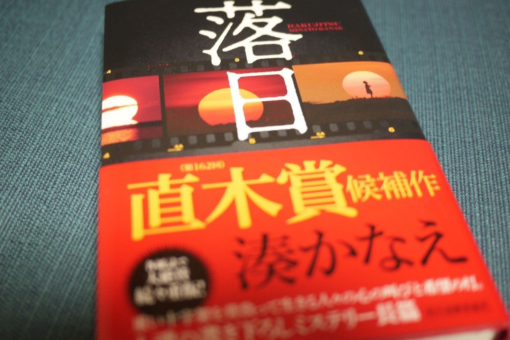

<figure>

</figure>

　「読み終わった後に嫌な気持ちになるミステリー」という意味のイヤミスという言葉がある。小説のジャンルを表すコピーとしては一定の支持を得て定着した感があるものの、作品の本質がボヤケてしまうような気がして、どうも好きになれない。

　で、**『落日』**である。世間ではイヤミスの女王なんて呼ばれることのある湊かなえの作品だ。しかし「イヤミスの女王」って呼称はどうなんだろう。もっと、登場人物の過去の遺恨や解決できずに抱えた問題、そういうところにスポットを与えたほうが、湊かなえの作品を理解することができるのではないか。

　**『落日』**は、なかなか芽の出ない脚本家 甲斐真尋（かい まひろ）が主人公。大物脚本家の先生に師事しつつ自分も脚本の仕事をこなすが、自分の名前が出るような仕事はなかなか来ない。そんな真尋のもとに、世界的な賞を受賞した映画監督 長谷部香（はせべ かおり）から、主人公の故郷で過去に起きた殺人事件を映像化したいと話を持ちかけられる。ピアノの演奏で海外を飛び回る姉の存在を誇りに思うと同時に、自分の不甲斐なさから心の奥に劣等感を持つ真尋と、彼女の故郷で起きた事件に少なからず因縁のある香。2人は事件の映像化を目指し、過去の事件を再検証する。

　裁判で判決も出ている過去の事件を探りつつ、その真相を知ることで、事件の本質がまったく変わったものになってくる。事務的に真実だけが語られる司法とは異なり、当時の状況を様々な人から聞くことで、事件の様相は一変する。それが、真尋と香の過去にも関連していることで、凄惨な殺人事件は、その意味を顕にして、登場人物たちの人生観にも影響を与える物語だ。

　本作に登場する事件の悲惨さも、登場人物の過去も、彼女たちの人生に影を落としている。しかし、だからといってこの物語が単なる嫌な読後感を持つミステリ小説ということはない。むしろ、真実を知った登場人物たちが、過去のトラウマを自分の中で消化し、新たな人生観を持つためのきっかけとしていく、そんなドラマが描かれていると言える。

　かように、**『落日』**という作品を「イヤミス」という単語で片付けてしまうことは極めて危険である。それは、冒頭にも書いたようにこの物語の本質を見誤るからである。

　タイトルの**『落日』**は、主人公の故郷から見られる風景だ。しかし、それだけではなく、自分の歩いてきた道に自信が持てず、このまま人生の落日を迎えるかのような主人公の気持ちを表しているのかもしれない。同時に、その落日は、いずれまた翌日の朝に上ってくる太陽でもあるのだ。陰惨な殺人事件を取り扱いながら、希望すら感じさせる物語だった。

　念のために補足しておくと、出版社自身は、決してこの作品を「イヤミス」というカテゴライズで売り出してはいない。しかし、読む方が勝手に湊かなえ作品に特定の期待を抱いて、そのように呼称している例が見受けられるということである。

[https://amazon.co.jp/dp/4758413428](https://amazon.co.jp/dp/4758413428)
