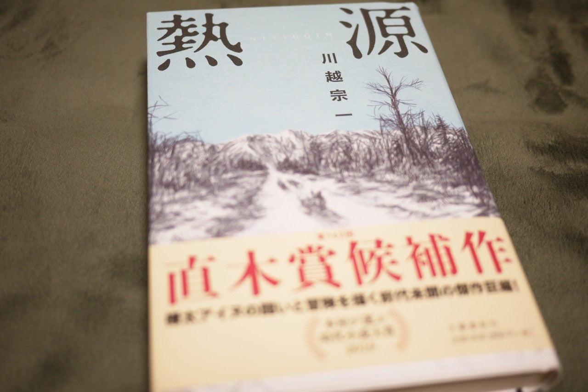

<figure>

</figure>

　第162回 直木賞受賞作。日本とロシアの間で揺れ動く樺太を舞台に、アイヌ青年ヤヨマネクフと、リトアニア出身のポーランド人ブロニスワフを中心に、激動の時代を描いた物語。その物語は、主人公を含め、実在の人物をモデルにフィクションとして語られる。

　アイヌやギリヤークなど、複数の民族が所有権を主張することなく暮らしてた樺太に、日本とロシアが入り込むことで、彼らの生活は一変する。日本人となることをよしとする教育を受ける中で、アイヌの文化は徐々に姿を消していく。アイヌ人であるヤヨマネクフは、そのことをきっかけに、自分たちは何者なのか、アイヌとは何なのかを考えるようになる。

　同時に、ポーランド人であるブロニスワフは、ロシアの侵攻によって、母国語を使うことすら許されないまま育ってきた。皇帝暗殺を企てた罪で故郷から遠く離れたサハリンへ流刑されたブロニスワフは、アイヌの生活を調査しながら、ヤヨマネクフと交流を深める。

　ヤヨマネクフとブロニスワフ。ともに故郷へのアイデンティティを保持することを許されない時代にあって、それぞれが自分の拠り所を探す人生を送る。彼らの長い長い人生が、壮大な一大叙事詩として描かれる。

　そもそも国家とは何か。地面の上に引かれた境界線なのか。自分の故郷は、誰の所有物でもないはずなのに、ある日突然自分たちの生活に入り込んできた和人により、侵略ではなくとも、緩やかにアイヌ民族の生活は消えていく。

　では、民族とは何なのか。遺伝子学上の分類なのか。故郷が誰かのものになるということは、自分が自分であることすら許されないということなのだろうか。

　物語は、実在の人物と史実を織り交ぜ、歴史の荒波に翻弄される主人公たちの探し求める自分たちの存在が語られていく。アイヌの生活をはじめ、登場人物たちの生活が精緻な表現で描かれ、そこにリアルを感じる。それは単なる考証の巧緻にとどまらず、実に魅力的な表現、目の前に樺太の風景が浮かび上がるような写実的な文体で表される。見事である。

　全編を通し、文章から当時の時代の熱さ、生きる人々の「熱」を感じ取ることができる見事な作品だった。
