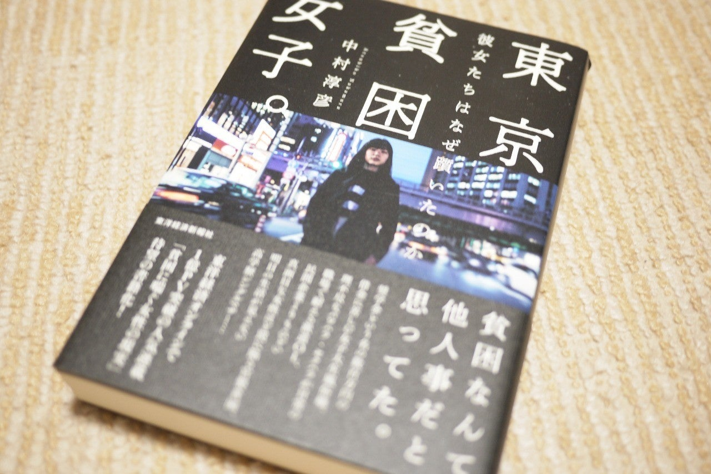

<figure>

</figure>

　以前より、風俗業やAV女優で働く女性と貧困について取材・執筆を続けている著者による、一般的な学生や主婦が風俗業をしてでもお金を稼がなくてはならないようになってしまう事情をルポルタージュするドキュメント。

　筆者は多くのインタビューを通して主張する。普通の女子大生が、奨学金などがもととなって転落する人生は決して他人事ではなく、誰にでも起こりうる。きっかけは、返済型の奨学金と、両親に起こった離婚などのトラブル。今の日本は、誰にでもあり得る出来事の複合的な要素で、あっという間に貧困へと転落する。それは予想もしない形で庶民を襲い、誰もが「貧困なんて自分には関係ないと思っていた」と言う。

　特に日本において、給付型でない、返済を必要とする奨学金は、名前を変えた高金利ローンと化している例もある。親に学費を出す資金力がない場合、学生は何もわからぬまま高金利のローンを課せられることになってしまうのである。自分名義で数百万円のローンを抱えたまま社会人をスタートする若者たち。それでなくとも高収入など期待できないこの時代に、途方もないハンデを背負って人生を送ることになってしまうわけだ。

　著者は、貧困や風俗産業に携わらずを得ない人々（ほとんどが若者であるが、そうでない場合もある）の個別の事情について丁寧に聞き取りを行い、その事情を事細かく記していく。そうやって、それぞれの事例に共通した様子を絞り出していく。

　問題は、個人の資質や心がけなどという単純なものではない。日本が、構造的に貧困を生み出す社会に変容してきているのだ。そのことに気付かされたとき、我々は自分もその危機に瀕しながら生きていることを意識する。

　実際、著者にこの本の企画を持ち込んだ女性編集者も、慶応大学出身の勉学優秀な人物ながら、そのキャリアのほとんどを安定しない非正規の形で生きてきたということも紹介されている。

　この国の階層化はますますもって深刻である。その瀬戸際で生きる人々の様子は、実際に目にしたものでないとわからない。そして、貧困にも貧富の差にも目を向けずに安定した生活を送る人々は、この階層化が、いずれ国そのものを侵食していくことにすら気づかないであろう。いや、気づいていても知らないふりをして自分の人生だけをまっとうすれば、それでよしとしているのかもしれない。

[https://amazon.co.jp/dp/B07NGX9JFX](https://amazon.co.jp/dp/B07NGX9JFX)
