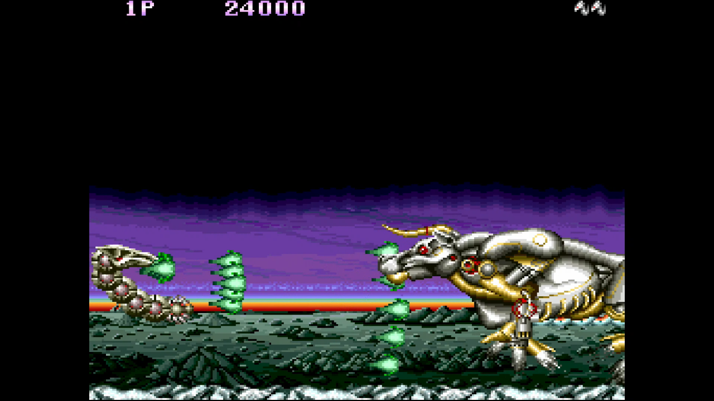
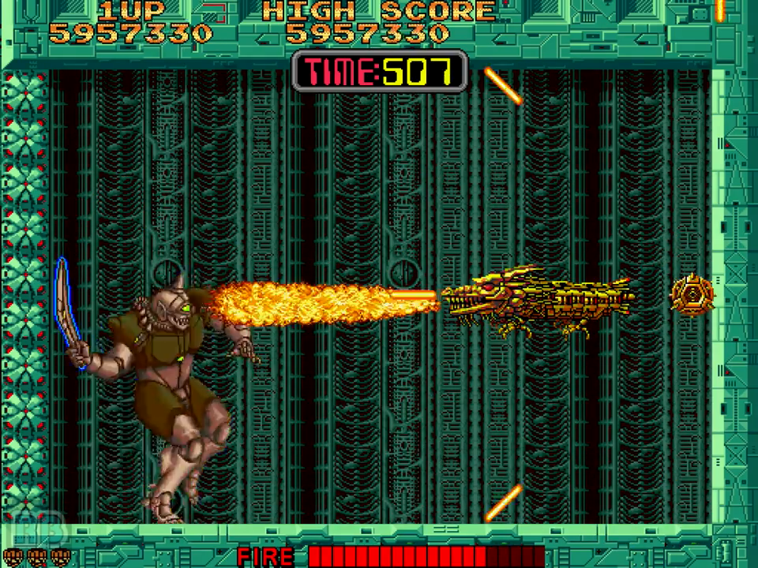
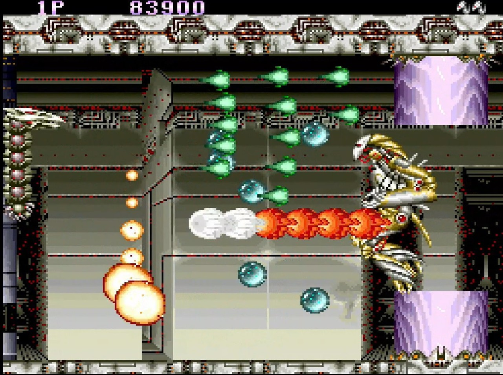

<figure>

</figure>

　**『天聖龍』**と書いてセイントドラゴンだ。ジャレコが1989年にリリースしたアーケードゲーム。この度アーケードアーカイブスでもリリースされた。個人的には比較的マイナーなゲームだったんじゃないかと思っているけど、どうなんだろう。

　**『天聖龍』**の最大の特徴は、自機がドラゴンであることだ。いや、自機がドラゴンのゲームなんて、他にもいっぱいあったじゃないかとお思いだろう。そうではない。**『天聖龍』**の自機は、ドラゴンはドラゴンでも多関節でうねうね動くチャイニーズ・ドラゴン系の姿をしている。もっとも、このタイプの自機は1988年にタイトーが**『サイバリオン』**ですでに披露しているので、まったくの新発想というわけでもない。その辺りが、ちょっとマイナーに甘んじている理由なのかもしれない。

　**『天聖龍』**は、自機がドラゴンであるという特徴を除けば、あとはオーソドックスな横スクロールシューティングだ。次々と現れる敵をショットで倒し、パワーアップして、ステージ最後のボスを倒して面クリアである。実にわかりやすい。ただ、やはり自機がうねうねしているだけあって、そこは最大限に利用しないとちょっと難しい。自機の頭の部分に敵の弾が当たればミスとなるが、ボディのうねうね部分は敵や弾をガードできる。これをうまく使って、敵の猛攻をかいくぐるのだ。

　しかし、これが遊んでみると結構難しい。自機をうねうねっと動かして弾をガードするのだが、もう少しボディが長いとありがたいのに！　と思う場面がしばしば現れる。うん、ちょっと自機が短いんだな。この自機の短さの理由はわかる。あまりボディを長くしてしまうと、弱点である頭をぐるぐるっと囲むようにガードしてしまったときに、無敵のドラゴンができあがってしまうからだ。帯にもたすきにも短いぐらいの自機に仕上がってしまったのはやむを得ないところだろう。

　さらに、このゲームの当たり判定は比較的大きい。ほぼ見たまんまの当たり判定で、特に地形との接触にはシビアなジャッジがくだされる。地面スレスレを飛んで、頭上をボディでガードしようとすると、だいたい地形に激突して死ぬ。実際何回も死んだ。

　無敵だけど短いボディ。プレイヤーに優しくない当たり判定。これらを抱えながら、さらに我々は、敵の出現パターンを覚えて、出会い頭の事故に備える記憶力も要求される。そう、**『天聖龍』**は当時のシューティングゲームらしく、しっかりと覚えゲーのスタイルを取っている。敵の出現を覚えていないと、あっという間に弾に囲まれ、ボディでは防ぐことのできない硬いミサイルなどに撃墜される羽目になる。

　そんなわけで、結構苦しい戦いを強いられる**『天聖龍』**。アイデアはがんばったけど、シビアなゲームバランスと、ちょっと地味なドラゴンで、ゲーセンに生息していた時間はあまり長くなかった。でも、こうやって今の時代にリリースされると、改めて遊んでみたくなって嬉しいものだ。難しいけど、ちょっとがんばってプレイしてみよう。

　前年に**『サイバリオン』**が登場してしまった不運が、地味な感じに拍車をかけてしまっている**『天聖龍』**。こちらはこちらで、きっちりとした攻略を積み重ねていく楽しみがあるように思う。今さらではあるが、応援したくなった。がんばれ**『天聖龍』**！

