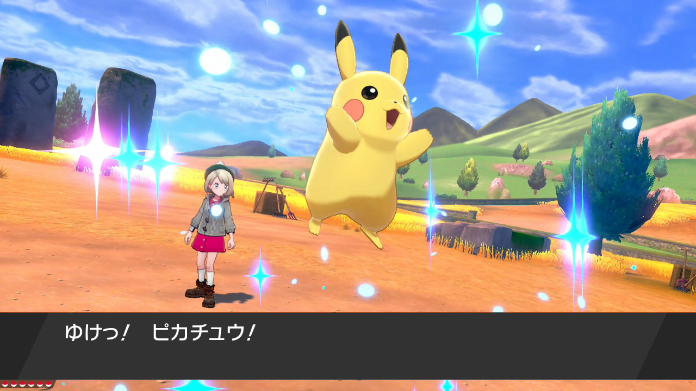
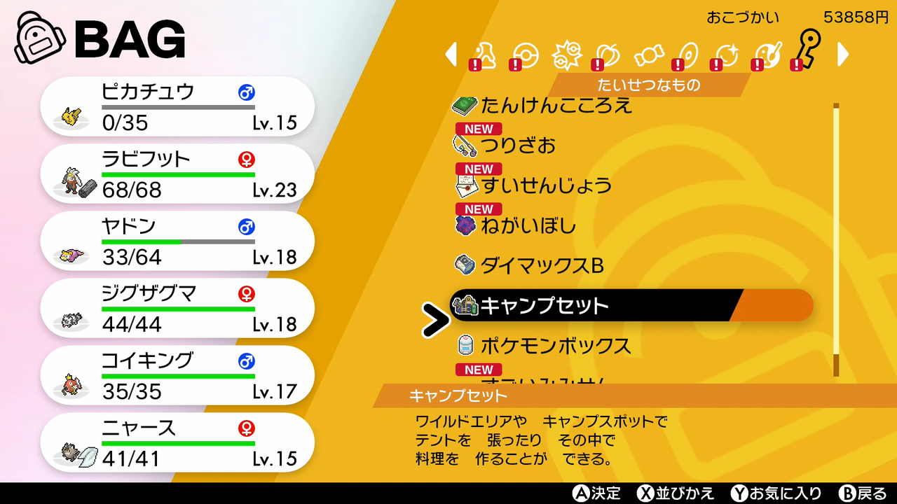
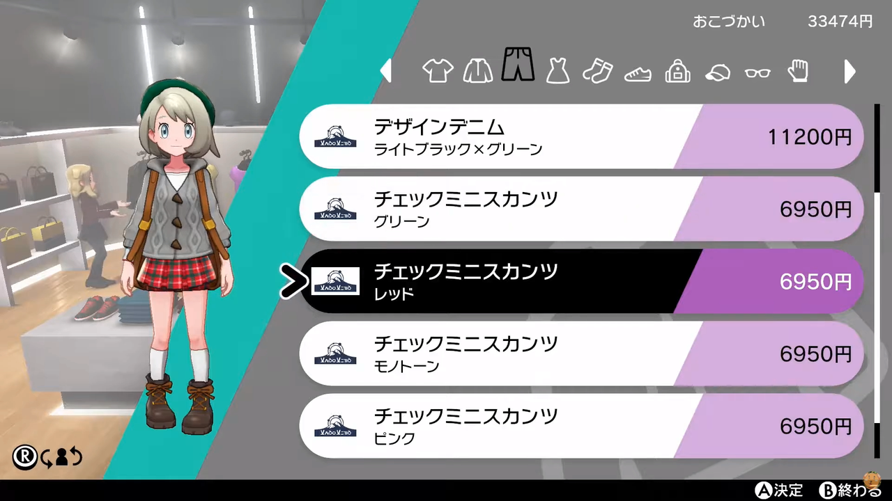
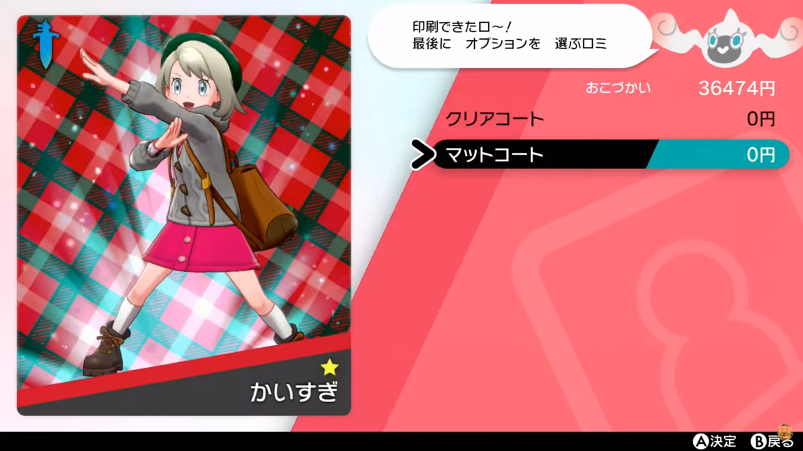

<figure>

</figure>

　かつて「僕はポケモンをやらない」という記事を書いたが、その後、最新作の**『ポケットモンスター ソード』**を遊んでみることにした。

　最初の**『ポケットモンスター 赤・青』**が発売されたのが1996年だから、実に24年の時が経っているわけだ。最初のポケモンが白黒だったなんて今では信じられないことだ。

　最新ゲーム機で遊ぶ**『ポケモン』**は、愛らしいキャラクターも美しい風景もすべて3Dで描画され、まさに最新技術の粋を集めたかのような映像美にあふれている。しかし、それだけではない。**『ポケットモンスター ソード・シールド』**では、メニュー画面に徹底したフラットデザインが採用されており、これが実に見やすく、洗練された印象を与えるのだ。立体感あふれる世界を旅して歩く画面から、一旦メニューを開くと、必要なアイテムがすっきりと配置された画面に移行する。これが、非常にわかりやすい。

　ひと昔前までは、スキューモーフィズムと呼ばれる、立体的で実際の世界に存在する素材を模したグラフィックスを使ったインターフェースが主流だった。しかし、長年コンピュータを利用してきた我々に、もはや現実を模倣したデザインのインターフェースは必要ないとばかりに、見やすくて軽量感のあるフラットデザインが台頭してきた。これはまるで、無駄を省いたライフスタイルを目指す、ミニマル生活そのものではないか。我々は自分の生活空間ばかりではなく、コンピュータの画面上もスッキリと余計なものをなくした生き方を心がけようというのだ。ポケモンは子ども向けのゲームと侮っていたが、これはなんだか究極の今風ゲームじゃないか。はっきり言ってオシャレである。

　ちなみに、ゲーム内ではプレイヤーの操作するポケモントレーナーに、好みの服を着せて見た目をアレンジできる。見た目が変わるだけだ。別に防御力が上がったりするわけではない。この服のラインナップもオシャレで、もうゲームの楽しみ方として、強いポケモンを育てるとか、対戦で勝ちまくるとか、そういう部分だけにフォーカスしたゲームじゃないんだなということがよくわかる。ゲームって、こんなに余裕のある楽しみ方を提供する作りになっていたんだなと感心してしまった。

　おそらく、僕が小学生だったらゲームのこんな部分も素直に楽しんで遊んでしまうだろう。大昔の、ひたすら敵を倒す、目的に向けて一直線のゲームとは違う、もっと広範囲に楽しみ方を広げてくれるゲームデザインがここにはあった。

　そう気づいたからには、少しゆったりと構えて、この『ポケットモンスター ソード』の、大筋の目的以外の部分まで楽しみながらプレイしてみたい。どちらかと言うと、そういう脇道にそれる楽しみ方は苦手で、ゲームはとにかく攻略！　のような遊び方しかしてこなかったビデオゲーム第1世代の自分にそんな遊び方ができるのか大いに疑問はあるが、がんばろう、ピカチュウ。

[https://note.com/keigox68000/n/n36ade849a5f7](https://note.com/keigox68000/n/n36ade849a5f7)
