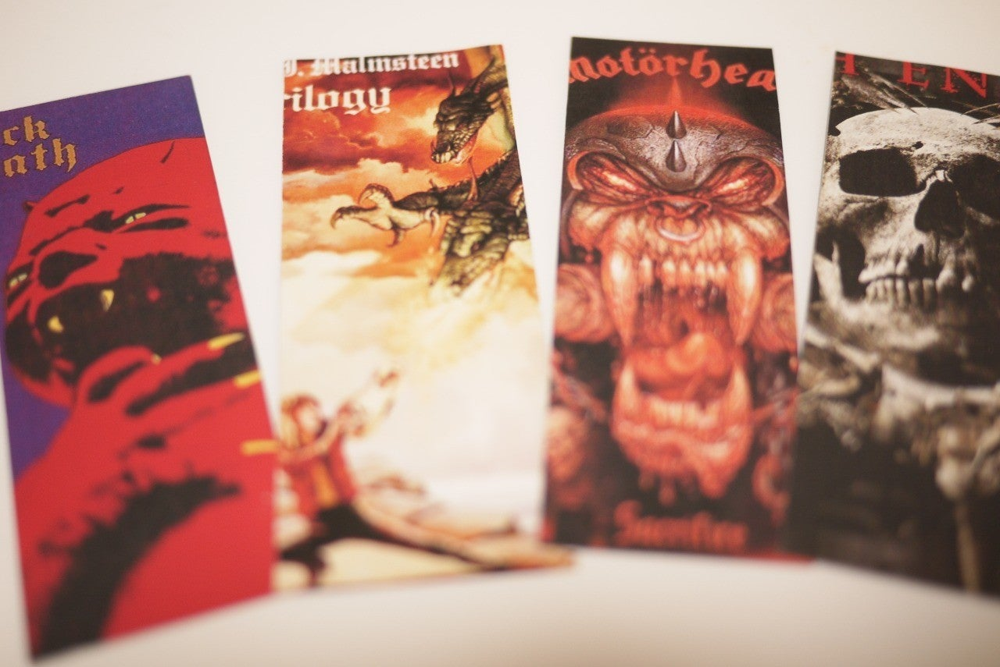
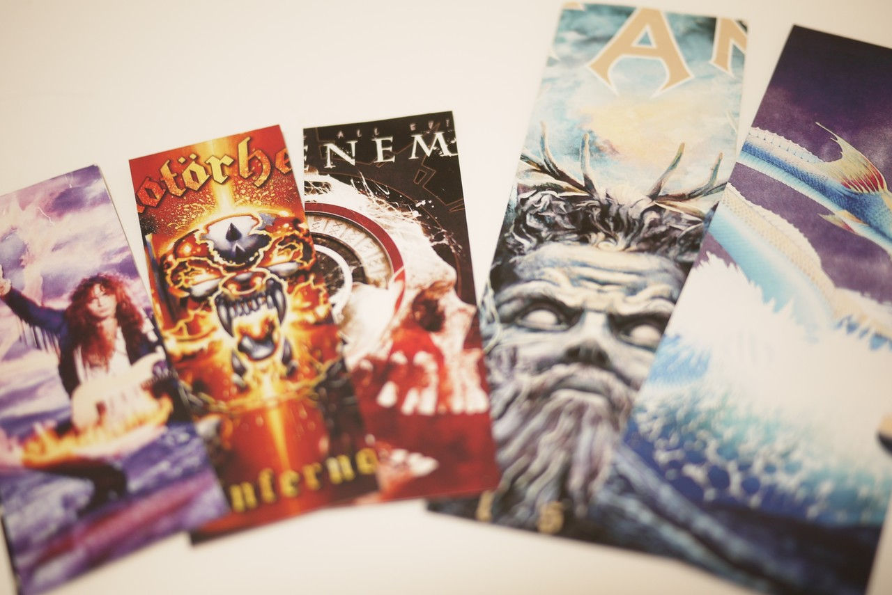

<figure>

</figure>

　ときどき「しおり」を自作する。本に挟むあの栞だ。

　以前は本を買うと必ずしおりをつけてくれたような気がしていたが、いつの間にかそれが無くなった。レジ前にはご自由にお持ちくださいという感じで置いてある本屋もあるが、要するに全員には配りませんよ、ということなのだろう。

　また、その置いてあるしおりも、以前に比べて紙質が少しグレードダウンしている気がする。結構ペラペラの薄い紙のしおりがほとんどなのだ。別に本を読むのに、立派なしおりはいらないし、僕なんかしおりを使っているうちに、必ずどこかへなくしてしまう。ペラペラの紙で十分だ。

　とは言え、やっぱりしおりに全然こだわらないのも、読書をするときに寂しいものである。それで、ときどき自分で作る。こういうとき、パソコンというのは実に便利だ。パソコンで、あらかじめしおりのテンプレートを作ってあるので、あとはそこにお好みの画像をはめ込むだけだから簡単だ。あとはそれを葉書サイズの用紙に、4枚分印刷する。裏面も印刷すれば、両面に図柄の入ったしおりができる。カッターできれいに切り離せば、4枚分のしおりができる。

　しおりにこだわらないと言ったものの、やっぱり自分で作るとちょっと愛着が湧く。書店ではあり得ない趣味丸出しのデザインのしおりも思うがままだ。これで少しは大事に使って、なくすこともないんじゃないだろうか。

　と、思うと、さにあらず。結局そのうちなくしてしまうのだ。そしてまた作る。そういうわけで、”ときどき”しおりを作るというわけなのだ。

おまけ：しおりを作ったときのフォトショップ用ファイル（自己責任でどうぞ）

assets/nd363c6bab451\_75653c6ca7258a5378ef3dc449608ce3.psd
