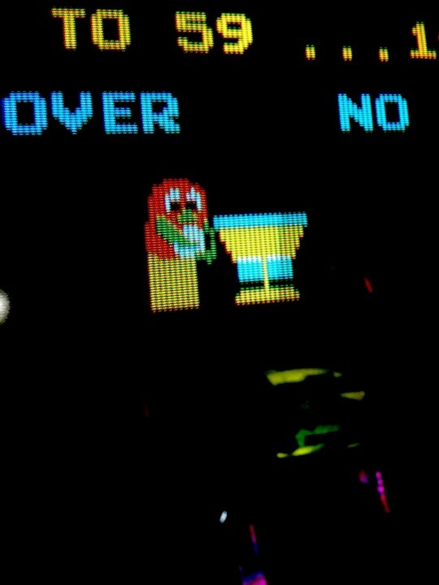

<figure>

</figure>

　僕の少年時代は、ゲームセンター最盛期だった。スペースインベーダーブームでゲーセンが禁止になり、それにも関わらずビデオゲーム文化が急速な発展を見せたような時代である。地元の長野市も、今でこそ見る影もないが、バブル期の繁華街はかなりにぎやかだった。そしてそこには、ちょっと歩けばゲーセンに当たる、というような今から考えると夢のようなゲーム環境が存在したのだ。残念ながら、当時のゲームセンターの記録はほとんど残っていない。地方都市ともなればなおさらだ。今、ゲームセンターの思い出を自分なりの記録の意味も含めて書き記しておこうと思う。今ではその多くが閉店してしまい、写真などもないが、当時の雰囲気を感じ取っていただければ幸いだ。

## 『アミューズメントパークNASA』

　格闘ゲーマーたちが切磋琢磨する長野市の聖地。それが**『NASA』**のイメージだ。テーブル筐体全盛の時代は**『ベンドリア』**という別の名前のゲームセンターだったのだが、後に**『NASA』**に生まれ変わってから、格闘ゲームを多く配置して、雰囲気が変わった。ストリートファイターIIより少し後の時代、**『ヴァンパイア』**やネオジオで**『餓狼伝説スペシャル』『真サムライスピリッツ』**が流行っていた頃から10年以上は全盛期が続いていたんじゃないだろうか。いつでも賑わっている店だったが、たまに空いているときにCPU戦を遊んでいると、店長自ら乱入してくるという離れ業をやらかしてくれるゲーセンとしても有名だった。僕は学生時代に毎日のように通って対戦に明け暮れたものだが、その20年後にふらっと訪れてみたら、まだ店長に顔を覚えられていた。客商売の鏡だ。近年、突如閉店してしまい、多くの格ゲー難民を生み出したのも記憶に新しい。

[https://www.google.com/maps/place/%25E3%2582%25A2%25E3%2583%259F%25E3%2583%25A5%25E3%2583%25BC%25E3%2582%25BA%25E3%2583%25A1%25E3%2583%25B3%25E3%2583%2588%25E3%2583%2591%25E3%2583%25BC%25E3%2582%25AF%25E3%2583%258A%25E3%2582%25B5/@36.6434648,138.2160637,3a,38.2y,301.09h,90.43t/data=!3m6!1e1!3m4!1sJ1tZWegkG\_Omeqhy\_fybrg!2e0!7i13312!8i6656!4m5!3m4!1s0x601d8673f4ac134d:0x986d2f48d10cb1a9!8m2!3d36.6436111!4d138.2158333](https://www.google.com/maps/place/%25E3%2582%25A2%25E3%2583%259F%25E3%2583%25A5%25E3%2583%25BC%25E3%2582%25BA%25E3%2583%25A1%25E3%2583%25B3%25E3%2583%2588%25E3%2583%2591%25E3%2583%25BC%25E3%2582%25AF%25E3%2583%258A%25E3%2582%25B5/@36.6434648,138.2160637,3a,38.2y,301.09h,90.43t/data=!3m6!1e1!3m4!1sJ1tZWegkG_Omeqhy_fybrg!2e0!7i13312!8i6656!4m5!3m4!1s0x601d8673f4ac134d:0x986d2f48d10cb1a9!8m2!3d36.6436111!4d138.2158333)

## 『パロ』（ヤングファラオ）

　ボウリング場**『ヤングファラオ』**内に併設されたゲームセンターである。ボウリング場のゲームコーナーと言うと、UFOキャッチャーやドライブゲームなどが申し訳程度に置いてあるイメージだが、**『パロ』**は違った。結構な面積をゲームセンタースペースに割き、相当数のゲームマシンが設置されていた。入口付近には、大きな筐体、アップライト筐体が置いてあり、エントランスで仕切られた奥にはテーブル筐体がズラッと並ぶという構成。大型筐体と言っても、**『アフターバーナー』**とか**『アウトラン』**ではない。もっと古い時代の筐体。**『モナコGP』『スペースタクティクス』『スターウォーズ』**そういうゲーム機だ。アップライト筐体には**『ルパン三世』『ラリーX』**などが入っていた記憶がある。テーブル筐体はそれこそ当時のゲームがあれこれ入れてあったのだが、**『タックスキャン』**がひときわ目立っていて印象的だった。ボウリング場だけあって、人の出入りも多く、いつも賑わっているゲームセンターだった。**『パロ』**という店名は、後についたような気がするが定かではない。

[https://www.google.com/maps/@36.6382428,138.2108918,3a,75y,105.46h,96.11t/data=!3m6!1e1!3m4!1swnxml8qNydLD5TfvPIF1oA!2e0!7i16384!8i8192](https://www.google.com/maps/@36.6382428,138.2108918,3a,75y,105.46h,96.11t/data=!3m6!1e1!3m4!1swnxml8qNydLD5TfvPIF1oA!2e0!7i16384!8i8192)

## 『ピピック』

　長野市民の足、長野電鉄の本郷駅内で営業していた小さなゲームセンター。本当に小さい店で、人ひとり分通れるスペースを残して、テーブル筐体が8台くらい設置してあったような気がする。その後主流になるミディ筐体と違って、どんな狭いところにも置けるのがテーブル筐体の利点だ。とにかく狭い店だったことばかりが印象に残っていて、なんのゲームを遊んだかイマイチ記憶がない。**『ストラテジーX』**とか**『ギャラガ』**とか**『ゼビウス』**を遊んでいたんじゃないかな。僕の家の最寄り駅から一駅の場所だったのだが、遊びに行くと、いつも最後の100円まで使ってしまい、夕暮れの街を電車に乗らずに歩いて帰っていた思い出も懐かしい。

[https://www.google.com/maps/place/%25E6%259C%25AC%25E9%2583%25B7%25E9%25A7%2585/@36.6625169,138.2034532,3a,75y,104.11h,105.94t/data=!3m7!1e1!3m5!1sW8IMWljhVm0n2OvATEz5NA!2e0!6s%252F%252Fgeo0.ggpht.com%252Fcbk%253Fpanoid%253DW8IMWljhVm0n2OvATEz5NA%2526output%253Dthumbnail%2526cb\_client%253Dsearch.gws-prod%252Flocal-details-localweb.gps%2526thumb%253D2%2526w%253D211%2526h%253D120%2526yaw%253D85.534645%2526pitch%253D0%2526thumbfov%253D100!7i16384!8i8192!4m5!3m4!1s0x601d865725e3a7ab:0x574f2268597c2886!8m2!3d36.6625298!4d138.2038451](https://www.google.com/maps/place/%25E6%259C%25AC%25E9%2583%25B7%25E9%25A7%2585/@36.6625169,138.2034532,3a,75y,104.11h,105.94t/data=!3m7!1e1!3m5!1sW8IMWljhVm0n2OvATEz5NA!2e0!6s%252F%252Fgeo0.ggpht.com%252Fcbk%253Fpanoid%253DW8IMWljhVm0n2OvATEz5NA%2526output%253Dthumbnail%2526cb_client%253Dsearch.gws-prod%252Flocal-details-localweb.gps%2526thumb%253D2%2526w%253D211%2526h%253D120%2526yaw%253D85.534645%2526pitch%253D0%2526thumbfov%253D100!7i16384!8i8192!4m5!3m4!1s0x601d865725e3a7ab:0x574f2268597c2886!8m2!3d36.6625298!4d138.2038451)

## 『マジカルガーデン』（通称 B1）

　書店の地下にあったゲームセンター。その入口看板に**『B1 マジカルガーデン』**と書かれていたため、そこへ行く全員が**『ビーワン（B1）』**と呼んでいた。本当の店名知らない人もいたんじゃないかな。地下ゲーセンということで、何やら怪しげだが、結構広い店内スペースには、主にテーブル筐体を中心に、数多くのゲームが置いてあった。店の内装や配色がきれいで、当時としては珍しく明るい雰囲気の店内だったように記憶している。ここはナムコの直営店ではなかったが、ナムコのゲーム中心に置いてあり、ナムコの新製品を遊びたかったら、ここへ行けばプレイできるという感じだった。長野市にはキャロットがなかったので、そういう意味ではナムコファンの聖地たりうる店だったのだ。例えば、**『モトス』**とか**『ワンダーモモ』**みたいな人気的にもうひとつふるわないタイトルも置いてあったし、**『サンダーセプター』**のような大型筐体。ナムコが販売していた**『ガントレット』**などもいち早く入荷していた。NGや**『イシターの復活』**のルームカードなども配布してくれて、本当に直営店並みのサービスをしていてありがたかった。でも、コナミの**『RF2』**とかセガの**『ハングオン』**も入っていたので、幅広くやっていたみたいだ。

[https://www.google.com/maps/@36.6702564,138.2078048,3a,30y,338.45h,89.56t/data=!3m6!1e1!3m4!1svXtTmAjgz9EKT\_fimYxrxg!2e0!7i13312!8i6656](https://www.google.com/maps/@36.6702564,138.2078048,3a,30y,338.45h,89.56t/data=!3m6!1e1!3m4!1svXtTmAjgz9EKT_fimYxrxg!2e0!7i13312!8i6656)

## 『ダイエー』

　現在は閉店してしまったが、長野市の中心地にはダイエーがあった。当時、その最上階にあるゲームコーナーが一大ゲームセンターの体をなしていた。ここもテーブル筐体がずらりと並ぶ様子は他のゲーセンと同じだったが、いつの頃からか、セガの大型筐体を積極的に導入するようになっていた。世の中の景気もよかったが、ダイエー自体の経営も好調だったのだろう。（後にそのツケが回ってくることになるのだが）一番印象に残っているのは**『アフターバーナー』**のダブルクレイドル筐体が置いてあったこと。一介の商業施設には大げさすぎるゲームマシンだ。他にも、**『アウトラン』**や**『エンデューロレーサー』**などが置いてあった記憶があるが、同時に**『アサルト』**など変則コンパネのゲームも置いてあって、バリエーション豊かなゲームが楽しめる店だった。

[https://www.google.com/maps/@36.6494793,138.1871668,3a,75y,236.81h,109.07t/data=!3m7!1e1!3m5!1spz0HoAT5JscQVHEuyXzarA!2e0!6s%252F%252Fgeo3.ggpht.com%252Fcbk%253Fpanoid%253Dpz0HoAT5JscQVHEuyXzarA%2526output%253Dthumbnail%2526cb\_client%253Dmaps\_sv.tactile.gps%2526thumb%253D2%2526w%253D203%2526h%253D100%2526yaw%253D15.50849%2526pitch%253D0%2526thumbfov%253D100!7i16384!8i8192](https://www.google.com/maps/@36.6494793,138.1871668,3a,75y,236.81h,109.07t/data=!3m7!1e1!3m5!1spz0HoAT5JscQVHEuyXzarA!2e0!6s%252F%252Fgeo3.ggpht.com%252Fcbk%253Fpanoid%253Dpz0HoAT5JscQVHEuyXzarA%2526output%253Dthumbnail%2526cb_client%253Dmaps_sv.tactile.gps%2526thumb%253D2%2526w%253D203%2526h%253D100%2526yaw%253D15.50849%2526pitch%253D0%2526thumbfov%253D100!7i16384!8i8192)

　簡単に5軒ほど書いただけでもかなりの長文になってしまった。それほど、当時のゲームセンターの記憶が鮮烈であり、また、店舗数にも恵まれていたということだろう。実は、これだけでも覚えているゲームセンターの1/10程度なのだ。すごい時代だったなあ、と改めて思う。しかし、こういう地方都市のゲームセンタについては、記録もほとんどなく、いずれ忘れ去られる情報ではあろう。そういう意味も込めて、また気が向いたら書いてみようと思う。

　長野市のゲームセンターについては、閉店したものを含めて、MORIYAさんという方（Twitter : @morian）がGoogleマップにその場所を記録してくれていて、こちらも参考になる。

[https://twitter.com/morian/status/370141216051970048](https://twitter.com/morian/status/370141216051970048)
