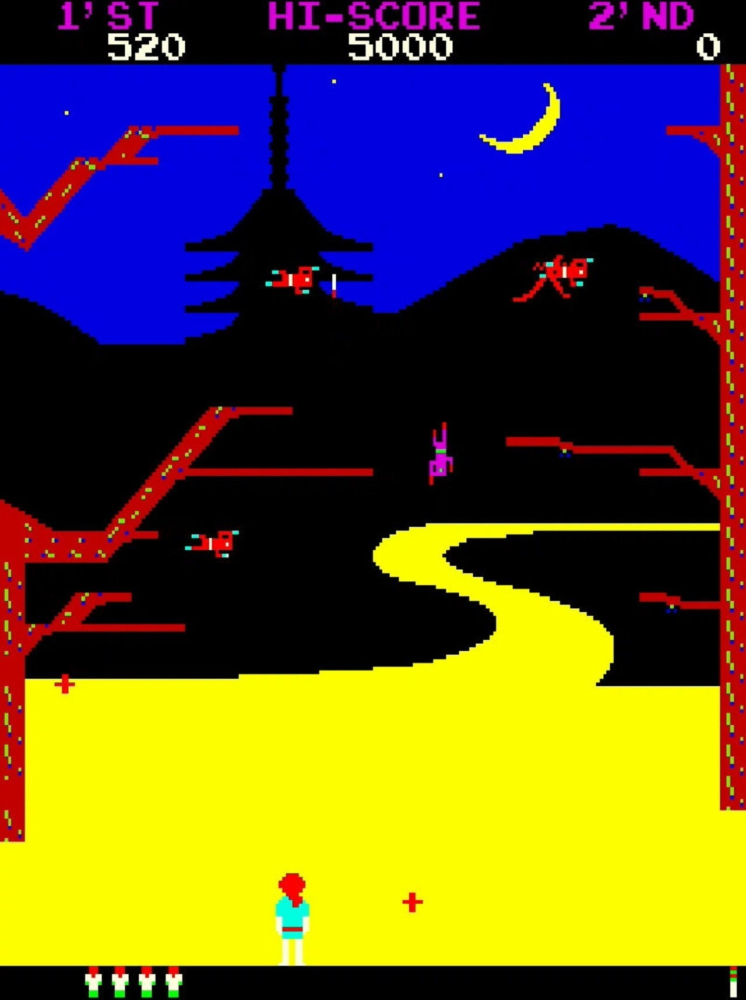
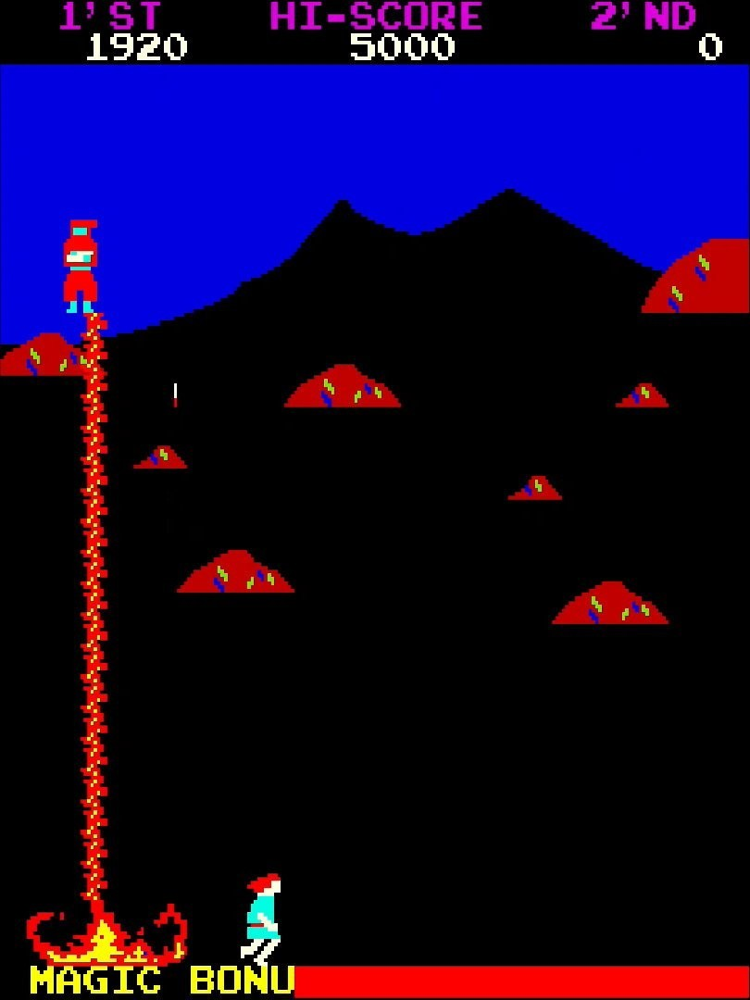

<figure>

</figure>

　アーケードアーカイブスで『サスケvsコマンダー』が配信された。SNK（ゲーム画面上の表記は”SHINNIHON KIKAKU”）の1980年作品なので、だいぶ古いイメージがある。当時人気があったのか、結構あちこちのゲーセンで見かけたタイトルだ。

　忍者の戦いを描いた本作。ゲームとしてはシンプルなシューティングゲームだ。ゲームのオープニングでは画面上には将軍（SHOGUNと表記）現れ、ゲームの主人公（自機）であるサスケに、「忍者から我が身を守れ」と（英語で）命じてくる。

　いざゲームがスタートすると将軍の姿は影も形もなく、バックには単色で描かれた三日月と大文字焼きの見られる山、そして五重の塔らしき建造物。これだけで雅な雰囲気を醸し出す表現力は大したものである。

　言われなくても夜の京都だなとわかる風景をバックに、忍者たちが空中より飛来する。数人の忍者が編隊を組みつつ空を滑空する姿は、どちらかと言えば、『ギャラクシアン』や『ムーンクレスタ』など同時期に登場した宇宙を舞台にしたシューティングゲームに近い。敵の数や、派手な動きではその2作には劣るかもしれない。しかし、忍者たちの攻撃はなかなか侮れない激しさでサスケを追い詰める。このゲーム、敵忍者から高速で発射される十字手裏剣に加えて、サスケが倒した忍者は、死骸となって落下してくるのだ。もしかしてこれは、シューティングゲームにおける、初めての撃ち返し弾の概念かもしれない。死してなお、目の敵に一矢報いようとする忍者の執念が、ゲームシステムとして見事に表現されている。

　敵忍者をすべて倒し、京都での激しい戦いを終えると、今度はボス忍者と一対一での戦いが待ち構えている。舞台は荒涼とした岩山（のような背景）に移り、（ちょっとだけ）巨大なボス忍者が登場する。この忍者たちは、巨大な炎を放射してくる「火炎の術」、3体のボスが瞬間移動しながら手裏剣を投げてくる「分身の術」、着弾した長剣が画面上に残ってサスケの移動を妨害する「飛竜剣の術」などなど、実に多彩である。わかりやすいゲームシステムに、この多様なボス戦を乗っけたことが、当時の人気の秘密だったのではないだろうか。次の忍者はどんな術を使ってくるのか気になって仕方ない。

　このボス忍者との戦いはまさに一騎打ち。どちらかが絶命した瞬間に戦いは終わる。ボスを倒せばプレイヤーの勝ち。プレイヤーがやられたら、ボスとの戦いはそこまで。次のステージに進む。この辺りの潔さは、忍者の非情な戦いを端的に表していて、実に美しいゲームデザインだ。

　単音ながら、要所々々で流れるBGM（ジングル）もキャッチーだった。特徴をとらえて描かれた忍者の姿も相まって、実に印象的なゲームだった。前述した夜の京都を描いたシンプルな映像と、そこで繰り広げられる容赦なき忍者同士の死闘。ボス忍者登場シーンにおいて画面が光る迫力の演出など、単純なシューティングゲームながら、独自路線で他にはない魅力を放っていた本作。これは、今見ればひとつのアートとさえ言えるんじゃないかとさえ思ってしまう。

