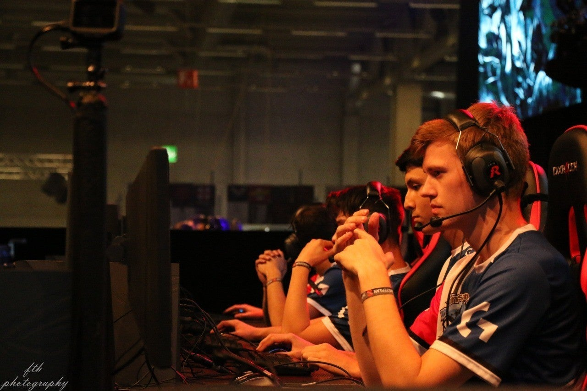

<figure>

</figure>

　いいツイートを見た。

[https://twitter.com/ikeda\_San/status/1228165855298502663](https://twitter.com/ikeda_San/status/1228165855298502663)

　そう、たまにはストイックにゲームを極めようとする姿勢も楽しいものである。

　言うまでもなくゲームは遊びだ。余暇を利用して楽しむためにプレイするものである。でも、そのプレイスタイルには人それぞれ、いろんなタイプがある。

　最近では、このプレイスタイルを指して「ガチ勢」とか「エンジョイ勢」なんて言い方も出てきた。要するに、そのゲームを真剣に攻略しているのか、パーッと楽しく遊べばそれでいいのか、その違いを表す言葉だ。特に、他の人と一緒にプレイするオンラインゲームにおいて、その呼称は重要な意味を持つようである。ガチ勢とエンジョイ勢が一緒にプレイすることは、ときとして不幸な結果を招く。真剣に勝ち負けを競いたい者、勝手も負けても、大勢で楽しくやれればそれでOKな者。両者の間に温度差が生まれ、試合結果やスコアに対して不満が出て、微妙に険悪な空気が生まれたりするのだ。

　僕自身は、どちらのプレイスタイルもあっていいと思っている。冒頭に述べたように、ゲームは遊びだ。ひとつのプレイスタイルにとらわれることなく、多様な遊び方で楽しめばいい。ただ、プレイする人たちの、ゲームに対する意識が違っていると、そこはやはり人間同士。感情的に納得できない状況が出てくるものである。これはゲームという勝敗の存在するものである以上仕方ないだろう。できることならば、ガチ勢モードとエンジョイ勢モードの2種類のゲームモードを用意してくれるゲームが理想的だ。

　しかし、真剣にプレイしようとも、楽しく遊ぼうとも、やはりゲームにはルールがある。一定のルールに従い、設定された目標に向かうからゲームとして楽しいのである。オンラインゲームをプレイしていると、エンジョイが行き過ぎて、このゲームのルールすら関係なくなっている場合が見受けられる。勝利を目指さず、ゲームのシステムの中で好き勝手に遊び始めるのだ。殺人鬼役のプレイヤーが生存者を真剣に追いかけなくなり、スナイパーは相手を狙撃することなく敵味方入り混じってダンスのようにじゃれ回る。そして格闘家たちが拳で語り合うことなく、試合を諦めたかのように棒立ちになり挑発ポーズを繰り返す。

　こうなってしまうと、ゲームはその面白さを失ってしまう。ゲームシステムによって設定された目標に向かわないのであれば、そんなゲームはやる意味がない。百歩譲って、それもゲームの楽しみとするのであっても、そのお遊びに巻き込まれる、ルールに従って遊びたいプレイヤーはたまったものではない。ただの時間の無駄である。

　どんなにエンジョイ勢と呼ばれていても、やはりその人たちも一定の目標を目指してゲームをプレイするのである。ただ、そこには時間的な都合や個々の技能もあるから、攻略にかけるエネルギーの度合いは人によって違うのだ。そう考えると、やはり最初に引用したツイートのとおりだ。ときには修行のようにストイックにゲームを遊ぶことがあってもいいんじゃないか。その中から、自分のライフスタイルや考え方にマッチする遊び方も見つかるのではないだろうか。

　自分のプレイスタイルは**「ゲーム腕で聞けよ」**ということかもしれない。
