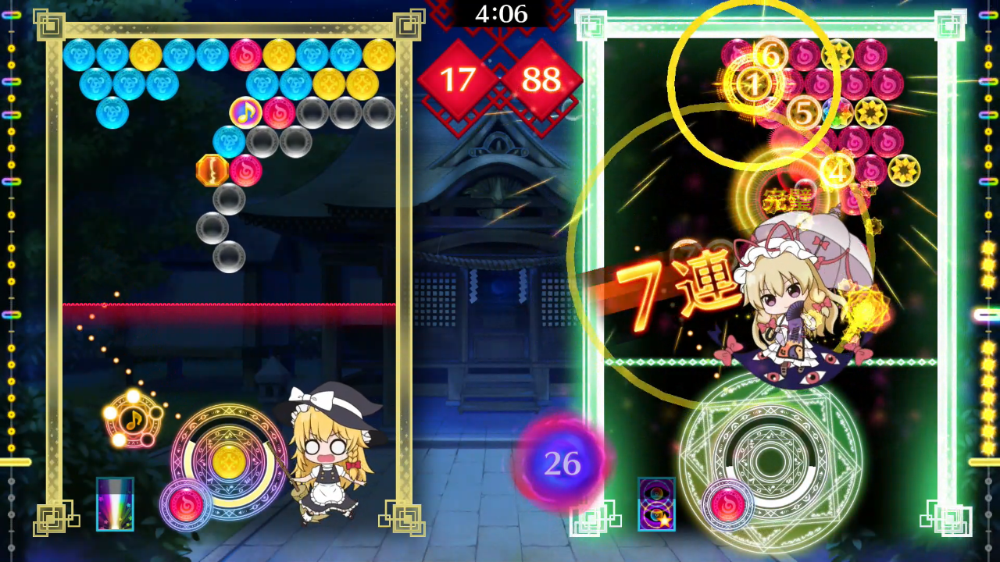

<figure>

</figure>

　実は、タイトーという同人サークルが作った**『東方スペルバブル』**というゲームを買ったんですよ。

　というのは、冗談です。なんとタイトーが東方二次創作のゲームソフトを、任天堂スイッチ専用ソフトとしてリリースしたのです。

　**『東方スペルバブル』**は、その名前からなんとなく推測できる通り、タイトーの有名タイトル**『パズルボブル』**をアレンジしたゲームです。しかし、**『東方スペルバブル』**では、泡を消すときにBGMのリズムに合わせてボタンを押すと、対戦相手を妨害できるという新システムが搭載されています。これは斬新だ！

　ゲーム中に流れる曲は、もちろん東方シリーズのアレンジ曲で、これならファンも納得です。ちなみに、過去に同人サークルなどがアレンジ曲として発表されたものがそのほとんどです。人気曲を聴きながらゲームができるなんて、考えただけでもワクワクしますね！

　ゲーム中のキャラクターは有名な神絵師さんたちに描いてもらった新規絵が勢揃い！過去の東方シリーズのイメージを損なわず、新しい幻想郷の物語が紡ぎ出されます。東方シリーズの原作をプレイしている人なら、思わずニヤリとさせられるやりとりも満載。なんとサービス満点なゲームでしょう。

　さらに、今回はZUNTATA自ら東方シリーズの楽曲をアレンジして参加しています。うわあ、ZUNTATAファンならマストアイテムなゲームですね。

　お値段は5800円と少々お高めではありますが、ファンなら納得の内容はむしろ安いぐらい！しかもダウンロード専売なので、パッケージが品切れになる心配もありません。さすが僕らのタイトー。いつもファンのことを考えた販売方法を用意してくれますね。ありがとう、タイトー！

  

　……などと、今度こそ冗談はさておき。

　かつて日本のゲーム産業のトップを走っていたタイトーが、同人ソフトばりの二次創作ゲームをリリースしたのはちょっと驚いた。果たしてどういう開発形態で出来上がったゲームなのかはわからないが、エンディングのスタッフロールを見る限り、しっかりタイトー自身が開発に携わっているであろうことが推測できる。

　タイトーのホームページを見ると、自社のタイトルが本当に少ない。おそらくいろいろな大人の事情で、かつてのタイトータイトルはリリースできるような状況ではなくなっているのだろう。

　そんな現状に、少し寂しい気持ちになりながら、この**『東方スペルバブル』**をプレイした。うん、ゲームは面白い。ちょっとパズルゲームとしては緻密さに欠けるというか、勢いと運で持っていく大味な感じは否めない。でも、昔なじみの**『パズルボブル』**を、懐かしい東方アレンジ曲をバックにプレイできるのは素直に楽しいと思っておこう。これも時代の流れ。むしろこういうソフトが出てくる状況を楽しんでいきたい。ZUNTATAも同人音楽サークルみたいな活動でいいのだろうかと、若干の疑問を持ちながらも、時を忘れてゲームをプレイさせてもらった。

　ところで、このゲームはオンライン対戦がない。購入には注意が必要だ。一応2人プレイは搭載しているが、一緒に遊ぶ友達がいない人のことも考えてほしかった。

[https://www.taito.co.jp/touhousb](https://www.taito.co.jp/touhousb)
