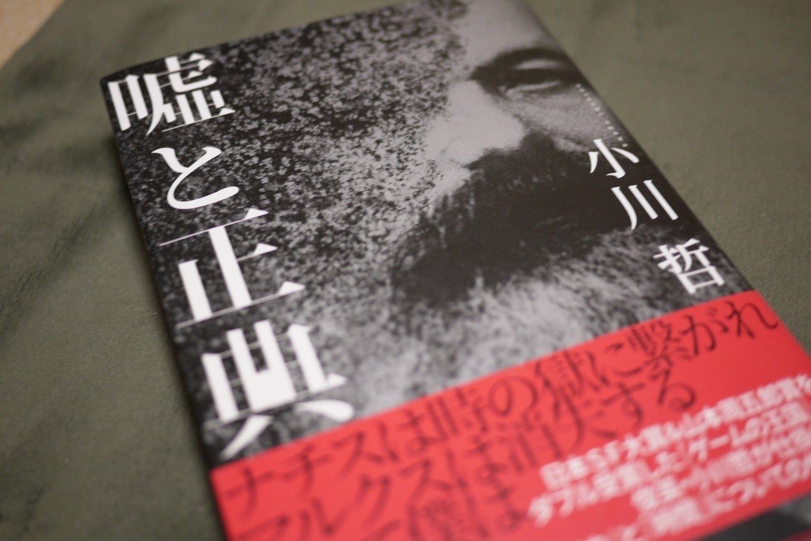

<figure>

</figure>

**※ネタバレなし**

　一見して何の話かわかりにくいタイトルと表紙だが、れっきとしたSF短編集。普段短編集はあまり読まないのだが、どの話もSFらしい趣向が凝らしてあり、楽しめる。各作品をかんたんに紹介してみた。

**『魔術師』**　奇術とタイムトラベルを精緻に組み合わせた話。その上でマジシャンの親子の物語が語られ、最後まで予想がつかないギミックで楽しませてくれる。

**『ひとすじの光』**　父の遺した競走馬の血統の秘密に迫る、一風変わった作品。競馬好きには馴染み深い競走馬も登場して、まるで史実のような面白さがある。

**『時の扉』**　王と呼ばれる何者かに、謎の男が「時の扉」について、悠久の時の中で語り続ける話。歴史上のエピソードが散漫に語られるような印象をもたせつつ、男の正体が判明するまでに巧みに仕掛けられたギミックが、ラストに効果を表す珠玉の短編。

**『ムジカ・ムンダーナ』**　音楽家である父の筆によると思われる曲を追い、その息子が、音楽が息づく島へと赴く。幼いときから音楽を拒絶した主人公が、音楽を通して父親の人生に触れるストーリー。

**『最後の不良』**　近未来の、個性がその価値を失った世界の話。その中で「不良」というものがどんな価値を持つのか。その唐突さに面食らうが、どこかユーモラスで、それでいて現代における価値観の収束ということの意味を考えさせられる一篇。

**『嘘と正典』**　表題作。ソビエト連邦を舞台に、CIAの工作員が、共産主義の根本的消滅を目論む話。ネタバレすると面白さが半減するので書かないが、その方法がSFらしい展開を持って語られていく。ラストまで楽しんでほしい。

[https://www.amazon.co.jp/dp/4152098864](https://www.amazon.co.jp/dp/4152098864)
