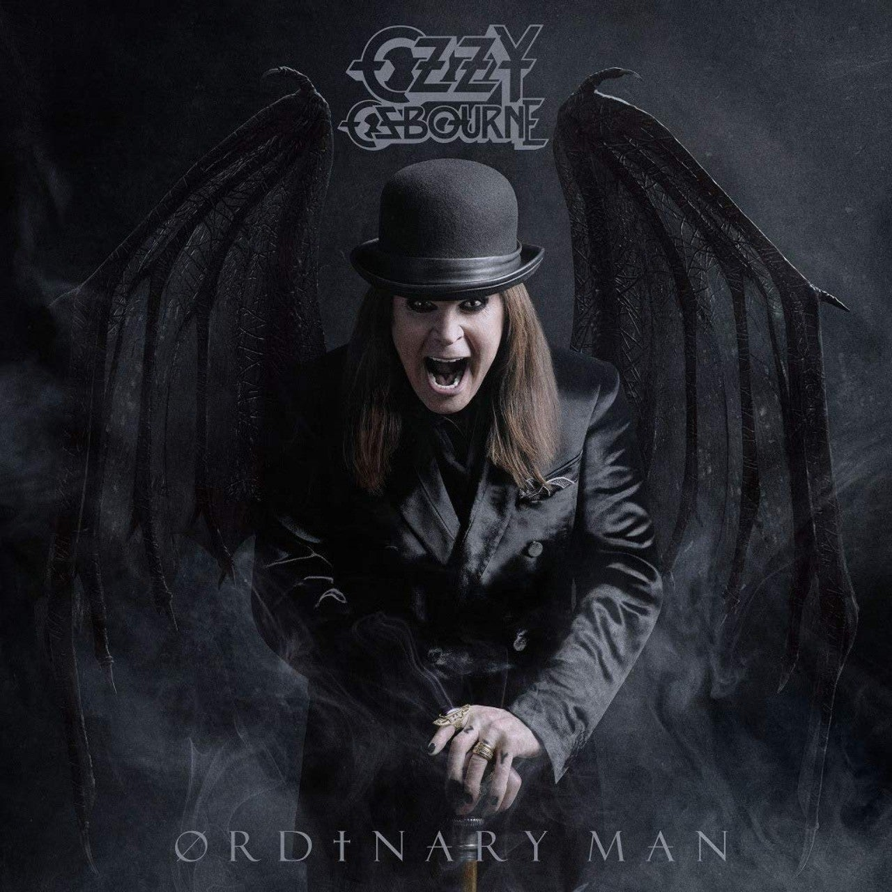

<figure>

</figure>

　ヘヴィメタルヴォーカリストの**オジー・オズボーン**の話。

　オジー・オズボーンは、かつて**ブラック・サバス**のヴォーカルとして活躍。その後長くソロで活動している。そのオジーが、ここ数年体調が悪いということで、いくつもツアーをキャンセルしている。昨年日本で開催された**『Download Japan 2019』**への出演も直前に取りやめになっている。僕はそれが理由で、『Download Japan 2019』へ行くのをやめた。

[https://www.barks.jp/news/?id=1000178857](https://www.barks.jp/news/?id=1000178857)

　もう長い間、オジーの音楽が好きで聞いている。僕がヘヴィメタルミュージックを聞き始めたのが1989年頃。その頃すでにオジーはメタル界の大御所だった。当時の僕は、オジーがブラック・サバスとして活動を始めてからのサウンドをリアルタイムで聞けなかったことを悔やんだものだが、早いものであの頃からすでに30年以上経った。もう、僕がオジーの歌を聞いていなかった年数より、聞き続けている年数の方が長くなってしまったのだ。オジーも71歳だ。

　ブラック・サバスのサウンドは、邪悪に満ちたヘヴィさを持ちながら、やはりどこか英国らしい寂寥感を持ち合わせているところが魅力的だ。それをリードするオジーのヴォーカルは呪術的でありながら流麗。そしてときに甘美ですらある。極めて類型的な音楽ジャンルであるヘヴィメタルの世界にあって、その始祖と目されるブラック・サバスとオジー・オズボーンは、しっかりと唯一無二の存在であり続けた。多くのヘヴィメタルバンドに影響を与えながらも、やっぱり彼らはオリジネイターなのだ。

　その後ソロで活動を始めたオジーのサウンドは、ブラック・サバス時代との違いを見せつけるかのように、メタリックな輝きを放ち始める。次々と、フラッシーなギタープレイを得意とするスーパーギタリストと手を組み、80年代なかばから最盛期を迎えるメタルシーンを牽引するかのような、きらびやかなメタルサウンドを連発する。

　このブラック・サバス時代とソロ時代の対比が、僕の中ではオジー・オズボーンのミラクルマンたるイメージを形作っている。30年間、彼のサウンドを聞いてきて、本当に力強い、根っこにメタルの精神性を宿した音楽だと感じている。だからずっとオジーの音楽を聞いているのだろう。

　さて、そのオジーがずっと体調不良で思うように活動できずにいるのを見て、やっぱり寂しさを感じる。どんなアイアンマンも歳を取る。オジーも例外ではない。寂しさと同時に、長年不摂生をしてきたオジーの生活が、ここへ来て彼のキャリアの大きな影を落とし始めたのかとも思ってしまう。今はただ、彼の回復を祈るだけだ。

　そんなオジーだが、明日2/21にニューアルバムをリリースする。奇しくも僕の誕生日だ。それはどうでもいいか。なんと、10年ぶりのニューアルバム。ネットには、何曲もPVが上がっていて、未だに健在でいつもの歌声を聞かせてくれるオジーの姿を見ることもできる。今は、これらの曲がまた再びライブで見られる日が来ることを願っている。

[https://www.youtube.com/watch?v=kSRNrVjISRQ](https://www.youtube.com/watch?v=kSRNrVjISRQ)

[https://www.amazon.co.jp/dp/B0842K8GQM](https://www.amazon.co.jp/dp/B0842K8GQM)
