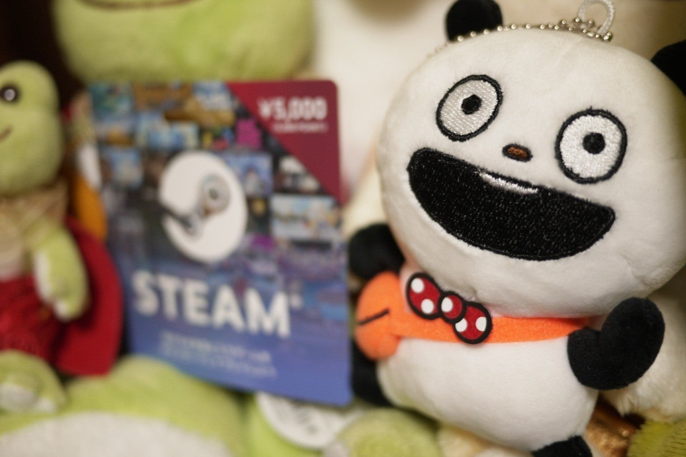

<figure>

</figure>

　自分で書くのも変な話だが、今日は誕生日だった。昨日もオジー・オズボーンの記事に自分の誕生日の話をしれっと忍ばせたりして、そんなに祝ってほしいのかと言えば、もう全然誕生日を喜ぶような歳でもなく、劇的な感情はないわけだが。

　とは言え、最近はSNSの普及に伴って、あちこちで誕生日を祝ってもらえる。そんなつもりはなくても、「誕生日おめでとう」と言ってもらえれば嬉しいわけで、そう言ってくれる人達がいるってことはとてもありがたいことだ。負の側面ばかりが取り沙汰されるSNSだが、いろんな人と知り合えた上に誕生日まで祝ってもらえる。日々の生活をちょっとハッピーにする、素敵な発明じゃないかと思う。みんな、ありがとう。

　ところで、今年も奥さんからプレゼントをもらった。普段僕のツイッターを読んでいる人は覚えているかもしれないが、去年はお菓子と一緒にSteamのギフトカードをもらっている。

[https://twitter.com/keigox68000/status/1098539013202313217](https://twitter.com/keigox68000/status/1098539013202313217)

　今年もその流れで、またまたSteamのギフトカードをもらってしまった。これでまたゲームはライフワークが充実すること間違いなし。嬉しいなあ。

　さらに今年は、『ごきげんぱんだ』というキャラクターのぬいぐるみまでもらってしまった。これは、LINEスタンプやローソンとのコラボで多方面に展開するキャラクター商品だ。その中でも、このぬいぐるみは、上の駅でしか売っていない限定商品。ちょっとレアだ。そうでもないか。

[https://twitter.com/uenolandjp/status/1153513322781663232](https://twitter.com/uenolandjp/status/1153513322781663232)

　いつも上の駅で降りたときに、僕が「うーん、欲しいなあ」という顔でこのキャラクターを眺めていたので、プレゼントしてくれたようだ。

　そんなわけで、SNSでメッセージとともに、ゲームにパンダと、とてもハッピーなバースデーとなったというお話。

　私事で失礼しました。

[https://www.lawson.co.jp/lab/campaign/gokigenpanda\_konezumi/](https://www.lawson.co.jp/lab/campaign/gokigenpanda_konezumi/)
