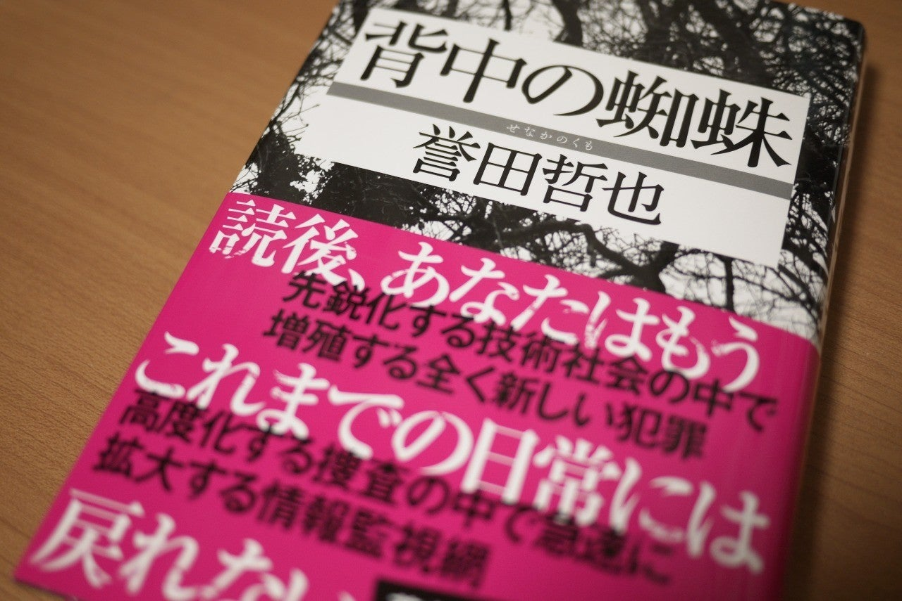

<figure>

</figure>

**※作品の概要について書いています。ネタバレはないですが、要注意で読んでください。**

[https://www.amazon.co.jp/dp/B07YNNFT8X](https://www.amazon.co.jp/dp/B07YNNFT8X)

　ある殺人事件の解決をきっかけに、高度化した情報捜査と、警察の持ち得る権力について大きな問題が提起される警察小説。

　個人が尊重されるというごく当たり前のことが、治安の維持という大義名分の前に蔑ろにされる。それは果たしてあっていいことなのか。警察官だからこそ守らなければならない正義と、そのために一線を超えてしまうことを看過できない正義。それぞれ異なる形の正義が、警察という組織の中で衝突する。その葛藤が読む者に真の正しさというものを問いかける。

　重厚なストーリー展開をベースに、犯人と警察組織の両方を追いかける刑事の執念が緻密な表現で描写される。社会派のテーマを持ちながら、同時にエンターテインメントとしても満足できる作品だ。

　発売日のタイミングで、2019年のミステリランキングに入らなかったことと、惜しくも直木賞を逃したことで、もうひとつ話題に上っていない感のあるこの作品。どこかでスポットライトが当たるべき小説ではないだろうか。
