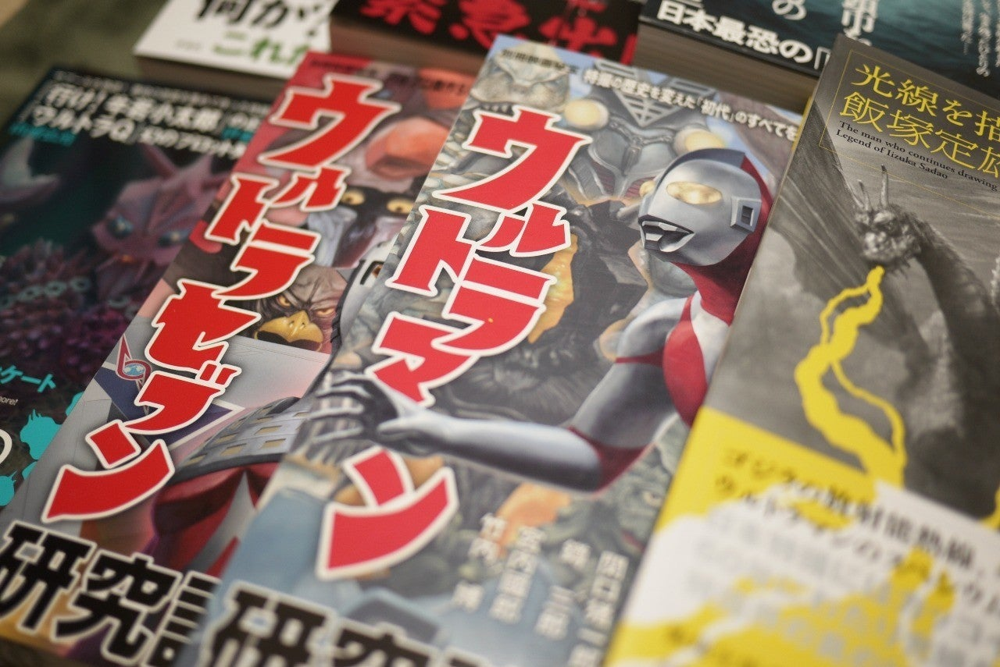

<figure>

</figure>

　先月末、洋泉社が解散した。雑誌**『映画秘宝』**などを発行していた出版社で、親会社である宝島社に合併吸収されたということだ。

[https://twitter.com/tksthiho/status/1223103296740544513](https://twitter.com/tksthiho/status/1223103296740544513)

　**『映画秘宝』**はあまり頻繁に読んでいなかったのだが、洋泉社の発行していた映画関連の書籍はいろいろと読んでいた。特に、**『ゾンビ論』『ジョージ・Ａ・ロメロ』『映画評論・入門！』**など、目を引くラインナップが魅力的だった**『映画秘宝セレクション』**シリーズは楽しく読ませてもらった。

[https://www.amazon.co.jp/dp/4800311381](https://www.amazon.co.jp/dp/4800311381)

　また最近では、**『サスペリア・マガジン』『ブレードランナー究極読本』**など、リメイク映画とその旧作を並べて語るようなムック本を出版していたのもファンとしては嬉しいところだった。**『ブレードランナーの未来世紀』『＜映画の見方＞が分かる本』**など町山智浩の一連の著作は、映画を別の側面から鑑賞する楽しみを啓いてくれた名著だ。

[https://www.amazon.co.jp/dp/4896916603](https://www.amazon.co.jp/dp/4896916603)

　一方で、**『サイコパスの手帖』『サイコパス解剖学』**といった、平山夢明・春日武彦のコンビによる著作も興味深い。サイコパスについて、精神分析と映画の両面からアプローチする、一風変わった研究・対談本で、これも大いに知的探究心を満足させてくれる。少し前には、**『殺しの手帖』**というムックも出版されており、こちらは平山夢明を含む何人かで執筆されている。てか、なんでこんなに殺人に関する本が多いんだよ。

[https://www.amazon.co.jp/dp/4800313627](https://www.amazon.co.jp/dp/4800313627)

　そんな感じで、以前から洋泉社の本にはだいぶお世話になっていたのだが、それでもやっぱり何冊かは書いそびれてしまっていた。そこに、１月末で解散のお知らせ。ネットでは洋泉社の本が軒並みプレミア価格になり、もう手に入らないとあきらめていたのである。

　ところが、今日立ち寄った本屋に洋泉社の本がまだ残っているではないか。ここぞとばかりに、欲しかった何冊かを買ってしまった。

　**『ウルトラマン研究読本』『ウルトラセブン研究読本』**は、その２作について、各話シナリオや撮影のエピソードなど、当時のスタッフやキャストとの対談を含めて多角的に論じた本。**『光線を描き続けてきた男 飯塚定雄』**は、キングギドラの引力光線やスペシウム光線を描いてきた特撮技術者の話。**『死の海』**は、昭和30年に三重県の中河原海岸で起きた、36名溺死事故の真相を探るドキュメント。などなど、多数買ってしまった。また少しずつ読んでいこう。あ、他にも**『特撮秘宝 vol.8』**というムックも購入。これは「特撮の悪役」という特集に惹かれて買ってしまった。

[https://www.amazon.co.jp/dp/480031545X](https://www.amazon.co.jp/dp/480031545X)

　そう言えば、少し前に**『オカルト・クロニクル』**も買っておいた。これは、オカルトの話ではなく、オカルトチックな実在の事件について、その真相を論じた書籍だ。同名サイトの書籍化である。

[https://www.amazon.co.jp/dp/4800315433](https://www.amazon.co.jp/dp/4800315433)

　多くの読み応えある書籍を出版していた洋泉社がなくなってしまったのは非常に残念だ。宝島社と合併したのだから、いつかこれらの本が復刊することを望みつつ、今日も買いすぎた本を読むこととしよう。
