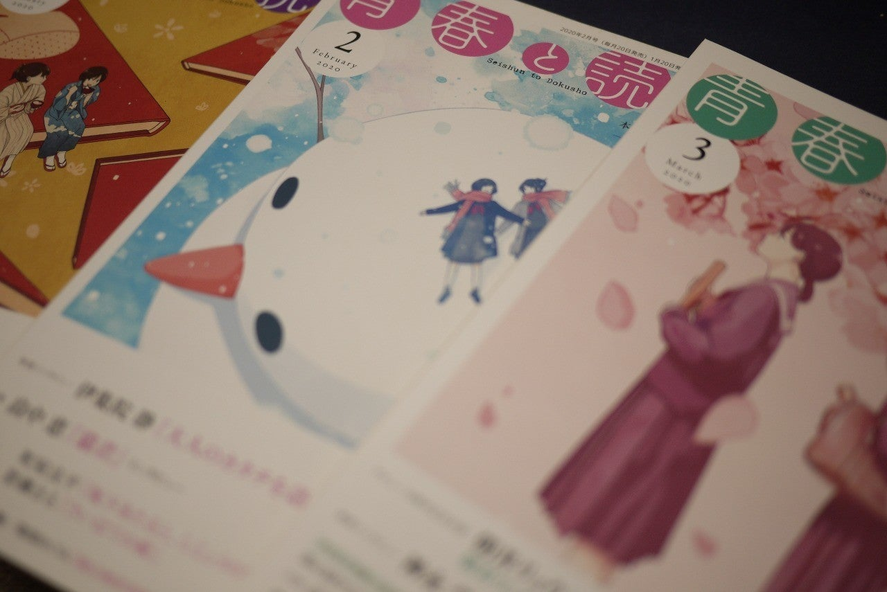

<figure>

</figure>

　**『青春と読書』**である。

　別に、僕の過ぎ去った青春を思い出そうとか、そういう話ではない。『青春と読書』は、集英社の新刊紹介ブックレットのタイトルだ。いや、集英社のサイトによれば、一応雑誌として刊行されているらしい。

[http://seidoku.shueisha.co.jp/](http://seidoku.shueisha.co.jp/)

　書店によっては、無料で置いてあって、ご自由にお持ちくださいという感じなのだが、一応値段がついていて買うこともできる。1冊83円。残念ながら、我が家の近所の書店では配布していないので、ときどき買っている。ところが、買うのも難易度が高い。通販サイトでは見つかることもあるが、発売日を過ぎてしばらくすると、すぐになくなってしまう。バックナンバーもあるのかどうなのかよくわからない。おそらく発行部数も少ないのだろう。

　肝心の中身だが、もちろん集英社の本を紹介する情報誌なので、集英社オンリーの中身なのだが、その分、一般的な読書メディアとは違った視点で本が紹介されていて、そこが楽しい。2020年1月号は佐々木譲**『抵抗都市』**を特集している。昨年末に出たばかりの本で、まだあまり話題になっていない小説だ。3月号は、朝井リョウと石田衣良の対談。10年前、朝井リョウが**『桐島、部活やめるってよ』**で小説すばる新人賞を受賞したときにも同じ2人で対談をしているが、今回はその10周年と銘打ちつつ、**『発注いただきました！』**を紹介しながらの対談。集英社ならではである。

　そんな感じで、少し他の出版社の新刊情報リーフレットとは違った感じ。もっと言えば、ちょっと突っ込んだ感じで新刊紹介をしているのが、この**『青春と読書』**なのだ。

　ちなみに、昨年からは表紙もちょっとかわいらしい感じになり、見た目にも、「情報誌」といった風情である。456さんという方が描かれているらしい。あまりそっちの方面に明るくないので知らなかったが、これなら少し書店に並べても手に取る人がいるんじゃないかな、などと思いつつ今月も読んでいた。また、新しい本への興味が湧いてきそうだ。

[https://twitter.com/456log/status/1225373449834483712](https://twitter.com/456log/status/1225373449834483712)
