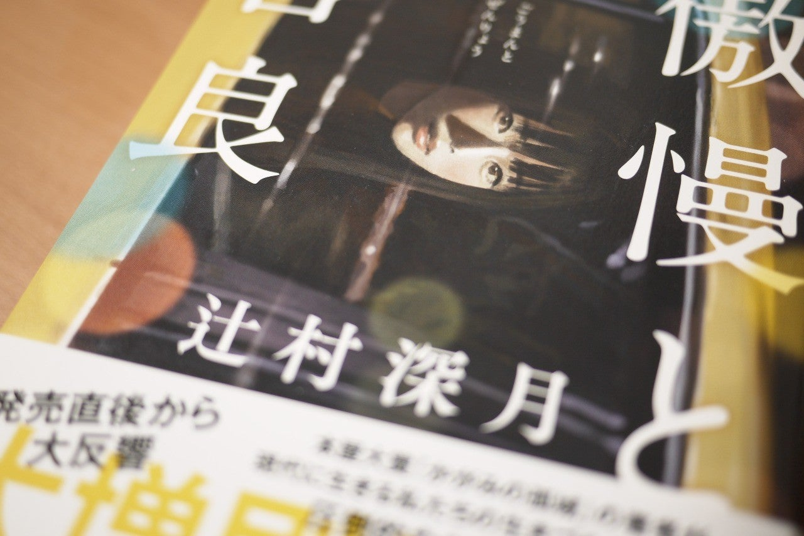

<figure>

</figure>

**※要注意！　ネタバレはないですが、物語のテーマとおおよその展開について触れています。**

[https://www.amazon.co.jp/dp/4022515953](https://www.amazon.co.jp/dp/4022515953)

　ストーカー被害を受けている婚約者が、ある忽然と姿を消す。ミステリ風味で始まる物語は、やがて主人公や、その周囲の人間の結婚観を考える物語に発展していく。

　2018年、**『かがみの孤城』**で本屋大賞を受賞した辻村深月。前作は、子どもにもわかりやすい、生きづらさをテーマにした物語だったが、本作は一転して、ある程度の年令に達した大人の、誰でも一度は考えるであろう「結婚」がテーマの作品になっている。

　主人公の西澤架（かける）は、どちらかと言えばイケメンで仕事にも恵まれている。社会的ステータスは申し分のない30代男性だ。しかし、架自身も自覚する、そのスペックの高さから「いつでも結婚できる」と高をくくっていたことが災いして、周囲の友人たちの中でも浮いたように結婚が遅れてしまう。もちろん架には婚約者もいて、いずれ結婚する気ではいる。しかし、その婚約者が失踪したことで、自分の結婚に対する考え方が周囲の人間、特に女性とは微妙に差があることに気づいていく。ちょっとした行き違い、考え方の違いの機微が丁寧にリアルに書かれていて、それがよく伝わってくる。

　一方で物語は、失踪した婚約者の坂庭真実の結婚感についても言及していく。地方の生まれで、親元で実直に生きてきた真実。一見して、家庭をもつのに向いた、地味な女性（これもひとつの価値観に縛られた結婚感だろう）だが、結婚ということになると、簡単にはいかない。婚活で出会った男性に抱く印象、自分の結婚に対する考え方が、親との生活の中で醸成されたものであり、それがどうしようもなく変えがたいものであることに気づいていく。あまりに頑なな自分の考えに対して、何らかの答えを求めようとする真実の葛藤もまた、人間として、結婚を控えた女性としてリアルな姿なのかもしれない。

　社会の状況が変化し、昔とは結婚に対する考え方も変化している。それは、自分の親の世代とも大きく乖離している場合もある。結婚は、自分と相手だけの問題ではなく、その家族、仕事、ときには地域のコミュニティすら巻き込んで、大きな問題に発展することすらある。そういうものが複雑に絡み合ったとき、我々は結婚というものをどう捉えればよいのか、もし自分がそういう複雑な状況に置かれたら、どう考え行動するのか。思わず考えてしまうストーリーだ。

　この物語の主人公は、決して悪意ある人間ではない。結婚を軽く考えているわけでもない。むしろ、恋人に対する姿勢は真面目そのものである。しかし、同じ結婚という目標に向かって、同じ価値観をもって臨んでいると思っているのが実は幻想で、人によってはそのとらえ方がまったく違っているということに気づかせてくれる作品だ。それは、自分自身にも当てはまるところがあるんじゃないかと、結婚後何年も経っているのに思いを巡らせてはっとさせられた。これから結婚する人にも、すでに結婚している人にも読んでほしい1冊である。
