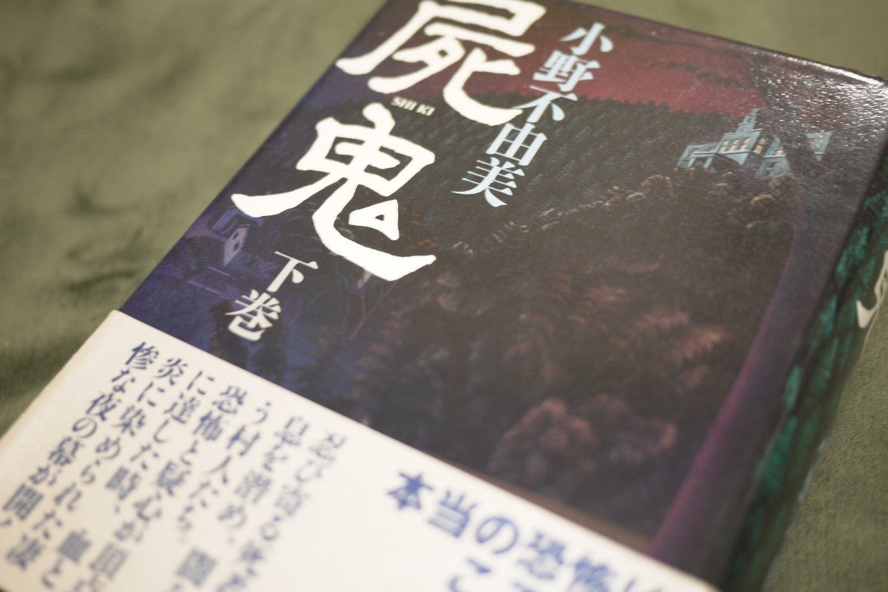

<figure>

</figure>

**※古い作品ですが、ネタバレなしで感想を書いています。ネット書店に記述されている本の紹介文程度の内容については言及しています。**

[https://www.amazon.co.jp/dp/410124023X](https://www.amazon.co.jp/dp/410124023X)

　小野不由美の**『屍鬼』**を読み直している。もうそろそろ終わりなので感想を書こう。

　何しろ、20年以上前の作品で、読んでからかなりの時間が経っているので、いい感じにストーリーを忘れていて、新鮮な感じで読むことができた。

　その昔、最初に**『屍鬼』**を読みながら思ったことは、とにかく長いということである。上巻500ページ、下巻700ページという分厚さ（その後文庫版では5巻に分けて刊行されたが）。本文は2段組という重厚感で、ちょっととっつきにくい印象すらある小説だ。

　文明社会の中にあって孤立していると言ってもいい村を舞台に、村民の不審死をきっかけに幕を開ける事件。のっけからホラーの香り漂う、小野不由美ならではの語り口で、雰囲気は抜群だ。しかし、総計1200ページを超える一大叙事詩だけあって、拙速には話は展開しない。数多くの村人の生活と、その一人ひとりの姿を緻密に描き、それぞれの登場人物の思いを語ることで、大きく動く物語の全容を形作っていく。日々増えていく死者たちに疑問を抱きながらも、それを解決しようとしない、いや、ただならぬ何かが起きているということから目を背けてでも日常を守りたい、保守的な人々の心のありようが、群像劇として積み重ねられる。

　そう、**『屍鬼』**はいわゆるホラー映画然とした怖さを語る物語ではない。それよりも、もっと恐ろしい、閉鎖的な人間関係の中で起きる、変化や異変に対する人間たちの退嬰的な考え、現実を見ようとしない集団の心理。そういうものを語ることで、人としてコミュニティで暮らしていく中に存在する、誰も抗うことのできない社会的な力のようなものの怖さを表現しているのかもしれない。

　突然**『屍鬼』**を読もうと思ったのは、今世間に新型のウイルスが出現し、その蔓延を人々が恐れているのを見て何か思ったからというわけではない。いや、もしかしたら無意識のうちにそんなことも意識していたのかもしれない。ただ、**『屍鬼』**の物語が佳境に入るにつれ、本当に怖いのは超常的な何かではなく、ある特定のコミュニティを形成した人間たちの、どうにも動かしがたい固定観念なのかもしれないという、より大きな枠組みでの恐怖を感じたのは事実である。

　願わくば、我々のリアルな世界がそんな恐怖に支配されないことを切に願い、**『屍鬼』**を読み終えたい。この時期に、この作品を読んだことは、大きな意義があったと感じられる1冊であった。
