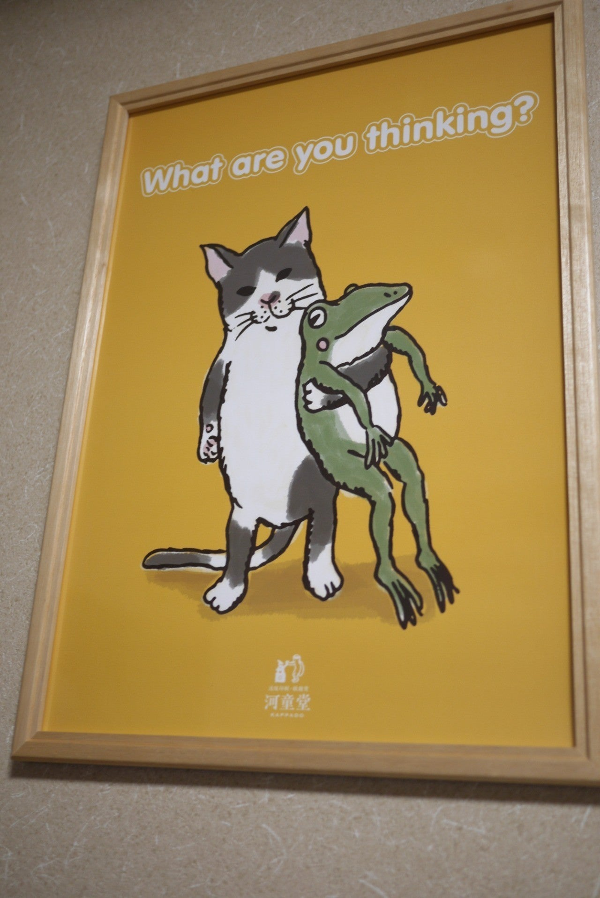

<figure>

</figure>

　河童堂をご存知だろうか。大阪で活版印刷を用いて作った紙雑貨を販売している印刷屋さん（？）だ。

　僕はオンラインショップで、商品を眺めていただけにすぎないが、古風な雰囲気を醸し出す繊細な紙雑貨の数々を見て、その不思議な魅力に一気に魅せられてしまった。

[http://blog.kappado.net/?eid=535](http://blog.kappado.net/?eid=535)

　活版印刷の歴史は古く、もともと中国で発明された印刷方法であると言われている。日本にも、朝鮮半島やヨーロッパなどから活版印刷の技術が伝わり、木版による凸版印刷を経て、やがて活字を使った活版印刷が普及するようになった。現在では印刷物に活字を使うことはなく、デジタル化されたDTPが印刷原版の主流となっているが、技術革新とは別のところで昔ながらの活版印刷を楽しむ向きもある。もちろん活版印刷のコストは高く、今となっては趣味的な意味合いが強い。しかし、圧力によって版をプレスすることで紙に刻まれる活版印刷独特の風合いは、ノスタルジックな味わいとともに、なにか特別な印刷物であることを主張するようなプレミアム感を醸し出してくれる。

　話を戻そう。河童堂では、その活版印刷をつかった数々の商品をラインナップしており、これが実に魅力的なのである。小さなノートやカレンダー、メッセージカードなど、身近なところに置いておくと、それだけで日常が楽しくなりそうなアイテムをそろえているのだが、そのデザインがまた愛らしくていいのだ。ユーモラスなネコやカエルが織りなすコミカルなストーリーが展開する絵柄は、見るものをホッと和ませてくれる。また、最近ではクマやブタ、その他の動物も仲間に加わり、にぎやかな感じでますます楽しくなっている。  

[https://kappado.stores.jp/items/5d2451ca66d86c40e94a8c77](https://kappado.stores.jp/items/5d2451ca66d86c40e94a8c77)

　で、やっと本題。今回、その河童堂でポスターを買ってみた。これは活版印刷ではないのだが、絵柄はこれまでの商品と同じデザインを使用している。カエルが猫に抱えられている、よく意味はわからないが、なんだか楽しい絵柄だ。これを、簡単な額に入れてリビングに飾ってみた。おお、見慣れた部屋が、何とも楽しい空間に大変身である。いや、ちょっと単純かなと思うけど、こういう遊びって大切だなと思った。

　そんなわけで、ちょっと楽しい絵を部屋に飾った話。うちは他の部屋にも絵を飾ってあるけど、それだけでいつもの日常が、潤いのある生活になるのかなと思っている。

　まあ、あまり広くない家なので飾れる数に限りがあるけど。楽しい絵を飾るのはおすすめだ。皆さんも是非。
