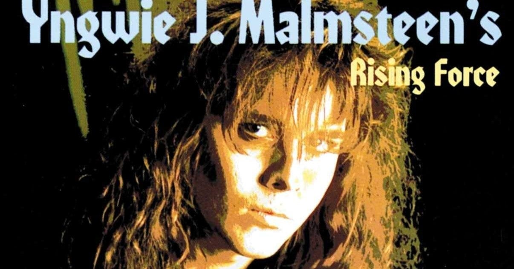

<figure>

</figure>

　もう30年ぐらいヘヴィメタルを聞いている。そのきっかけになったのが、このアルバムだ。ある意味、人生を変えた1枚と言っていい。実に懐かしい。

[https://www.amazon.co.jp/dp/B000001FOS](https://www.amazon.co.jp/dp/B000001FOS)

　当時、レンタルレコード（！）から、そろそろレンタルCDに切り替わった時期で、学生だった僕は、ほぼ毎日新しい音楽を探してCDを借りまくっていた。ジャンルも、アーティストもでたらめに、棚の端からCD借りていくみたいな感じで、本当にいろいろな音楽を聞いた。有り体に言えば暇だったってことだ。

　そんなある日出会ったのが、このアルバムというわけである。それまでに、ヘヴィメタルを聞いたことがないかと言えばそんなことはなく、でも、ヘヴィメタルって言えばアイアン・メイデンとか聖飢魔IIとか、そんな感じ。その程度の認識で聞いてみたら、もう1曲目の**"Rising Force"**から叩きつけるような衝撃を受けた。

　重厚なシンセのハーモニーから始まり、どちらかと言えば、オーソドックスなHM/HR（ヘヴィメタル/ハードロック）なリフとリズムでアップテンポに展開する楽曲。ああ、でも、これはなにか違う。そうだな、歌メロに独特のウェット感がある。決してじめっとはしていないんだけど、ちょっとハスキーなヴォーカルが歌うメロディラインは、ところどころ艷やかな哀愁を見せてくれる。サビにはそれまでに聞いたことのないドラマティックな盛り上がりが現れる。今まで聞いてきた音楽とは全然違う。そして、再び冒頭のリフに戻ってからのギターソロ。今までに経験したことのない流麗でクラシカルなフレーズが、あり得ないほどの高速ギタープレイで奏でられる。これだ！これだよ！俺の求めていた音楽は。

[https://www.youtube.com/watch?v=94Z3ry0tbxo&list=PLNc-FFHqewsOJuDf2mlZGl-1cbbR6QkMb&index=1](https://www.youtube.com/watch?v=94Z3ry0tbxo&list=PLNc-FFHqewsOJuDf2mlZGl-1cbbR6QkMb&index=1)

　もう、この1曲だけで僕の人生は決定的に運命づけられた。30年経っても逃れられない、素晴らしき音楽の呪縛にとらわれた瞬間だ。イングヴェイの数々のアルバムからすると、この『ODYSSEY』は、それほどクラシカルな側面を強調していない。でも、そこが逆にくどくなくていい。ヴォーカルのジョー・リン・ターナーも、ヘヴィメタルにありがちなシルクを切り裂くような極端なハイトーンとは一線を画する、どちらかと言えばブルージーな曲も十分に歌いこなせる色気のある歌声だ。この辺りの絶妙なマッチングが、奇跡的にメジャー感あるサウンドを作り出している。イングヴェイの故郷であるスウェーデンから数多く輩出された、いわゆる北欧メタルのB級臭さ（B級にはB級の魅力があるのだけど）の排除に成功しているのである。

　アルバム全編を通して、北欧ともアメリカンともつかない、その両者のハイブリッドなサウンドが貫かれている。バラードはどこまでも甘く優しく、スピードチューンでは、ヘヴィメタルらしいギラギラとした攻撃性が遺憾なく発揮されている。今でも僕の中のベストアルバムだ。

　個人的には前述の**"Rising Force"**, 3連符を基調としつつギターとキーボードの掛け合いがフラッシーな**"Riot in the Dungeons"**, クラシカルなイントロからブルージーな展開を見せるポップな**"Now is the Time"**, アルバム終盤を引き締めるかのようなスピードナンバー**"Faster than the Speed of Light"**辺りがお気に入りだ。とは言え、全部名曲だ。素晴らしい。

　実を言うと、このアルバムと、もう2枚。合わせて3枚、人生変えたアルバムが存在するのだが、その話はまたいつか。ときどき音楽の話も書くことにしよう。

[https://www.youtube.com/watch?v=lvMwsSF8hz8&list=PLNc-FFHqewsOJuDf2mlZGl-1cbbR6QkMb&index=6](https://www.youtube.com/watch?v=lvMwsSF8hz8&list=PLNc-FFHqewsOJuDf2mlZGl-1cbbR6QkMb&index=6)
