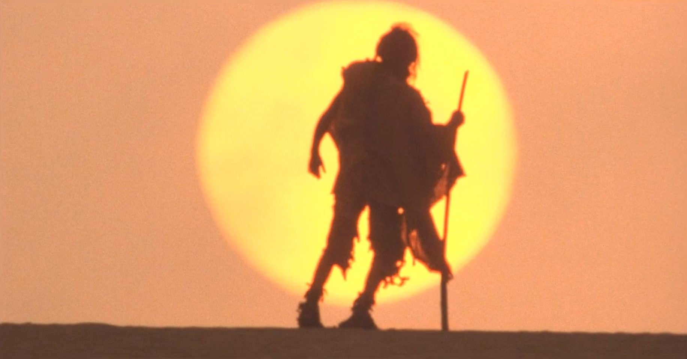

<figure>

</figure>

　小松左京の小説**『復活の日』**が売れているらしい。ただのネット上の噂かな、と思って、Amazonや楽天ブックスを見ると、なるほど売り切れている。他のネット書店にもないようだ。

　**『復活の日』**は、架空のウイルス兵器MM-88の流出によって、世界が滅びてしまった世界で、わずかに生き残った人間たちが、それでも生き続けるための希望を模索するSF作品だ。

　世界中に新型ウイルスが流行するこんな時代だから、現在の状況に酷似したテーマで書かれた作品に触れてみようとする心理は何なのだろうか。言われてみると、自分自身も興味が湧いてくる気持ちはある。**『復活の日』**のみならず、カミュの**『ペスト』**、篠田節子の**『夏の災厄』**など、やはり同じようなパンデミックを描いた作品が話題のようだ。

[https://www.amazon.co.jp/dp/4102114033](https://www.amazon.co.jp/dp/4102114033)

　**『復活の日』**は、1980年に深作欣二監督で映画化されている。昔（多分テレビで）見たときは、大袈裟なパニック映画のような捉え方をしていたが、今の状況で見ると、随所にリアルな描写が見え隠れしているのがわかる。南極基地で生き残った人間がたったの800余名という状況も、当時は、あまりに少なすぎて、いくらなんでも人類死に過ぎだろうと感じたが、その後の人間同士のいがみ合いを、国同士の争いの象徴としてシンプルに表現する方法として理解できる。映画では特に、東京が壊滅しているシーン、国同士の兵器が小競り合いに使われるシーンなどが、SFX映像で表現されていて、やはりヴィジュアル面の強力さを感じて楽しめる。

　話は変わるが、**『復活の日』**のような、パンデミックをテーマにした作品は、まだまだ名作が存在する。個人的には、子供の頃、やっぱりテレビで見た**『アンドロメダ』**が強く記憶に残っている。こちらは狭い範囲で未知の病原体の驚異がうまく表現されていた。それから、ダスティン・ホフマンやモーガン・フリーマンが出演していた**『アウトブレイク』**。アフリカからアメリカに持ち込まれた伝染病を殲滅するために軍隊がその兵装を使用することが驚異となるパニック映画だ。

[https://www.amazon.co.jp/dp/B0142J2PAM](https://www.amazon.co.jp/dp/B0142J2PAM)

　たぶん、我々は未知の脅威にさらされたとき、過去の予言めいた創作に、その解決の糸口を見つけたくなるのかもしれない。あるいは、解決できなくとも、想像の中で自分たちの見えない敵を封じ込めるストーリーを追体験することで、何か安心感を得たいのかもしれない。今我々が直面しているウイルスの脅威と、それに起因する、買い占めや争いなどのあまりにバカバカしいトラブルを見ていると、それも致し方ないことかもしれないと思わされる。

　ついさっきまで、Amazonプライムビデオで、**『復活の日』**を見ていた。不吉な未来を予言するかのような、この映画を見ながら、1日も早くすべてのことが解決することを願ってやまない。

[https://www.amazon.co.jp/dp/B00FIWTBBO](https://www.amazon.co.jp/dp/B00FIWTBBO)
