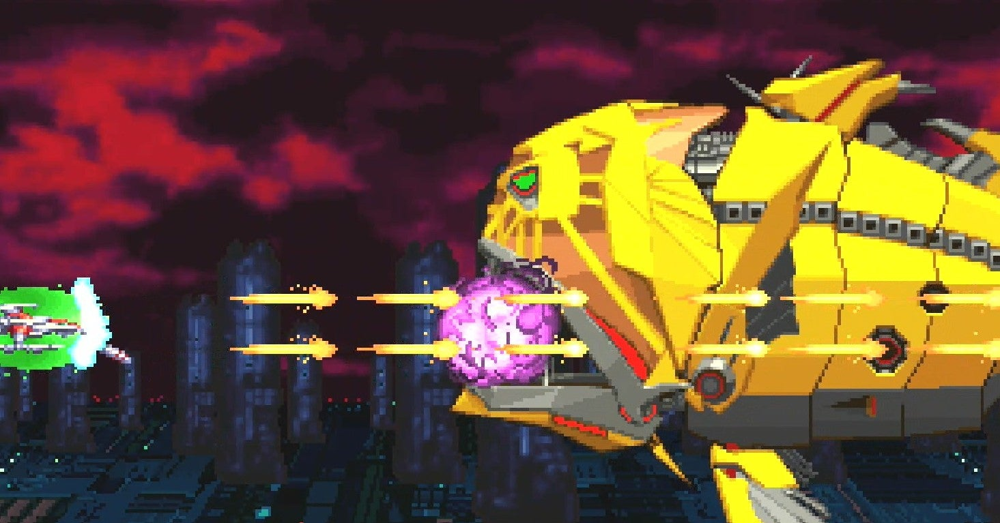
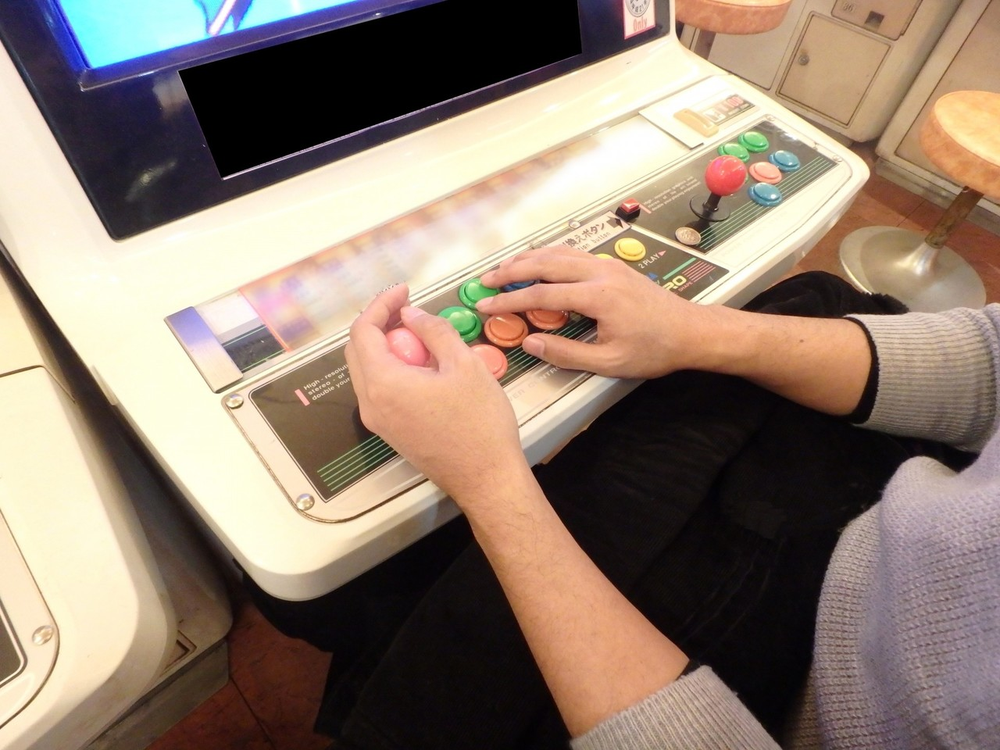

<figure>

</figure>

　プレイステーション4で、**『ダライアスコズミックコレクションAE』**が発売になった。

　これは、昨年ニンテンドースイッチでも発売された、**『ダライアス』『ダライアスII』『ダライアス外伝』**をひとつのパックにしたソフトで、往年の名作シリーズが1本で楽しめるスグレモノのレトロ系ソフトだ。

　ダライアスシリーズファンの僕としても、早速購入したわけだが、実を言えばニンテンドースイッチ版もすでに買って遊んでいる。では、どうしてプレイステーション4版も買ってしまうのか。

　それは、ひとえにプレイ環境の違いからくる満足感の追求である。これは、まったくの私事でしかないのだが、プレイステーション4用のアーケードスティックは持っているのだが、ニンテンドースイッチ用のアーケードスティックは持っていない。もともと、プレイステーション4は、古いアーケードゲームの移植企画である**『アーケードアーカイブス』**を遊ぶつもりで買ったので、それにあわせてアーケードスティックも買っていたのだ。一方、ニンテンドースイッチは、**『スプラトゥーン2』**を遊ぼうと思って本体を買ったので、アーケードスティックは買っていない。そんな単純な理由もあって、ゲームセンターのプレイ感に近いアーケードスティックで遊べるプレイステーション4版を買い直す形で入手したのだ。

　やっぱり、古くからゲーセンに通って、レバーとボタンでゲームを嗜んできた身からすると、アーケードスティックでプレイするダライアスシリーズは最高である。ニンテンドースイッチ版では、イマイチしっくりこなかった魚型戦艦退治も、プレイステーション4では（まったく同じゲームなのに）はかどる、はかどる。氷上ワカサギ釣りと、本マグロ爆釣トローリングぐらいの違いがあるってものだ。

　かように、昔のアーケードゲームを遊ぶのには、当時の環境を再現することも重要視されるのであるが、困ったことに、この環境の再現度は、人によって違いがある。僕は、最低限アーケードスティックが必要だと思っているのだが、それ以上はいらない。しかし、人によっては、ゲーム機に付属のコントローラーで十分という、極めてコストパフォーマンスのいいゲーマーも存在する。その適応力がうらやましい。一方で、アーケードスティックがあっても満足できず、やはり筐体がないと満足できない、本格志向の人もいる。もっと言えば、部屋全体がゲームセンターを再現してないと気が済まない、”おうちゲーセン勢”も最近ではメジャーな存在になりつつある。本当に人それぞれなのだ。

　しかし、そこまで行くとやっかいな問題が出てくる。本来業務用である筐体を導入すると、どうしてもメンテナンスという問題が目の前に立ちはだかる。何しろ古い機械である。30年以上経った今では故障は当たり前。その修理から、100kg以上ある筐体の移動まで、全部自分が責任を持たなければならない（中には、筐体搬入を、神輿を担ぐが如く、祭りのようにイベント化して楽しむマニアの人達もいるらしい）。

　こうなってくると、ゲームをプレイするのも簡単ではない。ゲーム機を買うというのは、ゲーセンの機械を買うことであり、買ってはみたものの修理やメンテをするまでゲームが遊べないということも往々にして起こりうるのだ。じゃあ、仕方ないからニンテンドースイッチで遊んでおいて、メンテナスはそのうちやるか。そんな本末転倒が起こるのも、本格ゲームマニアの間では普通のことらしい。興味があったら、みなさんも本格ゲーム道に入門してみることをおすすめする。

[https://www.youtube.com/watch?v=z3cvDKFciXw](https://www.youtube.com/watch?v=z3cvDKFciXw)
