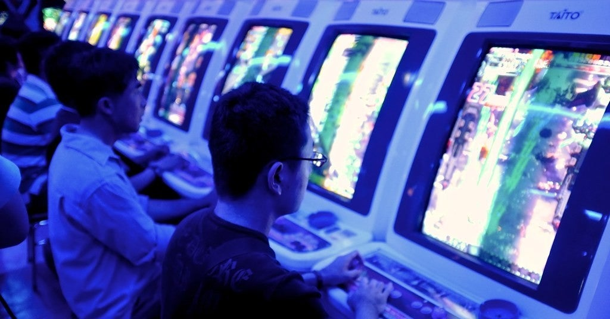

<figure>

</figure>

　アメリカ心理学会（APA）が、「暴力的なビデオゲームと暴力的な行動との因果関係を証明するには科学的証拠が不十分である」と発表したそうである。（詳細はネタ元記事をどうぞ）

[https://www.gamespark.jp/article/2020/03/05/97264.html](https://www.gamespark.jp/article/2020/03/05/97264.html)

　思えば僕たちのゲーム遍歴は、ゲームを悪者視する偏見との戦いであった。古くは**『スペースインベーダー』**の全面禁止令に始まる。当時僕は街の道場に剣道の稽古に通っていたのだが、そこの子どもたち全員に「今日からスペースインベーダー禁止」という傍若無人なお触れが出たのである。まあ、当然のように全然無視して遊んでいたんだけど。ついでに言えば、そういう意味のわからない強制力を発揮しようとする武道全般が今でも嫌いである。

　そして、1984年にゲームセンターに風営法が適用されるようになり、ゲーセンの深夜営業は終わりを告げる。当時、普通の店舗で営業しているゲームセンター以外に、ここ個人宅のガレージだよね？　という場所で営業している怪しげなゲーセンもあったのだが、すべてのゲームセンター営業が警察の管理下に置かれ、そういうアングラなゲーセンは姿を消した。実に残念な出来事である。

　その後成人して、ゲームセンターには自由に出入りできるようになり、また、家庭用ゲーム機の普及によって、家にいながらにしてゲーム遊び放題という素晴らしい時代が到来する。しかし、ここまで来てなお、世間ではゲーム依存による引きこもりがどうした、ゲーム脳がどうだという言説がまことしやかに弄されているのだ。

　一体、人はどれだけゲームをスケープゴートとして魔女狩りを行えば気が済むのだろうか。世の中に何か問題が生じたとき、その原因をゲームに求めようとする動きは未だ止むことがない。しかし、もっともらしい理由をつけて、的はずれな犯人を作って安心しているから、本来の問題は解決しない。ゲームで遊ぶと暴力的になるという、いかにもありそうな話を作り、それでよしとしているから、いつまでも暴力はなくならない。

　そう、世間はゲームによる悪影響を解決したいのではない。もっともらしい理屈を聞いて、わかったような気になりたいだけなのだ。それで偽物の安心感を得て溜飲を下げる。それだけの話しだ。

　そんな、ゲーマーにとって到底納得できかねる、この手のゲーム悪者論に一石を投じるのが冒頭のアメリカ心理学会発表だ。そう、**「暴力は複雑な社会問題であり、研究者、政策立案者、一般の人々の注意を必要とする多くの要因から生じる可能性が高い」**のである。もしも、ゲームをすることで人間が暴力的になるとすれば、僕などは、家の前の通行人をチェーンソーで襲った挙げ句、フックに吊るして最後は高笑いするような人間に成長してしまっていてもおかしくない。だけど、そんな人は一人もいない。そんなデータはどこにも存在しないのだ。

　この記事には、**「ビデオゲームの暴力への影響は科学的に信頼できるものではなく、暴力の歴史など他の要因から注意をそらすことになる」**とも書かれている。まさにその通り。嘘の理論を盲信するから、本来の問題が解決しない。そろそろ人は賢くなるべきではないだろうか。

　ところで、最近僕はゲームで遊ぶことによって、富に集中力がアップしたことを自覚している。休日なんか、起きてから寝るまでゲームしていても大丈夫だ。ゲームをすると、集中力が高まるって研究データを誰かに発表してもらいたいものである。

[https://www.amazon.co.jp/dp/4140880368](https://www.amazon.co.jp/dp/4140880368)
