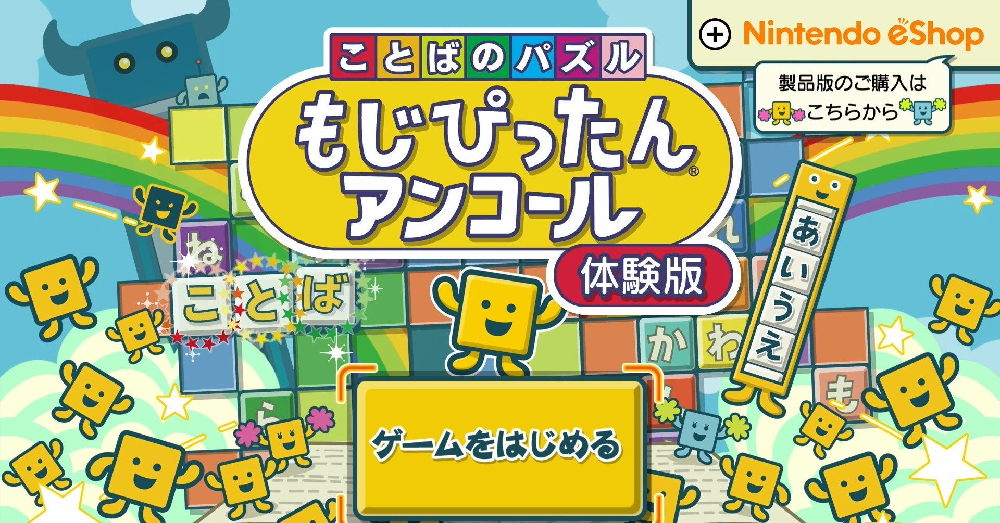
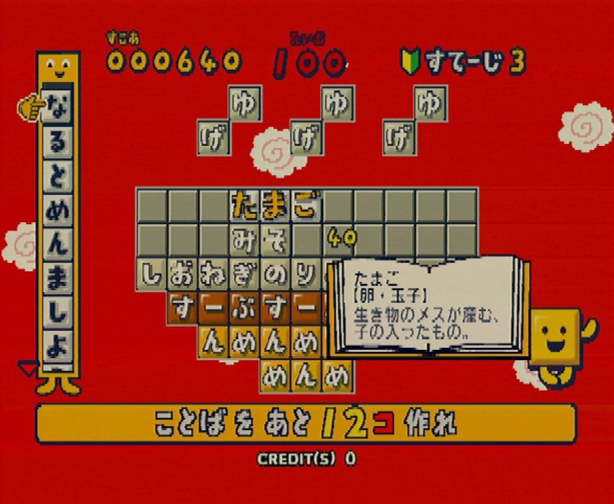
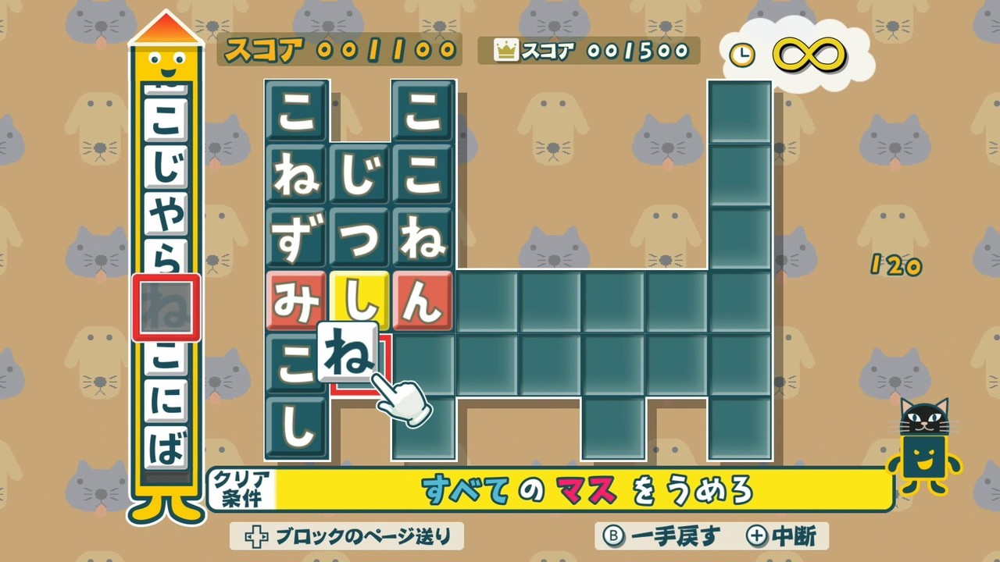
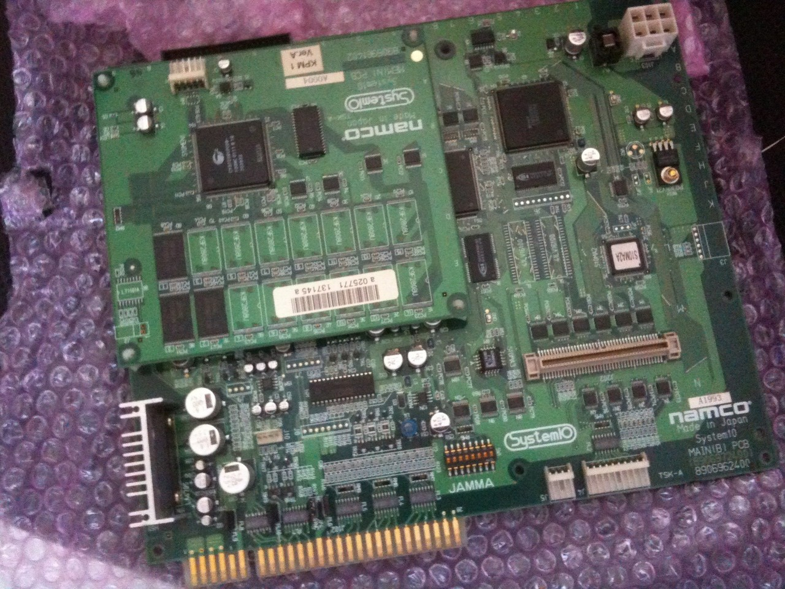

<figure>

</figure>

　ニンテンドースイッチで**『ことばのパズルもじぴったんアンコール』**が発売になる。

　**『ことばのパズルもじぴったん』**は、もともとアーケードゲームとして、2001年にナムコがリリースしたパズルゲームだ。画面上にならんだマス目に文字をはめ込んでいき、言葉を作ることでステージをクリアしていく、単純ながら奥が深いゲームで、そのご家庭用に続々と移植されている。

　**『ことばのパズルもじぴったん』**を攻略する上でもっとも必要とされるのは、なんと言ってもプレイヤーの語彙力である。パズルゲームと銘打ってはいるものの、ひらがなのパネルを置くことに難しいルールはない。とにかく、並べたときに言葉ができればいいのだ。ただし、ステージによっては、限られたマス目で多くの言葉を作る必要があり、マス目を縦横両方に使ったり、例えば「ナムコ」「むこ（婿）」のように、一つの列に複数の単語を含めるようにしたりして、効率よく言葉を作らなければならない。時間制限があるため、瞬時に多くの言葉を思いつく語彙力と発想力が勝負の、ユニークなパズルゲームだ。

　**『ことばのパズルもじぴったん』**では、ゲーム内に膨大な辞書を持っていて、これをもとに、作ったひらがなの羅列が言葉になっているかを判断する。ちなみに、家庭用移植の製品紹介によれば、PS2版で7万6500語以上。DS版では、なんと10万語以上の言葉を収録しているとある。三省堂の**『新明解国語辞典』**の項目数が7万7500だから、その辞書の巨大さがわかる。

　ところで、**『ことばのパズルもじぴったん』**の魅力は、驚異的な単語数による「こんな言葉もOKなんだ！」というサプライズ体験だけではない。後に**中田ヤスタカ**によるアレンジも話題になった**”ふたりのもじぴったん”**をはじめ、ポップでキャッチーな楽曲群もゲームに華を添えている。後に、**『アイドルマスター』**シリーズやアニメ畑でも数々の名曲を生み出すことになる、**神前暁**のペンによる印象的な楽曲は、その後も20年にわたって**『ことばのパズルもじぴったん』**の看板BGMとなっている。合わせて、画面内を所狭しと跳ね回る「もじくん」のキャラクターなど、映像面もキュートでかわいらしい。

　そんな一大人気シリーズに成長した**『ことばのパズルもじぴったん』**が、**『ことばのパズルもじぴったんアンコール』**となって、ニンテンドースイッチ用に発売されたというのが、今回の本題。ゲーム自体は、Wiiでリリースされていた**『ことばのパズルもじぴったんWiiデラックス』**がベースになっている。確かにWii版で見たステージがあったり、ステージセレクトの画面構成も似たりしている。それでいて、操作性が改善され、解像度もアップしているのが嬉しいところだ。

　実を言うと、**『ことばのパズルもじぴったん』**は、かつて基板を買ってしまったぐらい好きなので、今回も遊んでみることにしたい。

　さあ、かわいらしい見た目とは裏腹に、800ステージを誇る大ボリューム、やりごたえ十分の言葉遊びが待っているぞ。

[https://www.youtube.com/watch?v=UBv0IL-BOnA](https://www.youtube.com/watch?v=UBv0IL-BOnA)

[https://www.amazon.co.jp/dp/B084B5SYK9](https://www.amazon.co.jp/dp/B084B5SYK9)
