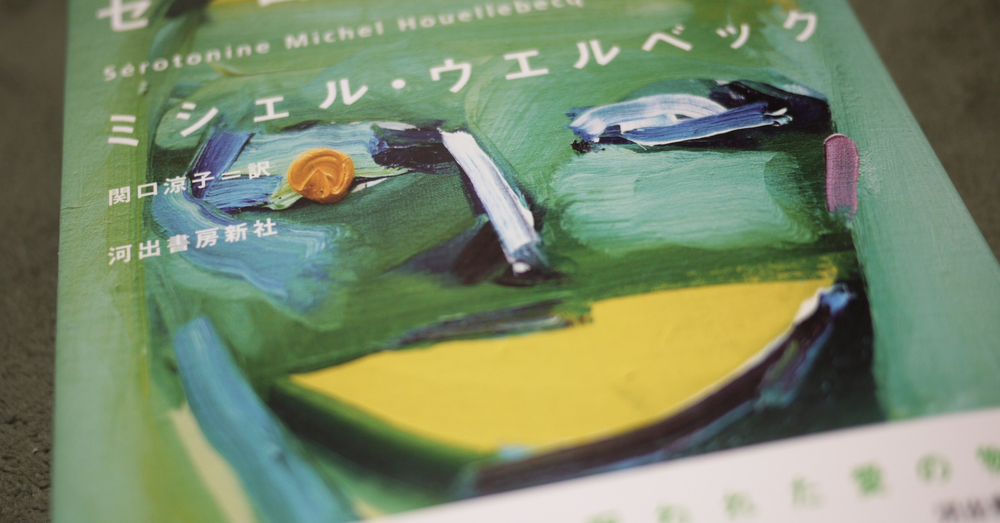

<figure>

</figure>

**※主人公の心のありようについて言及しています。未読の人は注意！**

　ミシェル・ウエルベックは、フランスの作家。たまたま以前読んだ**『H・P・ラヴクラフト-世界と人生に抗って』**という本の作者だったので興味を持った。しかし、本作は外なる神も、這い寄る混沌も関係ない。もっと、現実的で、グローバリズムにまみれた世の中を批判しながら語られる、厭世的な中年（青年？46歳だぞ）男性フロランの物語だ。

　フロランは、農業調査員という仕事をしつつ、親の遺産で優雅に暮らしている一見して羨ましいような境遇の男だ。結婚こそしていないが、パートナーの日本人女性がいて、この女性には（色々訳ありで）嫌気が差している。贅沢な悩みで、しかも本人のちょっとした努力でなんとかなりそうなことなのに、フロランはそこに注力しない。過去に付き合った何人もの女性との日々をひたすら思い起こし、そこに逃避することで、目の前の悩みから目をそらすだけだ。

　いつも厭世的で、抗うつ剤の副作用で性的に不能に陥っているフロランにとって、人生で一番のテーマは、女性と正常にセックスを行えるかどうかという一点に集中してしまっているのかもしれない。自国の農業が、グローバリズムの波に飲み込まれ、立ち行かなくなっている、政治的経済的に大変な局面を迎えようとも、そんなことは問題ではない。農業調査は自分の仕事としてそつなくこなそうとも、いつでも心の中には、セックスのことしかないのだ。しかし、薬のせいで現在のフロランはセックスをすることができない。だから、セックスを渇望し、過去の女性との経験ばかりを思い出す日々を送っている。その様子は、どこまでも抑うつ的であり、どんよりとした暗い感情と、世の中を前向きに捉えられないフロランの心理状態がどこまでも続いていく。

　やがてフロランは、目の前のあらゆることから逃げ出す。逃げ出して、過去の（彼がセックスに対して自由であった頃の）友人や恋人のもとを、何かを取り戻そうとするかのように訪れる。しかし、友人や元恋人は、みんな現実の中に生きている。その前にあって、フロランの悩みは、彼だけのごくパーソナルな悩みでしかない。もちろん、過去の自由と愛（≒セックス）を取り戻そうとするフロランの思いは成就しない。そもそも普通の生活を送るために抗うつ剤が必須となっているフロランに、セックスで過去の自分を取り戻すという選択肢はない。永遠のパラドクスに苛まれながら生きる一人の男の姿がそこにはあるだけだ。

　ところで、作中でフロランが美しいと評する音楽が、**ディープ・パープル**と**ピンク・フロイド**だ。それぞれ、**”チャイルド・イン・タイム”**とアルバム**『ウマグマ』**に収録され**た”グランチェスターの牧場”**が引き合いに出されている。この、自由主義の台頭で揺れる世界より、自分のセックスが大きな問題である男が夢想するにはふさわしい音楽かもしれない。

[https://www.amazon.co.jp/dp/4309207812](https://www.amazon.co.jp/dp/4309207812)
