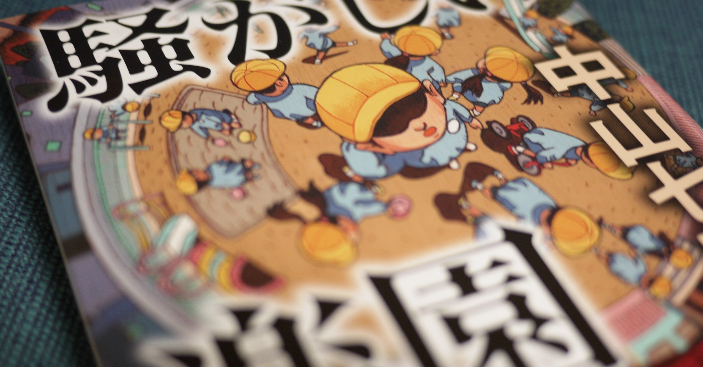

<figure>

</figure>

※ネタバレはないですが、物語の展開について簡単に触れます

　先日noteにも書いた、12ヶ月連続刊行の第一弾。主人公は、本作と同じく幼稚園を舞台とした**『闘う君の唄を』**に登場していた神尾舞子。彼女は、**『おやすみラフマニノフ』**にも登場している。作者のお気に入りキャラクターかもしれない。

　物語は、幼稚園ならではのトラブル、例えばクレーマーや、地域住民とのいざこざ、そういうものを相手に奮闘する舞子の姿を中心に展開していく。うーん、どちらかと言えばそれほど深刻ではないストーリー。軽いタッチで描かれる神尾舞子の日常は決して平穏ではないものの、むしろユーモアを混じえて、たくましくも微笑ましいものとして語られていく。

　しかし、中盤を過ぎた辺りから、あるできごとをきっかけに不穏な空気が流れ始める。そう、心配しなくとも、これはいつもの中山七里の小説だ。きちんと（？）事件が起きて、警察も登場する。

　どちらかと言えば中編の小説で、事件が起きるまでの展開もゆっくりとしているため、もしかすると、読み応えという点では、過去の長編小説に一歩譲るところがあるかもしれない。

　僕は、ミステリにおいて、犯人当てをする必要はないし、犯人がわかってもわからなくても、それは作品の出来不出来とは無関係と思っている。しかし、本作はプロットが単純である分、ラストに辿り着く前に、犯人の目星がつく人が多いのかもしれない。

　そんなことも合わせて考えつつ、毎月刊行というのは、こういう作風になるということなのかな、とも思っている。

　なんだか、満足していないかのような感想を書いてしまったが、いや、そんなことはない。ときにはこういう軽めの（とは言え、事件は起きるのだけど）中山作品を読んでみるのもいいかもしれない。

　さて、それでは気を取り直して、第二弾の**『帝都地下迷宮』**に取り掛かるとしよう。
