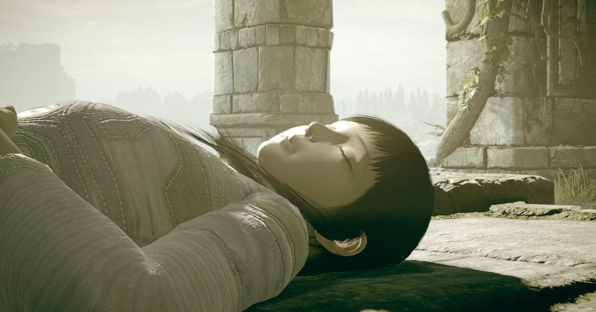

<figure>

</figure>

　プレイステーション4は、Playstation Plusという有料サービスに加入することで、オンライン対戦に参加できる。さらにこのサービスに加入していると、毎月何本かのゲームが、無料で遊べる。

　今月の無料ゲームは、2005年にプレイステーション2用ソフトとして発売され、その映像の美しさと独自の世界観で話題になった**『ワンダと巨像』**だ。僕は、この**『ワンダと巨像』**が大好きで、プレイステーション2でも何回かクリアしたし、その後プレイステーション3に移植された際にも遊んでいる。プレイステーション4版も発売されたときに気になっていたのだが、さすがに何回もクリアしているので、そのうち買おうかなぐらいに思っていたら、今回無料で配信されたのである。そんなわけで、早速ダウンロードして遊んでいる。ちなみに、このプレイステーション4用の**『ワンダと巨像』**は、過去の同作品のグラフィックを強化したもので、2018年に発売されている。

[https://www.amazon.co.jp/dp/B07NHQRBJ5](https://www.amazon.co.jp/dp/B07NHQRBJ5)

　**『ワンダと巨像』**はアクションゲームだ。ワンダという主人公の青年が、すでに命を失っている少女の魂を呼び戻すため、謎の声に導かれて巨像を倒すことが目的だ。ワンダは、巨大な敵の体を素手でつかみ、その体によじ登ることで、手にした剣をその弱点に突き立て、巨像を倒していく。

　この、巨像によじ登るというところが**『ワンダと巨像』**独自のゲームデザインである。プレイヤーはワンダの握力メーターを管理しながら、うまく巨体にのぼり、弱点部分までたどり着く必要がある。巨像のてっぺんまで登ったときの高所からの眺望と、そこで巨像が身を震わせてワンダを振り落とそうとする動きのダイナミックさは、このゲームならではの見どころで、実に圧巻である。

　**『ワンダと巨像』**は、ゲームデザインを担当した上田文人の作家性のようなものが色濃く反映されたゲームである。それがこの作品最大の特徴と言っていいのかもしれない。彼のデザインした前作**『ICO』**も共通する特徴を持っていた。どこかにありそうで、どこにもなかった、廃墟然とした古城と、そこに存在する魔法のような存在たち。ゲーム内では説明的な表現を一切オミットし、最低限のビジュアルで表現される世界は、僕たちにどこか郷愁を感じさせながら、それまでに味わったことのない幻想的な体験をさせてくれる。

　前作**『ICO』**では、主人公の少年が、謎の少女イコの手をしっかりと握って、ともに行動するというアクションが設定されていた。今作のワンダは、自分の手で巨像の体をしっかりと握って、高い場所へとよじ登っていく。一見して別のゲームに見える（実際、ゲームシステムとしてはまったく違っているのだが）2作であるが、何かを「しっかりと掴む」という点で、プレイヤーは共通した感覚を味わうに違いない。

　僕は以前、「ゲームの身体性」ということについて述べたことがあるが、巨像から落ちないようにコントローラーのボタンを押す指にぐっと力が入ってしまう様は、まさにこのゲームの身体性を実現したゲームデザインであると言える。ボタンを握ることに、それほどの握力は必要ないのだが、ゲーム内でワンダが、巨像に振り落とされんとする様子を見ながらボタンを押すことで、ついついその指に力が入ってしまうという仕掛けである。これが、実に見事にこのゲームの肝を表現しているのだ。それ故に、ついつい熱中して遊んでしまう。自分の脳内における、ゲーム中キャラクターの動きの解釈と、コントローラーによる操作が見事なマッチングを見せる秀逸なゲームデザインである。だからこそ僕は、**『ワンダと巨像』**を何回も遊ぶに至ったのであろう。

[https://note.com/keigox68000/n/n2865fd01ac6a](https://note.com/keigox68000/n/n2865fd01ac6a)

　さて、デザイナーの上田文人は、この**『ワンダと巨像』**の後、待望の**『人喰いの大鷲トリコ』**をプレイステーション4で発表することになるのだが、なんと**『ワンダと巨像』**から11年の時を経ての完成となっている。こちらも時間をかけただけあって素晴らしいゲームであったが、その話はまたの機会にしよう。

[https://www.amazon.co.jp/dp/B0772QGLKZ](https://www.amazon.co.jp/dp/B0772QGLKZ)
