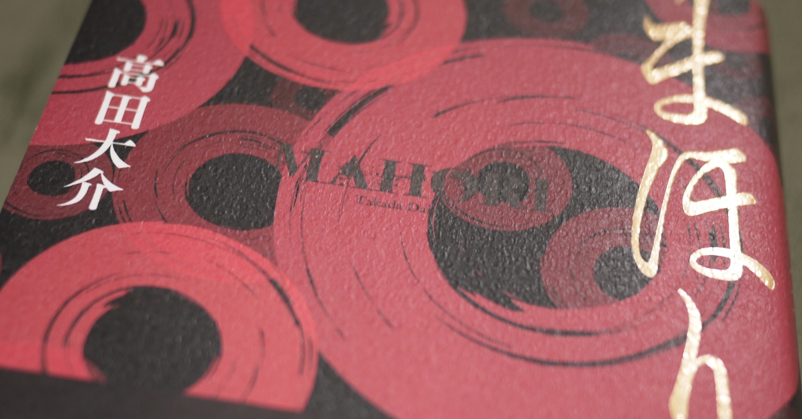

<figure>

</figure>

**※ネタバレなしです**

　**『図書館の魔女』**シリーズの高田大介による、民俗学ミステリ**『まほり』**。赤い円が無数に配されたシンプルながら魅惑的な装丁で、「これは何か来てるんじゃないの？」という予感がして手にとった1冊だ。

　社会学を専攻する大学院生の主人公は、上州のとある村で、いたる所に貼られている二重丸、「蛇の目紋」と、それにまつわる都市伝説に興味を持つ。なるほど、表紙の不気味な円は、この蛇の目紋のことか。

　土着的な因習をテーマにしたホラーやミステリには、どことなく惹きつけられる魅力がある。日本のどこにでもある、近代技術が十分に浸透しなかった地方の閑村。しかし、村である以上、そんな寂れた場所にもコミュニティがあり、そして土地なりの風習や伝承が存在する。ときには、現代社会の視点からすると奇妙に映る習慣もあり、古くからの因習を捨て去ってしまった我々には、その意味が理解できない故の畏怖や恐怖が存在する。

　この『まほり』は、そんな民俗学の持つ存在感、イメージを存分に生かして語られる、重厚なミステリ小説だ。

　物語は、誰でも聞いたことがある噂話、現代における民間伝承の調査から始まり、やがて本題の蛇の目紋へたどり着く。その調査が、大学院生の視点で描かれるということで、逐一過去の文献、古文書を引用し、それを紐解くことで書き進められていく。実在の古文書写真すら引き合いに出してくる、その緻密な語り口は、この話の細部にまでリアリティを与えてくれる。

　やがて、「まほり」という言葉の意味と、古くから伝わる因習の真相に行き当たったとき、衝撃の真相が明るみに出てくるわけだが、それはぜひ読んで体験してほしい。

　本作の、ある意味常軌を逸したほど古文書の解読に重きを置いた構成は、ややもすると読む者を遠ざける難解さを作り出してしまっているかもしれない。しかしそこには、創作と史実の境目を曖昧にし、読む者に「これは本当にあった話ではないのか」と錯覚させる迫力がある。それでいて、全体を支配する、どこかホラーめいた雰囲気も読んでいて楽しい。民俗学を読み解くアカデミックな好奇心と、心の奥にある原初の恐怖を揺さぶるエンタテインメントな部分が、見事に融合した一作だ。個人的には、昨年のベストミステリに推せるぐらいには気に入った。

[https://www.amazon.co.jp/dp/4041085594](https://www.amazon.co.jp/dp/4041085594)
