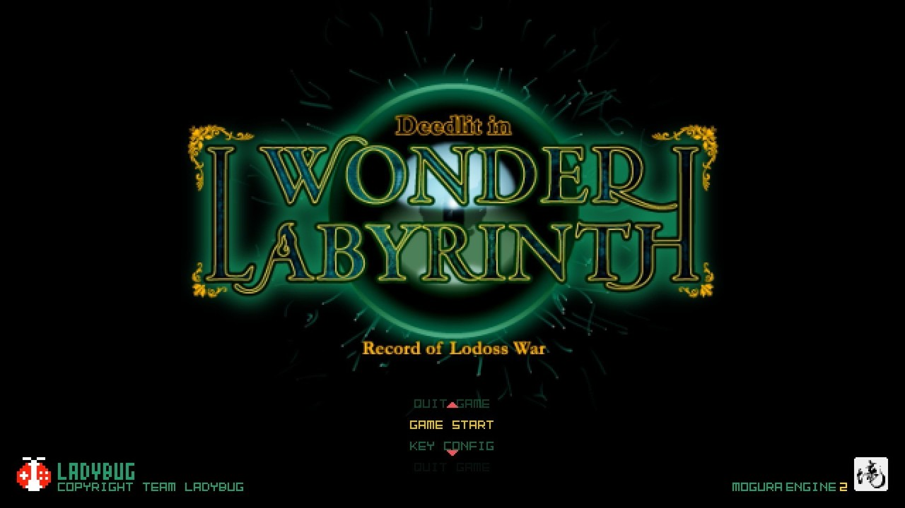
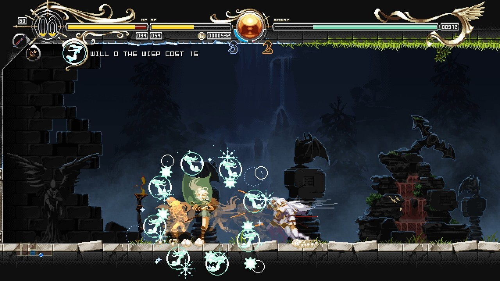

<figure>

</figure>

　Steamで、突如**『ロードス島戦記』**を題材にしたアクションゲームがリリースされた。と言っても、早期アクセスバージョンで、まだゲームの序盤が遊べるだけである。

　**『ロードス島戦記』**は、1988年発表の、水野良によるファンタジー小説だ。当時、ファンタジー小説やRPGが流行していた世相に後押しされるかのように、その後パソコンやコンシューマ向けにゲーム化されたり、アニメも作られたりして、結構な人気作品だったようである。

[https://www.amazon.co.jp/dp/B07VQR87DP](https://www.amazon.co.jp/dp/B07VQR87DP)

　そうは言っても、30年以上前の作品だ。今回、新作ゲームがリリースされるのは驚いた。しかも、原作本編に登場する、エルフのディードリットが主役のアクションゲームである。なんともマニアックな香り漂う一作ではないか。

　前述した通り、**『ロードス島戦記』**が人気を博した当時、世の中はファンタジーをテーマにした小説やゲームが大流行していた。個人的には**『指輪物語』**が話題になり、**『ウィザードリィ』**が国産のパソコンでも遊べるようになった辺りからの潮流なのかと考えているが、本当のところは何が発端なのかよくわからない。しかし、**『指輪物語』**などの本格的ファンタジーと比較すると、**『ロードス島戦記』**は、今で言うライトノベルにあたる立ち位置の小説で、平易でわかりやすいが故に、ライト層にリーチする大ヒット作になったのではないだろうか。その後のメディアミックス的展開も、それを証明しているように思える。

　さて、今このタイミングで登場してきた、**『ロードス島戦記』**を扱った本作。ゲームシステムは、いわゆるメトロイドヴァニアだ。広大なマップ内を移動し、様々な力を手に入れて、マップ内の行けなかった場所を踏破しつつ探索するアクションゲームである。映像は由緒正しいドット絵で描かれ、豊富なキャラクタパターンで、実に美しくアニメーションする。これを見ただけで、この手のレガシーなグラフィックが好きなゲーマーには強く訴求するものがあるだろうことは想像に難くない。

　ゲームを開発したのは、ゲーム開発チームLady Bugで、やはりSteamで**『Touhou Luna Nights』**という、東方二次創作のメトロイドヴァニアをリリース済みだ。こちらも、美麗なドット絵が、表情豊かにアニメーションする丁寧な作りのアクションゲームで、僕も以前から気になっていた作品である。

[https://store.steampowered.com/app/851100/Touhou\_Luna\_Nights/](https://store.steampowered.com/app/851100/Touhou_Luna_Nights/)

　**『ロードス島戦記ーディードリット・イン・ワンダーラビリンスー』**は、特にアクション面に凝っていて、ゲーム中に見つけた精霊を切り替えて装備（？）することで、同じ属性の攻撃や障害物を避けることが可能となる。これがアクションの肝となっていて、特にボス戦では、状況に応じた素早い精霊切り替えが必要になる。ボスが大量に発射する弾幕のごとき攻撃を、属性切り替えで次々とくぐり抜けていく様は、まるでシューティングゲームの**『斑鳩』**を見ているようである。

　まだ、早期アクセスということで、現在はステージ1が遊べるだけであるが、堅実な作りのゲームで、1時間程度のプレイ時間を楽しく過ごすことができた。正式な製品版となった際には、価格もアップするだろうことを見越して、早期アクセスのうちに入手するのもありだろう。ディードリット萌えとかあるのかよくわからないが、純粋にゲーム好きな人にもおすすめできるゲームになりそうな作品である。

[https://www.youtube.com/watch?v=0Vcss1LD8hc](https://www.youtube.com/watch?v=0Vcss1LD8hc)

[https://store.steampowered.com/app/1203630/\_/](https://store.steampowered.com/app/1203630/_/)
