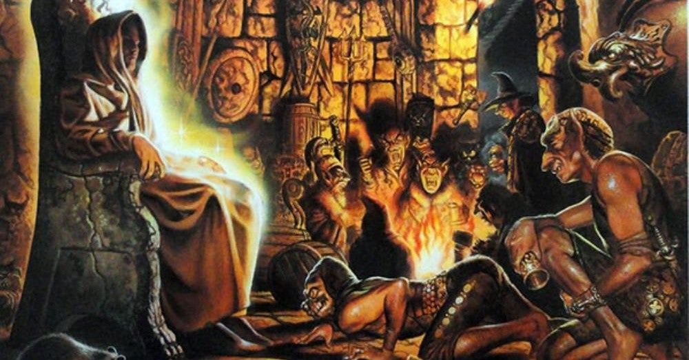

<figure>

</figure>

　ドイツの老舗バンド**BLIND GUARDIAN**の昔懐かしいアルバムを聞いていた。1990年発表の3rdアルバムだ。

[https://www.amazon.co.jp/dp/B0758CGTJQ](https://www.amazon.co.jp/dp/B0758CGTJQ)

　1988年にデビューし、今もコンスタントにアルバムをリリースしている**BLIND GUARDIAN**。現在の彼らは、非常にドラマティックで大仰、コーラスと分厚いギターサウンドでファンタジックな世界観を全面に押し出した楽曲をエピカルに演奏する、ジャーマンメタルを代表するバンドである。

[https://www.youtube.com/watch?v=e0Fv0NDghgI&list=PLRDvZ8cSGZI02lbJI6pF9-8FGCrzeVUnu](https://www.youtube.com/watch?v=e0Fv0NDghgI&list=PLRDvZ8cSGZI02lbJI6pF9-8FGCrzeVUnu)

　昨年には、**BLIND GUARDIAN TWILIGHT ORCHESTRA**名義で、**『LEGACY OF THE DARK LANDS』**なるオーケストラルなアルバムもリリース。**FILMharmonic Orchestra Prague**を起用し、壮大な交響叙事詩を聞かせてくれた。（ただし、こちらはバンドサウンドではなく、ヘヴィメタルの範疇も超越している）

[https://www.youtube.com/watch?v=WIP3tbE-gXA](https://www.youtube.com/watch?v=WIP3tbE-gXA)

　そんな、ドイツの大御所バンドである彼らにも若き日があった。初期の**BLIND GUARDIAN**はもっとスラッシュメタル寄りのエッジの効いたギターでスピードメタルを演奏するバンドだ。荒削りなディストーションサウンドの中にも、ジャーマンならではの流麗なメロディを持つ、原石の輝きのような新人バンドだったのだ。

　デビューアルバムからずっと聞いている彼らの音楽を振り返ってみると、3rdアルバム**『TALES FROM THE TWILIGHT WORLD』**が、スラッシーな攻撃性と、叙情性あふれる豊かなメロディセンスが見事に融合した瞬間であったように思う。今でも、この3rdアルバムが僕のフェイバリットだ。

　特に、**カイ・ハンセン**（ex.**HELLOWEEN**）がゲストヴォーカルとして参加している**"Lost in the Twilight Hall"**と、扇情的で劇的な展開を見せるスピードメタル**"The Last Candle"**の2曲は、このアルバムの核となって、**BLIND GUARDIAN**の揺るぎないスタイルを構築している。

[https://www.youtube.com/watch?v=-roJi6wR\_9Q](https://www.youtube.com/watch?v=-roJi6wR_9Q)

　この3rdアルバムで楽曲のスタイルに幅が出て、ソングライティングにも余裕が生まれたのか、続く4thアルバム**『SOMEWHERE FAR BEYOND』**では、彼らの出自を明らかにしたかにょうに、**QUEEN**のカヴァーである**"Spread Your Wings"**を披露している。なるほど、言われてみれば**ブラガ**サウンドの要である厚みのあるコーラスは**QUEEN**的なのかもしれない。そして、この辺りから見られるようになってきたサウンド的な幅の広さが、その後の**BLIND GUARDIAN**を、よりビッグなバンドへと押し上げることになる。

 　現在の**BLIND GUARDIAN**は、初期よりももっとミドルテンポの楽曲にこだわり、その中で、これまで徹底して追求してきたファンタジーの世界、我々の住む世界とは別の世界をテーマにした音楽を創造している。

　その初期には、ともすると**HELLOWEEN**フォロワー的なスピードメタルでカテゴライズされていた彼らだが、今や明らかに彼らにしか作ることのできない唯一無二のヘヴィメタルを聴かせてくれる。その成長ぶりは目を見張るものがあるし、昔からのファンにとってはもちろん嬉しい限りである。しかし、未だに初期のアルバムのエネルギッシュなサウンドが忘れられず、今でもこうして、時々引っ張り出しては聞いてしまう、僕の愛する音楽なのである。

[https://www.youtube.com/watch?v=dX3NXxTBXWc](https://www.youtube.com/watch?v=dX3NXxTBXWc)
