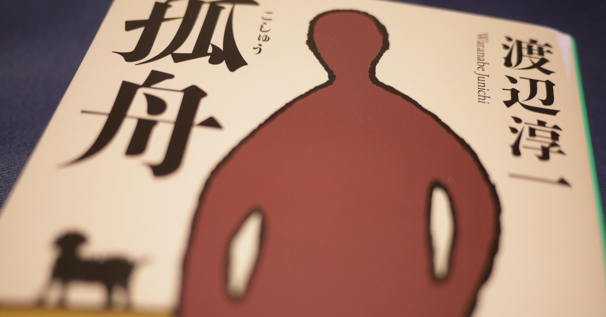

<figure>

</figure>

　孤舟とは、ただ一隻だけ孤独に浮かんでいる船のことだ。この小説は、定年退職し、悠々自適の生活を送ろうとしている男性が、仕事ほどには思うようにいかない老後に悩みあがきながら、孤舟のような寂しさを感じる物語である。普段あまり読まない感じの小説だが、実は2018年のナツイチフェアにラインナップされていたときに買ってみた。

　今読むと時代なりの古さと言うか、10年前の作品なので、そこまで古いわけではないのだけど、社会の雰囲気とか、老後に対する考え方とか、微妙に現在とは違うなあと感じるところがあって、それもまあ一興で読んでみた。

　仕事ではエリート街道を歩んできて、大手広告代理店で執行役員まで努めた主人公の大谷威一郎は、当たり前のように定年後にも晴れやかな第二の人生が待っているものと思っている。ところが、現実は退職した人間には厳しい。取り立ててやることはなく、かつて会社でともに戦った仲間も、役職の無くなった人間に声をかけることはない。何よりも、家庭を顧みずに仕事に没頭してきた威一郎は、家族に必要とすらされていない。

　やがて威一郎は、今自分にできることをあれこれ試し始めるのだが、これが驚くほどうまくいかない。かつて会社で役職を持ってバリバリ活躍していたときのプライドが邪魔をして、世間一般での普通のコミュニケーション能力が絶望的に欠けているのだ。プライドは高いのだが、自分が持ち上げられていたのは、あくまで会社のネームバリューと、そこでの役職があったから。退職によってそのすべてを無くした威一郎は、今やただの老人である。誰も相手にしてくれないのは当たり前だ。いや、むしろ普通にコミュニティに入っていくことが可能なはずなのに、余計なプライドがあるがために、それができないのである。

　とまあ、実によくありそうな話なのである。しかし、こんな話がありそうだったのは、本当に10年前までだったのではないか。今のこの社会で、定年退職が悠々自適な人間などごくわずかで、もうそれからしてファンタジーに見えてしまう。そこへ持ってきて、主人公の甘えた考え方と、贅沢な悩み。これだけで食傷気味、鼻白む人は当然いるんじゃないだろうか。今の言葉で表現するなら「キモい」のだ。一流会社を退職した人間であることでちやほやされることを期待する威一郎。勘違いして若い娘に声をかける威一郎。その行動のすべてがキモい。時代の移り変わりによって、社会の問題を描いたはずの作品は、今やキモいオヤジの話に成り果ててしまったのである。

　読書感想のサイトなど見ても、そんな感じのレビューが散見される本作。個人的には、主人公のプライドの高さが端から見ていてコミカルなところが楽しめた。そういう余裕があれば、あっさりと楽しめるライトな作品とも言えるんじゃないだろうか。発表当時は、定年後の身の処し方を問題提起した作品だったのかもしれないが、現在は、勘違いをしたトンデモおじさんの話として読むのもありだ。

　自分も定年を意識しなければならない年齢に近づきつつあるのかもしれないが、本作のような心配はまったくない。なんと言っても、退職後も持ち上げられることを期待するような役職はないし、そもそも一生働かなければ食っていけないその日暮らしだ。

　さあ、明日もがんばるぞ。

[https://www.amazon.co.jp/dp/4087451119](https://www.amazon.co.jp/dp/4087451119)
