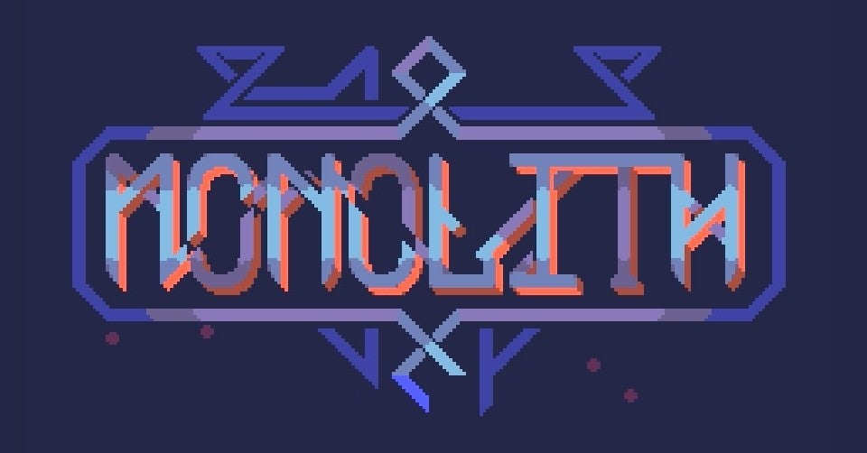
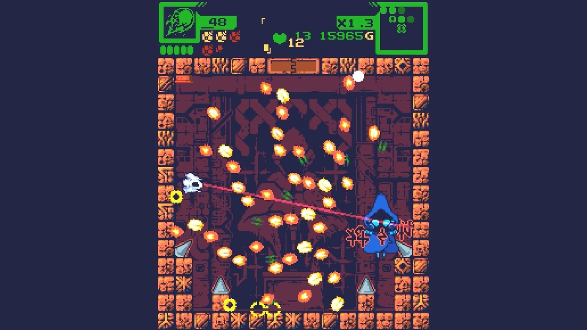
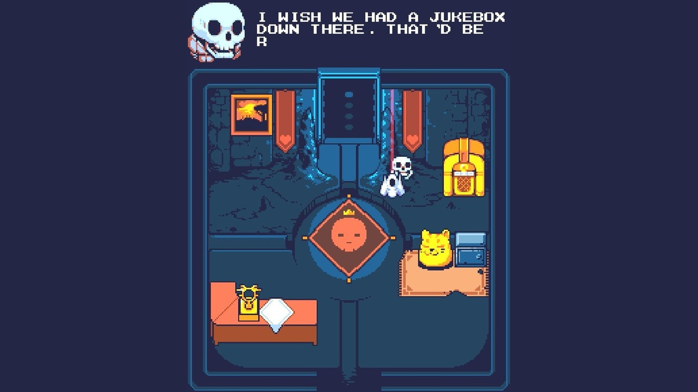
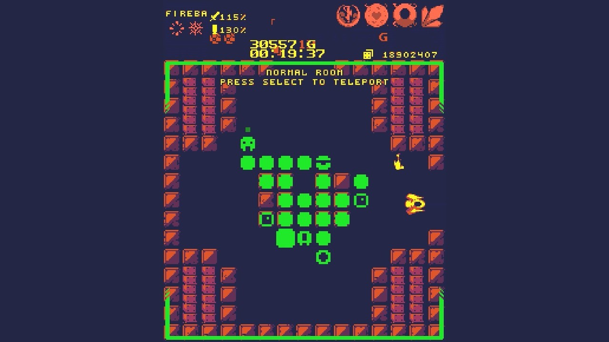

<figure>

</figure>

　**『MONOLITH』**は、Steamで販売されている、ローグライクな要素を取り入れたシューティングゲームだ。製作は**Team D-13**。彼らのTwitterによれば、ドイツ人、カナダ人、ポーランド人の3人組ということだ。2017年発表の作品である。

[https://twitter.com/team\_d13/status/1209897752865452032](https://twitter.com/team_d13/status/1209897752865452032)

　**『MONOLITH』**の目的は、**『ローグ』**のような迷宮を探索しつつ、各部屋で出会う敵を倒しながら自機をパワーアップし、各階層にいるボスを倒して先へ進んでいくというゲームだ。

　このゲームには数々の特筆すべき点がある。それらが複合して、インディーズゲームとしては極めて上質な作品に仕上がっているのが特徴だ。僕は、このゲームをSteamのフレンドからプレゼントしてもらったのだが、それまでその存在を知らなかった。このゲームと出会える機会を与えてくれたフレンドに感謝だ。

　まず、目を引くのはグラフィック。色数を抑えたドット絵でデザインされた画面は、例えて言うならばMSXなどのちょっとスペックの低いマシンのゲームのようにも見える。しかし、陰影を表現しながら、テクニカルに表現されたオブジェクトは、昔のゲームとはまた一味違った、レトロフューチャーな味わいを持っている。無機質なメカも、かわいらしい動物のようなキャラクタも、実に生き生きと動くし、愛らしいヴィジュアルに仕上がっている。ゲーム全体としては使用している色数が豊富なのだが、ひとつのオブジェクトの色数を少なくしているところがMSX風なんだろうな、うん。

　そうなると、当然のようにBGMはPSG風の音色で作られている。三角波とノイズをメインにした楽曲は、自然とレトロな画面に馴染み、効果音も含めて、ゲームの持つイメージから逸脱しない作りになっているところが巧みである。

　しかし、もっとも大事なのは、やはりゲームのシステムそのものだ。ランダムに生成されるダンジョンは、1画面サイズの部屋が連なった構成になっていて、プレイヤーはそこを行き来して敵を倒したり、パワーアップのアイテムを入手したりしてゲームを進めていく。

　前述したように、ゲームのメインはシューティングなのだが、操作性がまた秀逸だ。キーボード+マウスによる操作と、コントローラのみを使った操作の両方に対応しているのだが、どちらで遊んでも遊びやすい。

　マウス操作では、照準であるマウスカーソルを敵の方向に合わせ、攻撃ボタンを押すことで、自機はマウスカーソルの方に向いてショットを撃つ。一方、コントローラを使う場合は、左右のアナログスティックを使う。左スティックで移動し、右スティックを倒した方にショットを撃つという、全方位シューティングの理想的な操作方法が採用されている。僕は断然コントローラ派で、いにしえの名作**『ロボトロン2084』**ばりの操作で、快適なプレイ感を得ることができる。

　プレイヤーは、各部屋で敵と戦い、その部屋の敵を全滅させることで、ロックされた扉を開いて、隣の部屋へ移動できる。各フロアのどこかの部屋にはボスがいて、これを倒すことで次のフロアへ進むことができる。しかし、拙速にボスを倒して進むだけではなく、より強力な武器を手に入れ、ライフ制である自機のヒットポイントを増やしていくことで、ゲームを有利に進められるというわけだ。この辺りは、非常に上手に**『ローグ』**のシステムを取り入れている。ダンジョンの構成はランダムで、当然、出現する敵やアイテムもランダム。ゲームオーバーになると、すべてを失って最初からプレイするという潔いゲームシステムは、何回も遊べる楽しみを作り出すことに成功している。

　ちょっとした時間で軽く遊ぶのに向いたゲームであるが、その作りはしっかりしていて、ヴィジュアル、サウンド、ゲームシステム、操作性など、丁寧に作られた各要素が絶妙に融合し、極上のプレイ感を生み出している。

　もう3年前のゲームであるが、なんと去年の12月には**『Monolith: Relics of the Past』**なる、ゲーム拡張DLCがリリースされていて、まだまだ盛り上がりを見せている。。こちらはまだ試していないのだが、本編をもう少しやり込んだらぜひとも遊んでみたい。

　誰にも親しみやすい操作性に優れた良作シューティング。一風変わったゲームシステムではあるが、その実本格的な弾幕シューティング要素もあるボス戦なども含めてぜひ楽しんでみてほしい。現在のSteam価格は798円だ。安い！

[https://www.youtube.com/watch?v=xeSoYKr3CdQ](https://www.youtube.com/watch?v=xeSoYKr3CdQ)

[https://store.steampowered.com/app/603960/Monolith/](https://store.steampowered.com/app/603960/Monolith/)
