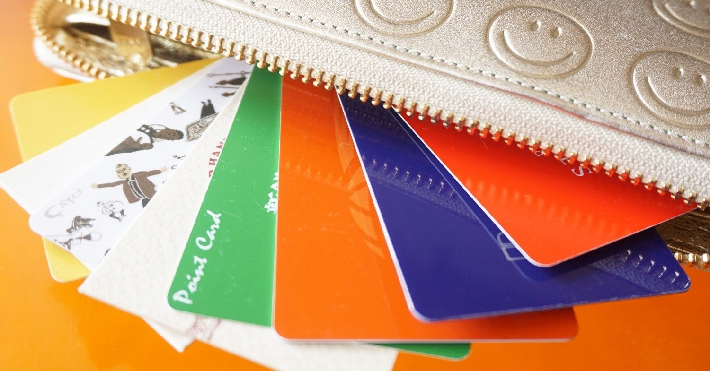

<figure>

</figure>

　ポイントカードというのがどうにも好きになれない。

　そう、あの、お店で会計のときに、  
「ポイントカードお持ちですか？」  
　と聞かれて、そのたびに分厚くなった財布から、この店はどのポイントカードを使っているんだっただろうか。いや、この店ではポイントカードを作っていなかったんじゃないか。そう言えば、先日使ってなくて整理したカードの中に入っていたんじゃないか。挙句の果てに、  
「ありません……」  
「失礼いたしました」  
　などとやり取りしながら、会計を遅らせる原因となるポイントカードのことである。

　こうやって自分で探していてもイライラするのに、他の人が、財布やハンドバックの中をあれこれ探して、ポイントカードはここかしら、あそこかしら、これですか？あ、これじゃない。持ってないのかしら？なんて延々やっているとなると、その後ろに並んで会計待ちの人はたまったものじゃない。

　それならば、最初からポイントカードなんて一切持たずに買い物した方がいいと思って、もうずっとポイントカードは持たないことにしている。これならば、  
「ポイントカードお持ちですか？」  
「ありません！」  
「失礼いたしました」  
　これで終わりである。

　もしかしたらお得なポイントをみすみす逃してしまっていて、損なのかもしれないが、大量のポイントカードで財布を無様に膨らませ、会計の際に無駄な時間を割き、その結果後ろに並んでいる人を待たせることを考えれば、そのコストをばっさりカットしていると割り切っている。これこそスマートな買い物ではないか。（一応ポイントが何パーセントお得なのかとか、そういうのは計算してみることにしている）

　だいたい、いつからポイントカードなどというものが幅を利かせていたのか。その昔はポイントカードなんてものはなかったじゃないか。どこか一つの企業が始めると、みんなして右に倣えで追従するのが間違っているのだ。あまつさえ、ある日突然「このポイントカードは今月いっぱいで廃止されます」などと、いきなりルール変更を申し渡されて、それまでレジで馬鹿正直にポイントカードを差し出していた努力が一瞬にして無に帰すことすらある。これはもう、客もレジ係も馬鹿にされていると怒らなければならない事態じゃないか。しかし、そんなことでは誰も怒らない。みんなとても人間ができていて、温厚なのである。そんなことを考えて、もうずっとポイントカードの類いは使わないようにしている。

　ところがである。いつの時代も便利なものを考える人がいて、最近はポイントカードを、スマホのアプリで代用する店が出始めてきた。なるほど、これなら財布は膨らまないし、スマホのアプリならあちこち探さなくてもさっと取り出せる。そんなわけで、これだけ文句たらたらで使っていなかったポイントカード代わりに、最近はスマホの画面を機器としてレジの人に出していたりする。人間、現金なものだ。きっと、これからは「アプリに切り替えないなんて遅れている！」なんて文句言いながら暮らしていくのかもしれない。

　うーん、書いていて、なんだかセコい悩みだなと、ちょっと自己嫌悪してしまった。願わくば、世の中からポイントカードとコロナウイルスが消え失せますように。
