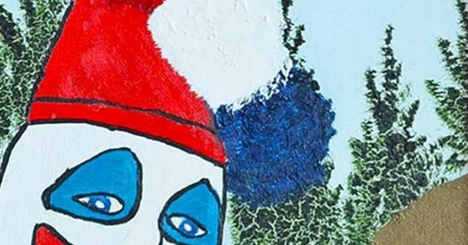

<figure>

</figure>

　こんばんは、皆さん。突然ですが、皆さんはサイコパスの話は好きですか。僕は大好きです。

　と言っても、別にサイコパスに憧れるとか、自分にサイコパスな要素があるなんて言っちゃう中二病ではありません。むしろその逆です。サイコパスは怖い！

　何を当たり前なことを言っているんだと思うかもしれません。でも、そうではありません。映画やドラマに登場するような、人を殺しても平気な、深刻なサイコパスのことを言っているのではないのです。僕が恐れているのは、日常に隠れている、「プチサイコパス」とでも呼ぶべき人々のことなのです。

　例えば、一見人当たりがよく、周囲の信頼を得ているのに、どこか冷淡で、最後は自分の思い通りに意見を通す人がいませんか。もしかしたら、仕事場でリーダーシップを発揮しながら、その実、他人を過剰に働かせたり、自分の言うことを聞かせることに躊躇がない人に思い当たりませんか。

　そうです。それが日常に潜むプチサイコパスなのです。もちろん彼らは、人殺しはしません。それが犯罪であることは理解しているし、世間の常識をわきまえているのです。いや、むしろ、コミュニティに溶け込んで、良き人間として振る舞うことには長けているので、犯罪を行わない分、ただの魅力的なリーダーにしか見えないのです。

　しかし、そういうプチサイコパスが、あなたの仕事の上司になったらどうなるでしょう。オフィスの隣の机に座っている人だったらどうでしょう。きっとあなたは、彼のぶんの仕事を頼まれ、あるいは休日出勤を、それとなく強要され、あなた自身のプライベートな時間や、パーソナルな領域が著しく侵害されるに違いありません。ところが、これは何ら犯罪ではないのです。むしろ、仕事で成果を上げる分、プチサイコパスな彼らは、優秀な人物として周りから尊敬を集めるかもしれません。そして、その陰であなたは多大なる犠牲を払わされる羽目になるのです。

　恐ろしいですね。そういうサイコパス傾向の人々について論じた書籍はたくさんあります。**『サイコパス（文春新書・中野信子 著）』**では、脳科学の見地からサイコパスを分析しています。

[https://www.amazon.co.jp/dp/4166610945](https://www.amazon.co.jp/dp/4166610945)

　また、**『サイコパスの手帖 |（洋泉社・春日****武彦****, 平山****夢明,****）』**では、精神科医と作家の2人の対談形式を通じて、身の回りのちょっとしたサイコパスについて解き明かします。

[https://www.amazon.co.jp/dp/4800316200](https://www.amazon.co.jp/dp/4800316200)

　コミック形式で書かれた**『まんがでわかる 隣のサイコパス（名越 康文）』**は、これまで述べてきたような、凶悪犯罪者ではないサイコパスについて、漫画で書かれています。読むだけで、自分の周りにいる、プチサイコパスに思い当たる人も多いのではないでしょうか。

[https://www.amazon.co.jp/dp/B07W974ZTN](https://www.amazon.co.jp/dp/B07W974ZTN)

　僕が、このような本を読んでいるのは、とにかく人生において、サイコパス傾向の人に出会わないように、出会ってしまったらなるべく関わるのを回避するようにしたいという気持ちが強いからなのです。

　プチサイコパス。彼らは、私達の日常に巧みに隠れています。もしかすると、あなた自身も、すでに彼ら（彼女ら）の魅力に取り込まれてしまっているかもしれません。そのときどうやって自分の身を守るのか。それは、自分自身の知識を持って対処するしかないのです。あなたの人生に幸多からんことを。

　という、前振りで、サイコパスをモデルにした小説を紹介しようとしたら前振りで終わってしまった。本の紹介はまた次回に！

**※文中の「プチサイコパス」という言葉は、私の造語です。**
