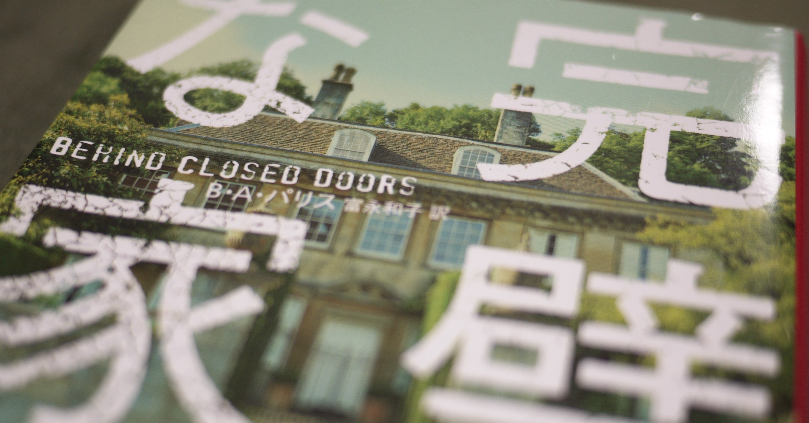

<figure>

</figure>

**※ネタバレなし、書籍紹介の説明文程度の記述あり**

　というわけで、イギリス人作家**B.A.パリス**の処女作、**『完璧な家』**の紹介。先日のサイコパスの話はこの本の紹介の前振りの予定だったのだ。

　**B.A.パリス**は、フランスとアイルランドをバックボーンとする作家で、イギリスで生まれ育った後、フランスへ移り住み、国際銀行のトレーダーとして働いている。その後、夫と語学学校を作り、5人の娘とともにフランスで生活している。（**『THE BREAK DOWN（日本未翻訳）**』紹介文より）

[https://www.amazon.co.jp/dp/4596550522](https://www.amazon.co.jp/dp/4596550522)

　郊外の大邸宅に済む、ジャックとグレースのエンジェル夫妻。夫のジャックはジョージ・クルーニー似の弁護士で、その暮らしぶりは絢爛豪華で優雅。夫婦としても仲睦まじい二人はまさに完璧な夫婦に見える。しかし、そこには誰も知らない秘密があった。

　本書の原題は**『BEHIND CLOSED DOORS』**、そう、一旦扉を閉じられた完璧な家の中でグレースは、夫のジャックによって囚人同様に閉じ込められた生活を送っているのだ。物語が進むにつれて、徐々に明らかになってくるジャックの裏の素顔。閉じ込められたグレースの恐怖。先の展開が気になり、一気に読んでしまうサイコサスペンスだ。

　この物語の肝は、妻グレースを巧妙に束縛するジャックの恐ろしさだ。閉じ込めていると言っても、単に監禁しているという意味ではない。家に友人も招くし、グレースを伴って旅行にも行く。本当にごく普通の夫婦の姿を見せながら、その裏でグレースを閉じ込めているのだ。

　それがどういう意味なのか、どうやってそんなことが可能なのかは、本編を読んでのお楽しみである。サイコパスが、その頭のよさを邪悪なことに利用し、一人の人間を、物理的にも精神的にも完璧な家に縛り付ける恐怖が延々と描かれるストーリー。それを楽しんでもらいたい。

　とりあえず、kindleで無料試し読みがあるので、それを読んでみるのもいいかもしれない。

[https://www.amazon.co.jp/dp/B072F6WKSG](https://www.amazon.co.jp/dp/B072F6WKSG)

　ところで**B.A.パリス**の作品は、日本ではあまり出版されていない。昨年、**『正しい恋人』**が出版されている他は翻訳されていないようだ。しかし、現在はもっと多くの作品が発表されているようなので、未翻訳の作品も日本で版されることを期待している。

[https://www.amazon.co.jp/dp/4596541078](https://www.amazon.co.jp/dp/4596541078)
