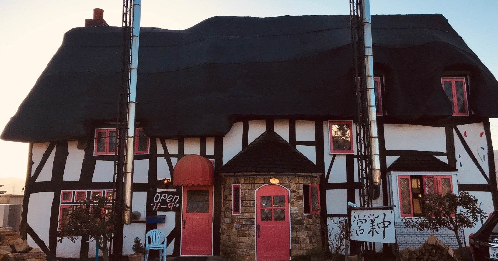
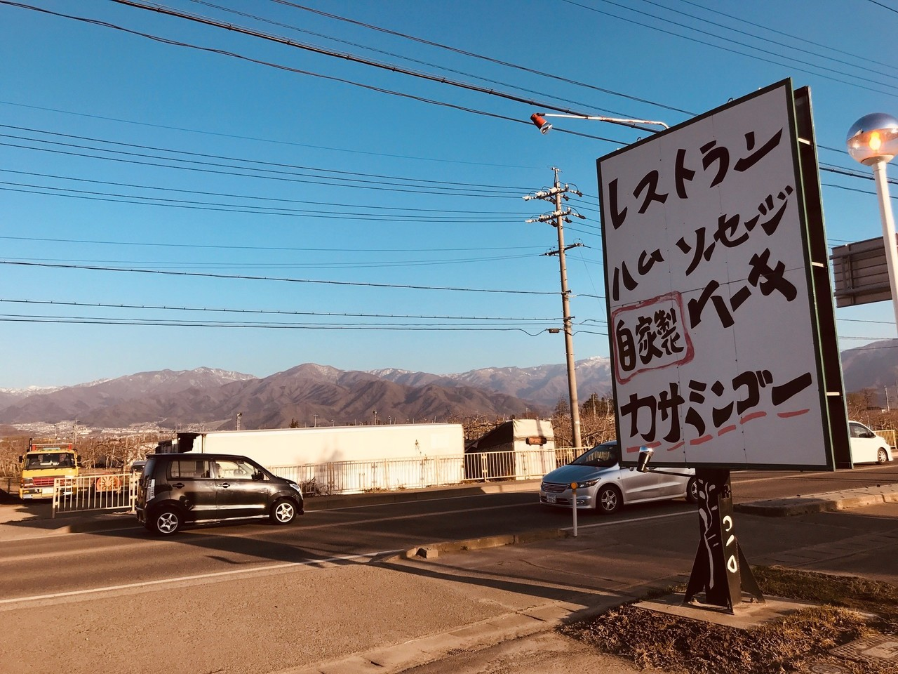
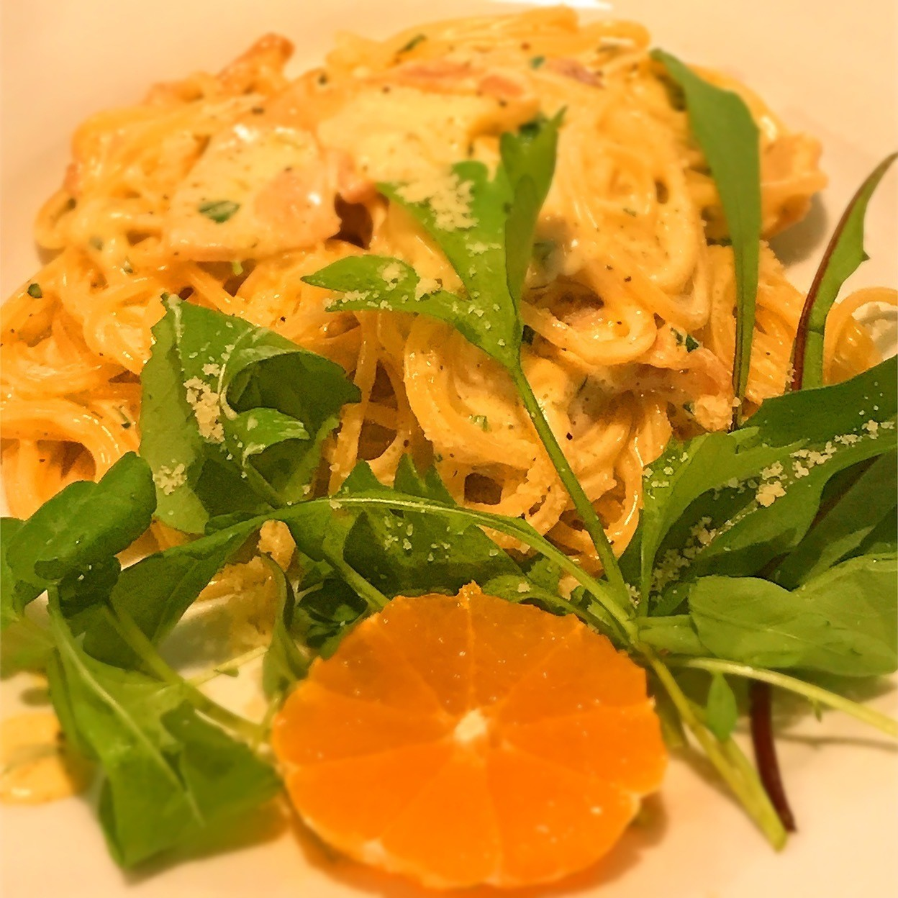
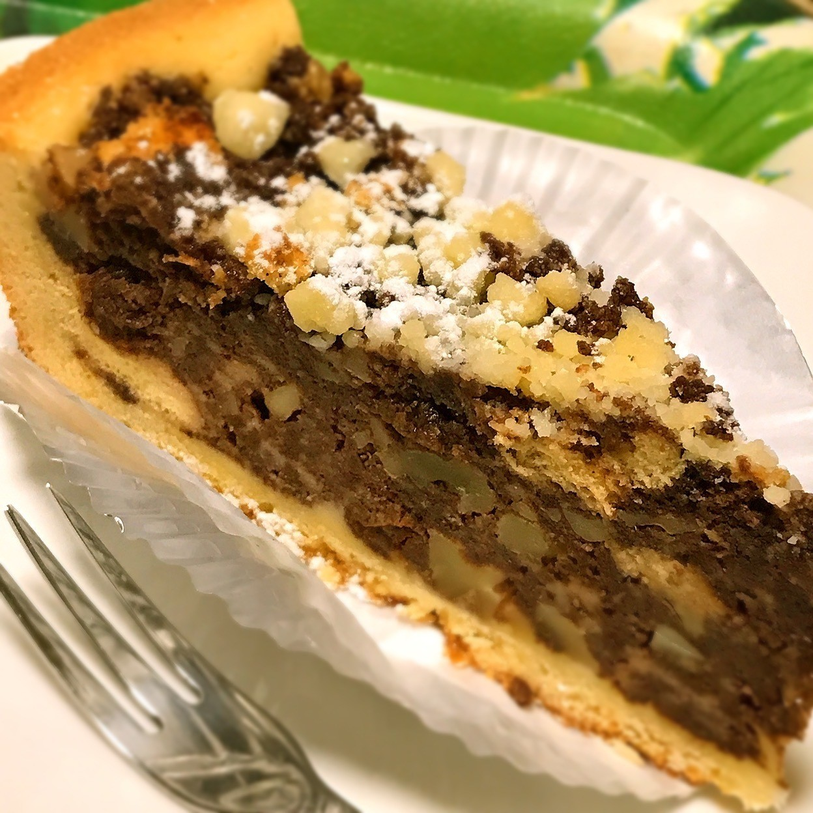
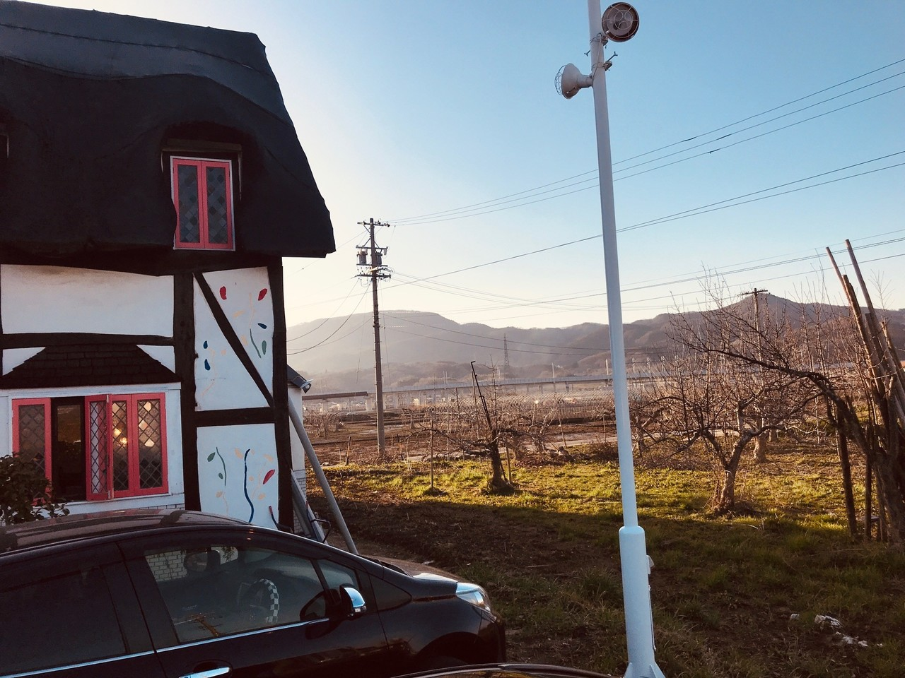
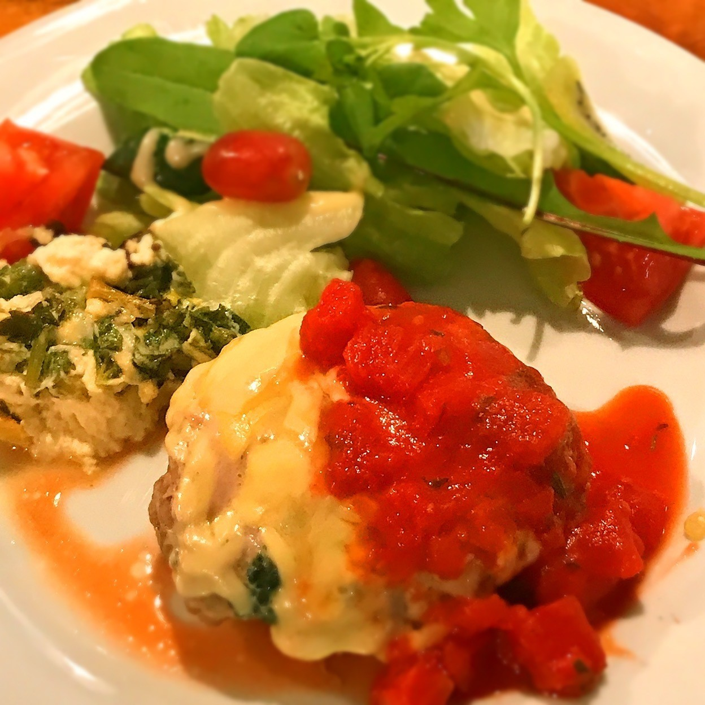

<figure>

</figure>

　今日は長野市にあるレストランの話。

　レストラン**『カサミンゴー』**は長野市津野にある洋食レストラン。1979年創業の、歴史ある店だ。長野みたいな地方都市では、こういうチェーン店でないレストランは超希少種で、それだけでも貴重なのだが、特色あるメニューが楽しめるのも、この店の魅力のひとつだ。

　アップルラインと呼ばれる、国道18号線バイパスに面した駐車場には、個性的な看板が掲げられ、それによるとハムとソーセージが売りのように見える。実際、メニューにはドイツソーセージやドイツハムが並んでいて、これが美味しい。サラダやカルボナーラに使われているハム、ベーコン類も自家製で、それぞれの料理のいいアクセントになっている。ザワークラウトがラインナップされているのも嬉しいところだ。

　では、ドイツ料理の店かと言うと、全然そんなことはなく、パスタやピザも置いてあって、まあ、欧州料理のいいとこ取りみたいなメニューなのだ。本格的な各国料理もいいが、そこにこだわらず、選びやすいメニューの構成にしてくれると、行きやすいお店になるよね。

　で、レストランであると同時に、洋菓子屋も名乗っているのだが、ケーキもドイツ風の感じで作られている。チーズケーキなんかはケーゼクーヘンなんて名前だし、ちょっとがっしりした質実剛健な風体でありながら、甘さ控えめの素朴な感じの洋菓子って感じがとてもいいのである。今回は、お店ではちょっとお腹いっぱいで食べられなかったのだが、つい欲張り根性を発揮して、テイクアウトしてしまった。美味しい。

　店の外見もだが、店内も木の風合いを生かした山小屋のような作りで、非常に落ち着けるのもいい感じだ。

　ところで、この**『カサミンゴー』**のある場所は、昨年の台風19号で千曲川の堤防が決壊した長野市穂保のお隣の地区である。店の駐車場からは、北陸新幹線の高架が見えるが、そのすぐ近くが、全国ニュースでも報道されていた、水没した車両基地のある場所だ。

　台風直後は、**『カサミンゴー』**も一部浸水の被害を受けたということで、しばらく休業が続いていたが、その後無事営業を再開してくれている。去年のクリスマスケーキをオンラインから注文しようとしたときに、メールでその一部顛末をお店から知らされて心配していたのだが、今は通常営業に戻っている。ちなみに、この**『カサミンゴー』**と同じ名称で、ケーキのみオンラインショップがあるのだが、こちらはご家族が経営されている洋菓子専門店だそうである。こちらも美味しいのだが、レストランのケーキラインナップとはまったく違うことも付け加えておきたい。（実は、僕も同じお店と勘違いしていたのだが、後日お店の方にご指摘いただいたのでした。ありがとうございました）

[http://casamingo.gift/](http://casamingo.gift/)

　最後に。僕は、この**『カサミンゴー』**の知り合いでもなんでもなく、たまに行くだけのただの客に過ぎない（常連ですらない）のだが、やっぱり災害の後に、独自路線でがんばっていたお店がどうなってしまうのか気にはなっていた。それで今回、こんな記事をnoteに書いてしまったのだ。多くの人にはどこか遠くの田舎の話だとは思うが、通りかかったときに立ち寄ってみるにはちょっと素敵なお店だと思うのだ。

