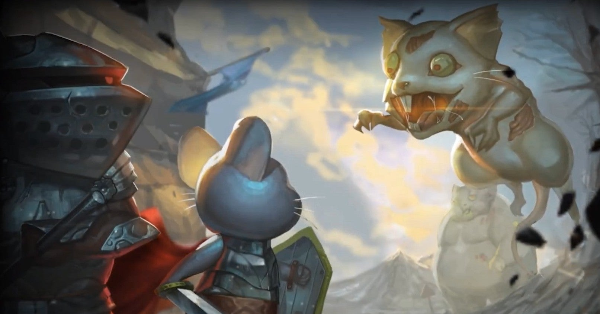
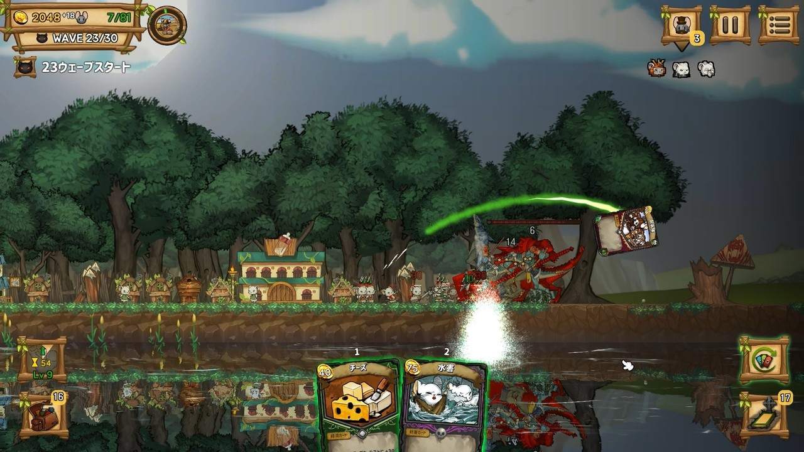
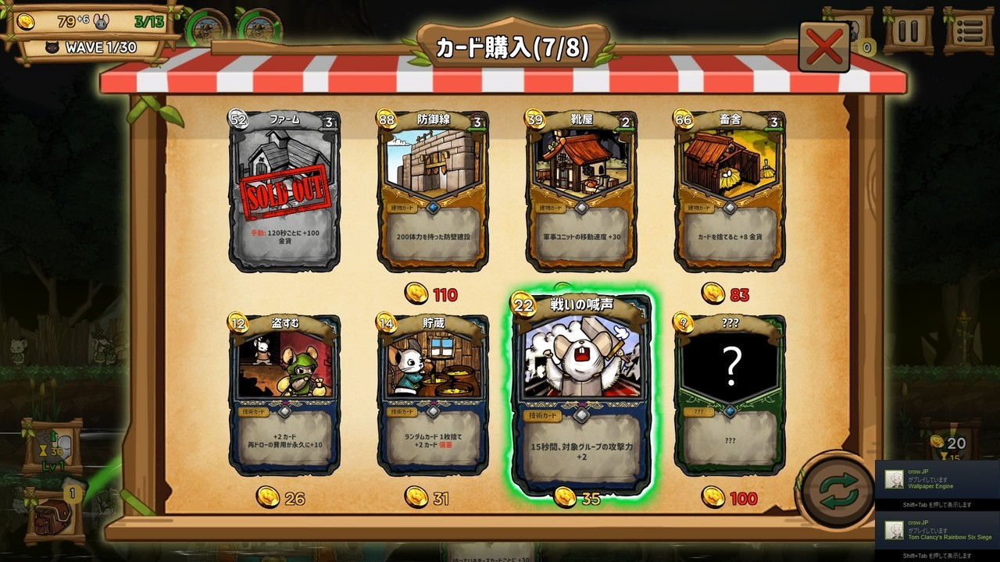
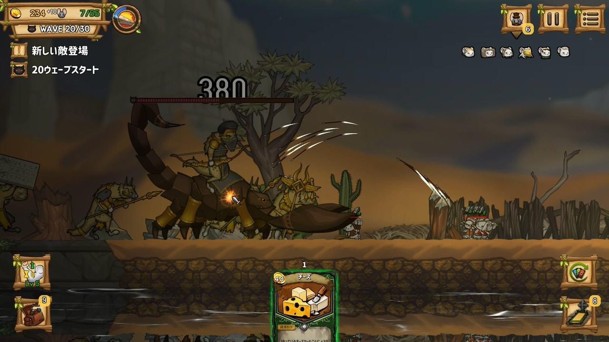

<figure>

</figure>

　**『RATROPOLIS（ラトロポリス）』**は、韓国の**CASSEL GAMES**によるサイドビューの、タワーディフェンス型RTSだ。小さなネズミたちを集めた王国を作り、次々と襲いくる外敵から国民を守り、国を大きくしていくことが目的だ。

　**『RATROPOLIS』**で特徴的なのは、なんと言ってもカードゲームのシステムを、上手にRTSに組み込んである点である。国民を増やすのも、国に必要な建造物を建てるのも、資金を調達するのも、すべてがカードを軸にして行われる。

　このカードは、例によってデッキに組み込まれたものが順次手元に登場して、プレイヤーは適宜必要なカードを場に出していくことになる。ただし、デッキと言っても、TCGのように、あらかじめ自分の持っているカードを使ってデッキを組むわけではない。ゲームスタート時には基本カードしか含まれないデッキに、ゲーム中登場する商人からカードを買い、ときには敵を倒して出現する宝箱からカードを拾って、リアルタイムに新しいカードをデッキに組み込んでいくのである。それ故、TCGにありがちな、カードが少ないから強いデッキが組めないという心配はない。その代わり、カードの引きが弱いと、なすすべもなく王国が崩壊することもあり得る。ランダム要素がいい感じに織り交ぜられたRTSなのである。

　ネズミ王国を大きくするためには、カードを使って家を建築する必要がある。家を建てた分だけ国民が増えるからだ。ネズミ王国をねらう外敵に立ち向かうためには、兵士を雇わなければならないのだが、その兵士はもちろんネズミ王国の国民である。つまり、家を建てて国民を増やさなければ、兵士も増やすことができない。RTSである以上、攻めてくる敵に対抗するためには国民を増やし、なるべくたくさんの兵士を確保する必要があるというわけだ。

　とは言え、ゲーム中ひっきりなしに敵が襲ってくるわけではない。WAVEで区切られた敵の襲撃タームに、まとまった敵勢力の襲来があるため、プレイヤーはそのWAVEの合間に軍備を整えることができる。国民と兵士を増やすことはもちろんだが、お金を稼いでくれる施設や、戦闘中に攻撃のサポートをしてくれる施設を建築したり、ときにはアドバイスをくれる軍師たち（実際には、各ユニットの能力が上がったり、カードのドローに有利に働いたりするお助けキャラクター）をカードから雇用したり、内政を整えていく必要もあるのだ。

　実際ゲームを始めると、これら複数の要素がリアルタイムで進行するため、ゲームのプレイは非常に忙しい。カードを切る順番を間違えたり、限られた資金で購入するカードを誤ったりしたがために、その後の展開が苦しくなることも往々にしてあり得る。画面の中をところ狭しと動き回るネズミたちはかわいらしいが、やはりRTSならではの緊張感があって、そこが楽しいと感じれば、ハマること間違い無しのゲームだろう。

　昨年の11月に登場した、この**『RATROPOLIS』。**Steamでは今のところ早期アクセスゲームとなっているため、今後大きく仕様が変わったり、アップデートが行われたりする可能性が高い。しばらくプレイしてみると、前述した通り、カードの引きによってゲーム展開がまったく違ってくるため、そのバランスが取れてくると、より手堅いゲームになる予感がしている。今のところ、カードの引きが悪いときには、ひたすらネズミ王国が蹂躙するだけのゲームとなっていて、プランBに当たる戦略を取りにくいところが、欠点のようだ。

　ところで、余談ではあるが、僕はネズミの出てくるゲームはいいゲーム、というジンクスを勝手に信じている。このゲームも、今後の調整次第で、名作となることを期待しているところだ。他の名作ネズミゲームは何かって？それはまたの機会に紹介しよう。

[https://store.steampowered.com/app/1108370/Ratropolis/](https://store.steampowered.com/app/1108370/Ratropolis/)
