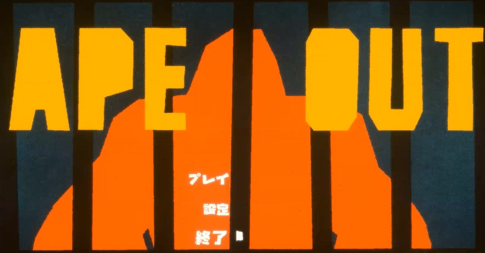
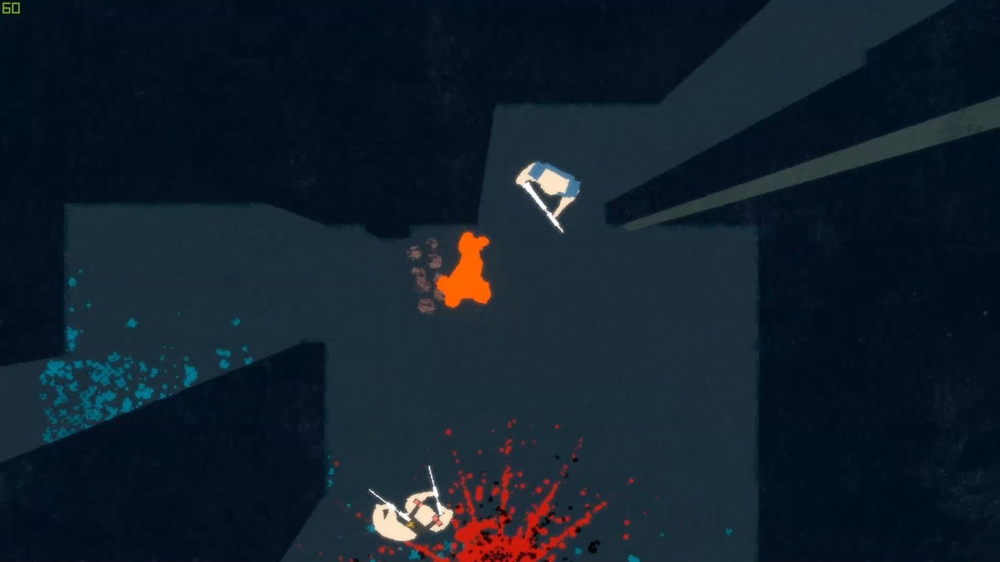
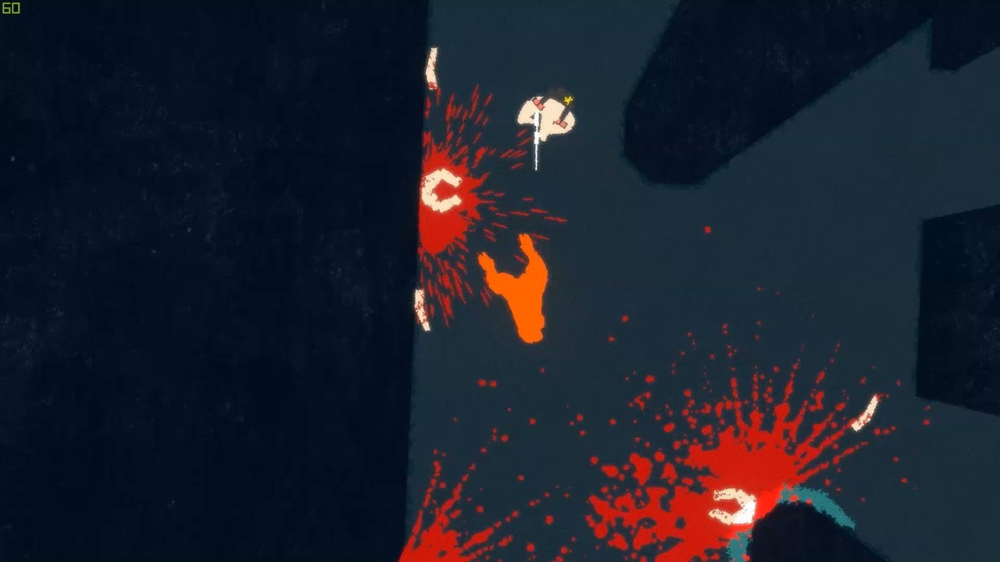
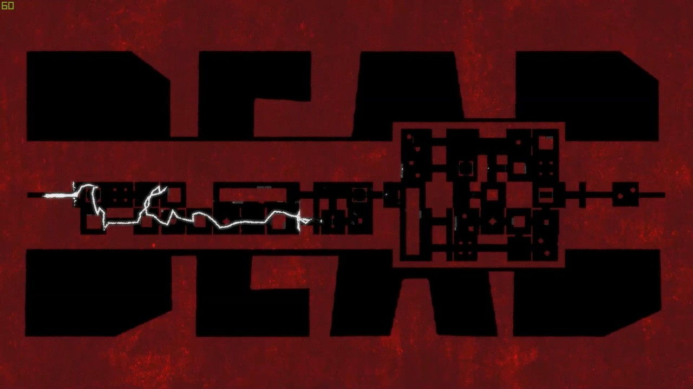

<figure>

</figure>

　**『APE OUT』**は、ゴリラのような生物が、囚われの檻から逃げ出して、迷路のような建物を脱出するゲームである。

　このゲームの面白いところは、キャラクターすべてが影絵のように、ほぼ単色で塗られたシンプルな形状をしていることである。さらに、そのキャラクターたちを真上から眺めた視点でゲームは進行する。正直、止まった状態で画面を見ても、何をやっているのかわからない。しかし、これが動き出すと、実にゴリラなのである。キャラクターの動かし方、見せ方がうまいのだ。

　ゴリラが脱出するステージは迷路のように入り組んでいるが、それを上空から壁が立ち並ぶ通路を見下ろしているかのように、3Dで表示されている。ゴリラの移動に合わせて、通路の先が見え隠れするところが、絶妙に視界の邪魔をして、ゲームに緊張感を添えている。ゴリラは、自分を狩ろうとする人間たちに見つからないように立ち回りつつ、ときには人間を壁に叩きつけ（！）、無事脱出を図るというわけだ。

　次々と叩きつけられた人間たちの残骸によって、画面が血みどろになるときもあるが、シンプルに描かれたキャラクターのおかげで、グロテスクな様子は感じられない。躊躇なく敵を倒して、ゴリラを脱出させるだけだ。目まぐるしく演奏される、ジャズドラムのインプロヴィゼーションのごとき、BGMが、ゲームのスピード感をより引き立ててくれる。映像面でもサウンド面でも、必要最低限ながら極めて効果的な演出を施された、表現のエッセンスがそこにはあるのだ。お見事。

　ゲームシステム的にも、シンプルなようでいながら、多彩な動きをプログラムされたゴリラによって、自由自在なゲーム展開が実現されている。ゴリラは人間を突き飛ばすだけでなく、掴むことで周囲の敵に向かって銃を撃たせたり、閉じられた扉を引きちぎり、銃口から発射された弾を防ぐ盾としたり、とにかく簡単な操作で、あらゆる戦略を取ることができるのだ。

　哀れ、人間たちの銃弾に倒れたゴリラ。そのときには、デカデカと表示された「DEAD」の文字とともに、迷路の中を歩いた軌跡が表示され、自分の到達度がひと目でわかるとともに、次回プレイの作戦を立てる助けにもなってくれる。ほんの一瞬の間に、ありとあらゆる要素を詰め込んだ、スマートなゲームデザインには感服する他ない。

　**『APE OUT』**は、アメリカ人インディーズゲーム開発者Gabe Cuzzillo（ゲイブ・クジーロ）によって生み出されたゲームだ。現在のところ、Steamと任天堂スイッチでリリースされている。ゴリラの破壊的な衝動を、アーティスティックな映像と、快適なシステムで見せてくれる**『APE OUT』。**一度はプレイしてほしいアクションゲームの佳作である。

[https://www.youtube.com/watch?v=bUEGlFb5Dbw](https://www.youtube.com/watch?v=bUEGlFb5Dbw)

[https://apeout.com/](https://apeout.com/)
