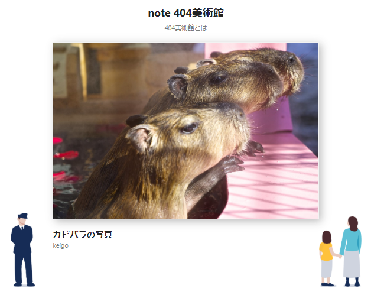
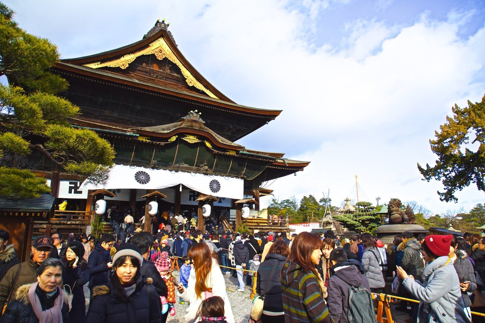

<figure>

</figure>

　以前、自分の撮った写真の中からnoteの404ページの写真用に、カピバラの写真を投稿していました。なんと、その写真がめでたく404美術館に採用されたようです。パチパチパチパチ。

[https://note.com/keigox68000/n/n42e9674dc28d](https://note.com/keigox68000/n/n42e9674dc28d)

　本来、ページが存在しないときに表示される404エラーのページなので、あまり見ることはないのですが、そこにユーザーの写真を掲載しようという遊び心がとてもいいと思うのですよ。一応、下記のアドレスで意図的にみることが可能です。

[https://note.com/\_404](https://note.com/_404)  

　早速自分の写真を見に行こうとクリックするのですが……むむ、表示されない。採用された写真からランダムに表示されるため、なかなか自分の写真が出てこないのです。本当に採用されているのか？と疑いかけたところに、やっとカピバラの写真が出てきました。あったー！

　こういうところに、自分の投稿したものが表示されるのは楽しいものですね。あまりそういう機会がないので、素直に喜んでしまいました。

　ところで、僕は、flickrなどにも撮った写真をアップしています。一時期、写真に凝って、一眼レフのデジカメを次々と3台も購入してしまいました。交換レンズも人に言えないぐらい買っています。それでいて、最近はアクションカムで動画撮影の方に興味が行っていて、なんだかなーという感じなのですが、こういうきっかけがあると、また写真も撮ってみたいな、と思ってしまうのでありました。

[https://flickr.com/photos/keigox](https://flickr.com/photos/keigox)

　ここのところflickrへのアップデートはサボり気味だったので、またがんばってみようかな。

　道具に凝って色々なカメラを試してみましたが、写真でいちばん大事なのは、機材やテクニックより、まずは撮るということです。世の中が落ち着いてきたら、外へ出る時間を取って、また写真を撮ってみることにしよう！

