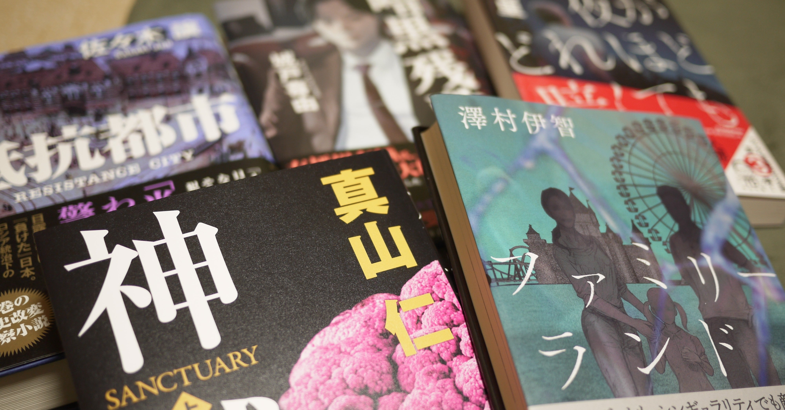

<figure>

</figure>

　久しぶりに（？）本を買ってきたので、読む前に備忘録メモ。（と言いつつ、年末年始に買った本もすべて消化しきれていないのだけど）

## ファミリーランド | 澤村 伊智, mieze  

　**澤村伊智**は、ここ数年に登場した中ではイチオシの作家。デビュー当初はホラー専門と思われたが、ここへ来て、意欲的に様々なジャンルに進出しているのも嬉しいところ。今回はSFの作品集だ。長編ホラーが、恐怖の因縁を丁寧に書き連ねて、それが作品の重みとなっていただけに、短編ではどんな味が出てくるのか楽しみ。

[https://www.amazon.co.jp/dp/4152098740](https://www.amazon.co.jp/dp/4152098740)

## 夜がどれほど暗くても | 中山七里  

　**中山七里**12ヶ月連続刊行の第三弾。スキャンダル記事で出版社をさせる副編集長が、自分の息子の自殺にまつわるスキャンダルで、記者に追われる立場になるという話。早く読みたいところだが、今第二弾の**『帝都地下迷宮』**を読んでいる最中なので、そちらを早く終わらせなければ。

[https://www.amazon.co.jp/dp/4758413479](https://www.amazon.co.jp/dp/4758413479)

## 抵抗都市 | 佐々木 譲  

　昨年末に発売になり、それからずっと気になっていた作品。日露戦争に日本が負けたという架空の設定のもと、ロシアの統治を受ける日本で起きた変死体事件を追う警察が、捜査に介入するロシア、警視総監直属の高等警察と三すくみの争いになりつつも、真実を追求しようとするユニークな視点の警察小説。

[https://www.amazon.co.jp/dp/4087716902](https://www.amazon.co.jp/dp/4087716902)

## 神域 上 | 真山 仁 |本 | 通販 | Amazon

　アルツハイマーを治療するための人工細胞をテーマに、国家戦略としてその開発を急ぎたい日本政府と、再生医療の安全性に疑問を持つ科学者たちとの間に生じる軋轢。医療ビジネスを手掛ける実業家、科学者、政府関係者の間に起きる事件を追った医療ミステリ。上下巻に別れた長編で期待が持てる。とりあえず上巻のみ購入。

[https://www.amazon.co.jp/dp/4620108472](https://www.amazon.co.jp/dp/4620108472)

## 暗黒残酷監獄 | 城戸 喜由  

　若干、タイトルのインパクトで手にとってみた感じはある。女性には言い寄られるのに、友人はいない高校生・清家椿太郎の姉が十字架に磔になって死んだ事件。姉の遺した「この家には悪魔がいる」という言葉を追って展開する事件。ちょっと突飛すぎて意味がよくわからないが、まあ読んでみよう。

[https://www.amazon.co.jp/dp/4334913369](https://www.amazon.co.jp/dp/4334913369)

　というわけで、積ん読がいっぱい残っているので、しばらく買うのを我慢していた新刊を、新たに何冊か積んだので、またしばらくがんばって読もう。ああ、読書とはなんと楽しい趣味であることか。
