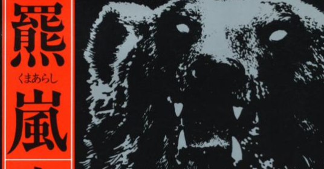

<figure>

</figure>

**※ストーリー序盤について若干触れます**

　突然だが、僕は熊小説が好きだ。熊小説と言っても、プーさんとかではない。もっと熊の怖い側面、熊の引き起こす恐るべき事件についての話に興味がある。そんな小説を紹介しよう。

　**『羆嵐』**と書いて「くまあらし」だ。「くま」の文字は「羆（ひぐま）｣が当ててある。

　吉村昭によるこの小説は、1915年（大正4年）に北海道の三毛別で起きたヒグマによる獣害事件をモデルにした物語である。執念深いヒグマの習性や、事件の悲惨さ、そして厳冬の北海道という悪条件で繰り広げられる、人間とヒグマの死闘が、極めて写実的に描かれている。

　日本でヒグマと言えば、北海道に生息するエゾヒグマのことを指す。熊は、ぬいぐるみやキャラクターで、人間に広く愛される動物のひとつであるが、言うまでもなく獰猛な一面を備えている。

　特に、北海道のヒグマは、寒さやその年の気候条件によって冬眠前に十分な餌を取れないことがある。そうしたヒグマは「穴持たず」と呼ばれ、空腹を満たすために冬になっても徘徊していることがある。（これには諸説あるが、本作ではそのように解釈されている）

　やがて、腹を空かせたヒグマが人間の集落にたどり着き、なんらかの食物を見つけてしまったことから、行動がエスカレートし、そこに住む人間を捕食してしまう。これが、ヒグマによる獣害の第一歩だ。さらに悪いことに、一旦人間の味を覚えたヒグマは、人間を襲った民家を餌場として再び現れる。捉えた人間を安全な場所へ運び出し、食い荒らすヒグマ。当然その遺体を取り返そうとする人間たち。そこで再び悲劇が起きてしまう。

　一度獲得した餌を少しずつ食べるヒグマは、人間の遺体が持ち去られたことによって、それを取り戻そうと、再び民家を襲うことになる。これによって、被害はさらに甚大なものとなってしまう。

　何しろ大正四年の話である。しかも厳冬の北海道、開拓村。熊に襲われたから撃ち殺せばいい、と簡単にはいかないのだ。遠く警察本部から応援を呼ぶものの、装備に乏しい警官隊も、大自然の中で生きる知恵を身に着けたヒグマに苦戦する。

　一方で、昔からヒグマと対峙し、その習性を知り尽くした老猟師がいた。混迷を極め、人間の本性をさらけ出して右往左往する村民と、その中でヒグマを退治するために自然の摂理を理解しようとする猟師。その対比が、大袈裟に飾られることのない、現実の事件のように淡々と描かれる。

　史実をもとにしただけあって、迫力がある。熊好きかどうかは関係なく読んでみてほしい。

　実は、世の中に熊小説はいくつか存在している。映画やドラマも作られている。そういうものをときどき紹介できるといいなと思っている。大自然の驚異の象徴としての熊。それを知るのもまた一興だ。

[https://www.amazon.co.jp/dp/4101117136](https://www.amazon.co.jp/dp/4101117136)
