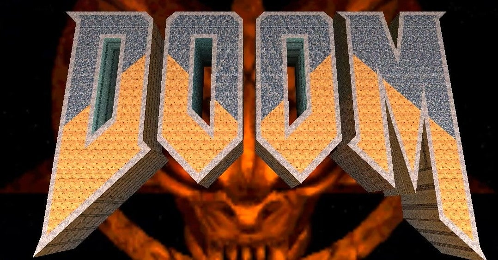
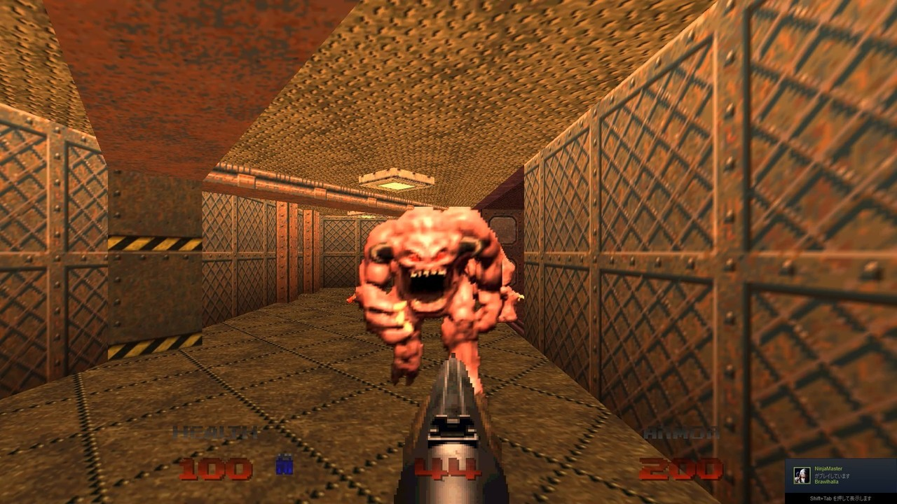
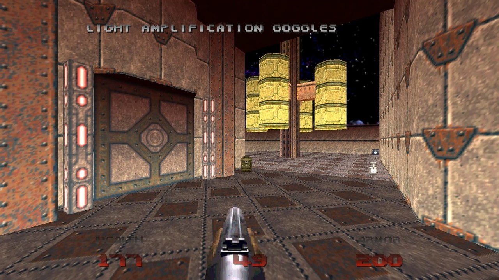

<figure>

</figure>

　Steamのセールで販売されていた**『DOOM 64』**を買って遊んでいる。今月発売になったばかりのゲームだ。**『DOOM 64』**はもともとNINTENDO64用のソフトで、FPSのご先祖様のような存在のPC向けゲーム**『DOOM』**をNINTENDO64向けにアレンジ移植したものだ。1997年に発売されている。

　当時、PC用のゲームが日本の家庭用ゲーム機に逆アレンジ移植というのは例がなかったわけではないが、それがまたPC用にリメイクされて復活してくるのは珍しいのかもしれない。特に、NINTENDO64のソフトがPC用に移植されるという話は聞いたことがない。それだけ**『DOOM 64』**の評価が高かったということなのだが、今回このソフトは、発売が延期になったDOOMシリーズの最新作**『DOOM Eternal』**の予約特典にもなっている。（冒頭に書いた通り、別売もしている）

　1997年当時、FPSという言葉はあまり聞かなかったような気がする。「3Dゲーム」とか「3Dシューティング」とか言っていた。海外では、この3Dシューティングがその地位を固めつつあった時期で、id Software社の**『Wolfenstein 3D』**(1992)や**『DOOM』**(1993)、そして**『Quake』**(1996)、3D Realms社の**『Duke Nukem 3D』**(1993)など、まさにFPSが萌芽しようとしていた時代と言えるのかもしれない。

　この時期のコンシューマ機の1台にNINTENDO64があるわけだが、実はNINTENDO64専用ソフトとしてリリースされたFPSに**『ゴールデンアイ 007』**（レア社,1997）がある。当初知る人ぞ知るソフトだったが、口コミでその面白さが広がり、今ではFPSの代表格にまつりあげられているようだ。

　当時なぜ、ファミリー向け、子ども向けの印象が強いNINTENDO64に、こんなガチのFPSが移植されたのかは謎である。しかし、実はNINTENDO64にはFPSが何本か存在していて、密かにマニアを喜ばせてくれていたのである。

　**『ゴールデンアイ007』**に先んじてリリースされていた、Iguana Entertainment社の**『時空戦士テュロック』**と、その続編の『バイオレンスキラー』。ファンタジーを題材にしつつFPSのシステムを採用したRaven Software社の**『ヘクセン』**。どんなゲームかわかりにくいパッケージを採用し、発売した瞬間にワゴン行きになっていたION Storm社の**『大刀』**。**『ゴールデンアイ007』**と同じレア社による開発の**『パーフェクトダーク』**などなど、充実のラインナップを誇っていたのだ。

　元来洋ゲー好きだった僕は、その頃あまりPCでゲームをやろうという発想を持っていなかったため、自然と手元にあったNINTENDO64でFPSを遊んでいたのだ。

　特に洋ゲーの主流がFPSに移り変わっていくゲームシーンの隆盛も考えていたわけではなく、単純にその迫力ある視点を生かしたゲームシステムにのめり込んでいただけであるが、さらなる洋ゲー好きの下地を作る要因となっていたのは間違いない。

　その後、本格的に洋ゲーを好んでプレイするのは、XBOX360の登場を待たなければならないのだが、その話はいつかまた。

　とりあえずは、PC用としてフルHDに生まれ変わりつつ、FPS原初の楽しみを失っていない**『DOOM64』**を思う存分遊ぶことにしよう。ちなみに、同ゲームは、今回任天堂スイッチにも移植されている。

[https://www.youtube.com/watch?v=wMTgsw-lOb0](https://www.youtube.com/watch?v=wMTgsw-lOb0)
