<figure>

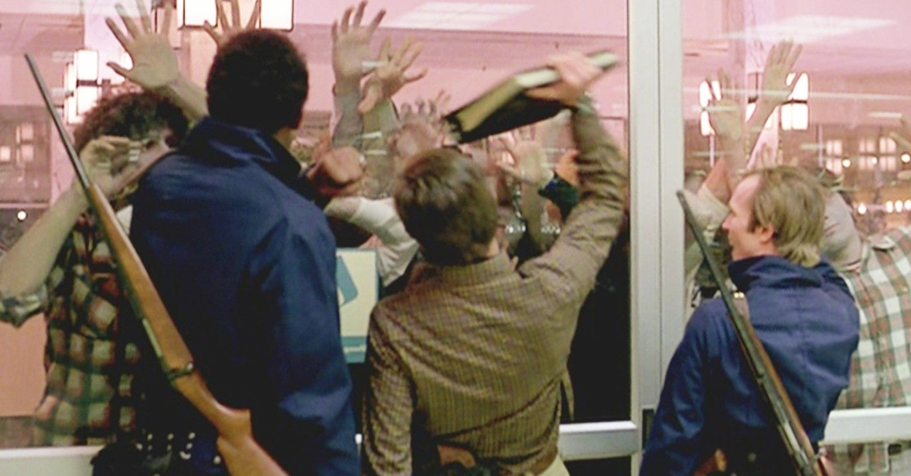

</figure>

**※この記事は以前ブログで公開した記事の改訂版です**

　映画**『ゾンビ（原題：DAWN OF THE DEAD）』**は、1979年に公開された巨匠ジョージ・A・ロメロ監督の手によるゾンビ映画の古典だ。そんな説明はいらないぐらい有名だよね。

　この映画の見所のひとつが、ショッピングモールに何日間も籠城する主人公たちが、ゾンビに囲まれているという危機的状況の中で、それでもショッピングモールの物資や設備を利用して、非日常的な日常生活を送り始めるところ。今の時代には、ともすると冗長なシーンと捉えられがちな展開ではあるが、生命の危機に瀕しても人間とはこうした文化的生活を求めるものなのかもしれない、と妙に納得してしまうところが面白いのである。

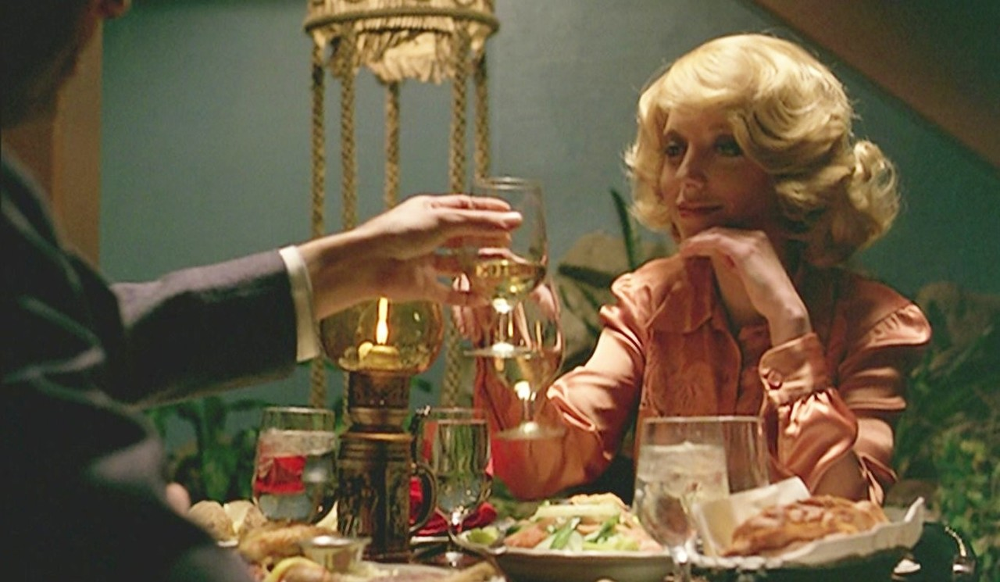

　その、ショッピングモールでの日常生活のシーンのひとつに、主人公たちが店内のゲームセンターで、ビデオゲームに興じる場面がある。笑顔で仮初めの平和を楽しむ面々。しかし、恐るべしゲームマニア。すでに映画のシーンには目が行っていないのである。そう、映画の中に登場する、数々のビデオゲームが一体何なのか？　そこにばかり興味が集中してしまうのであった。

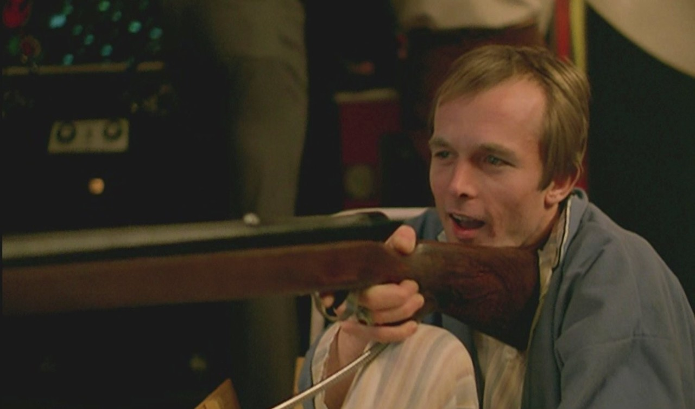

　SWAT隊員のロジャーは、陽気な性格で憎めない男だ。しかし、そんな性格が災いして、物資調達の折、ゾンビに噛まれてしまう。彼が悲惨な最後を迎えるにはまだ時間があるわけだが、そんな彼がゲームセンターで楽しんでいるのが、ATARIの**『QWAK！』**(1974)だ。アーケードゲームとしては初めてライトガンを使用したマシンで、ダックハントをテーマにしたゲームである。（ちなみに、画面の奥で同期信号を失ったかのように画面が乱れているのは、ATARIの**『SPRINT 2』**(1976)だ）

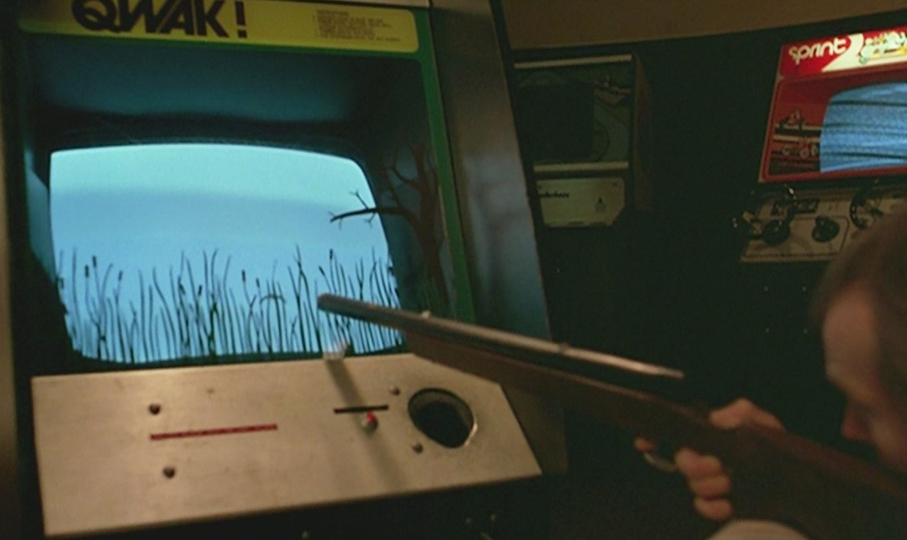

　そのロジャーの同僚SWAT隊員。本編の主人公であるピーターが熱中しているゲームは、MIDWAYの**『GANGBUSTERS』**(1974) である。こちらは、ビデオゲームではなく、ミニチュアのターゲットが筐体内を動き回る昔ながらのエレメカ型ガンシューティングだ。

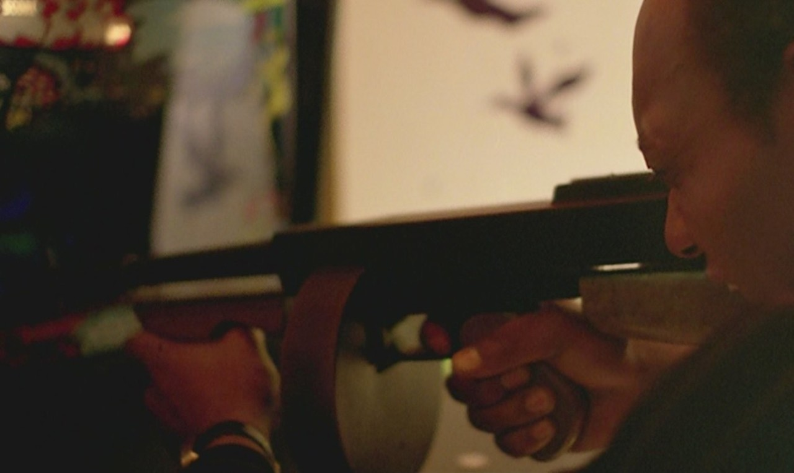

　古風なドラムマガジンのマシンガンを装備した筐体で、発射音のギミックがリアルでかっこいい。

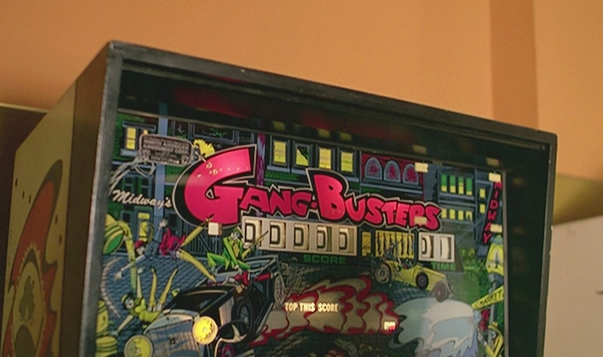

　古いピンボールのようなスコアリールのレトロ感と、蛍光塗料で艶かしく輝くバックグラスは、今見てもクールな美しさがある。

[https://www.youtube.com/watch?v=otWHnimBVN8](https://www.youtube.com/watch?v=otWHnimBVN8)

　恋人のフランとともにショッピングモールに逃げ込んだスティーブン。彼が遊んでいる筐体は影になって見えないが、ゲーム画面を見ると、ATARIの**『STARSHIP 1』**(1976)であることがわかる。

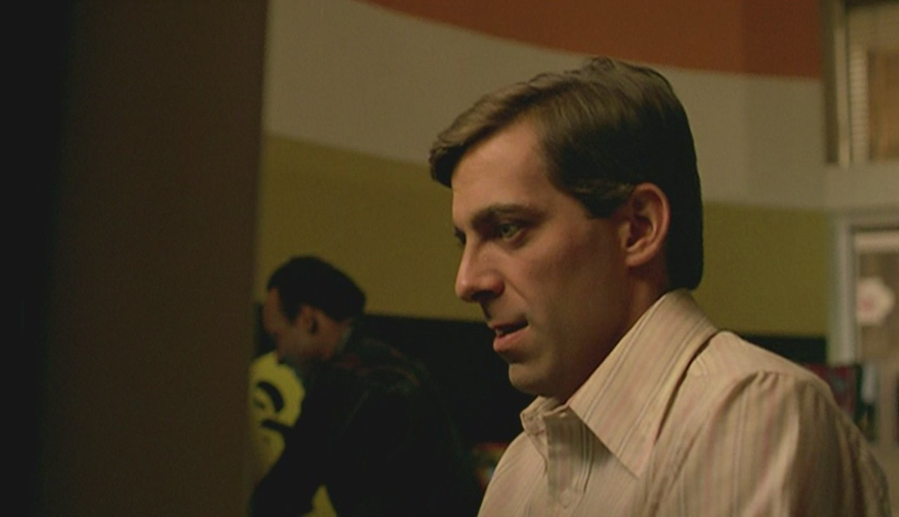

　パイロット視点のシューティングゲームで、画面中央に向かって発射されるビームで、エンタープライズ号似の宇宙船を破壊するゲームだ。

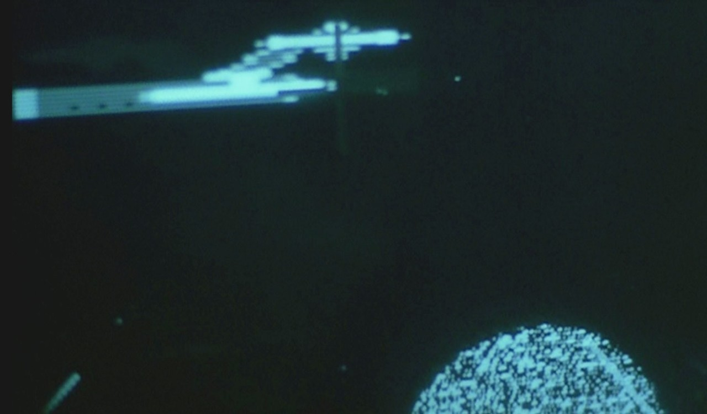

　リアルな3D表現と、迫力ある破壊サウンドが印象的な作品である。

[https://www.youtube.com/watch?v=-crXVuoKlL4](https://www.youtube.com/watch?v=-crXVuoKlL4)

　ピーターとスティーブンが対戦プレイしているのは、MIDWAYの**『GUN FIGHT』**(1975)だ。

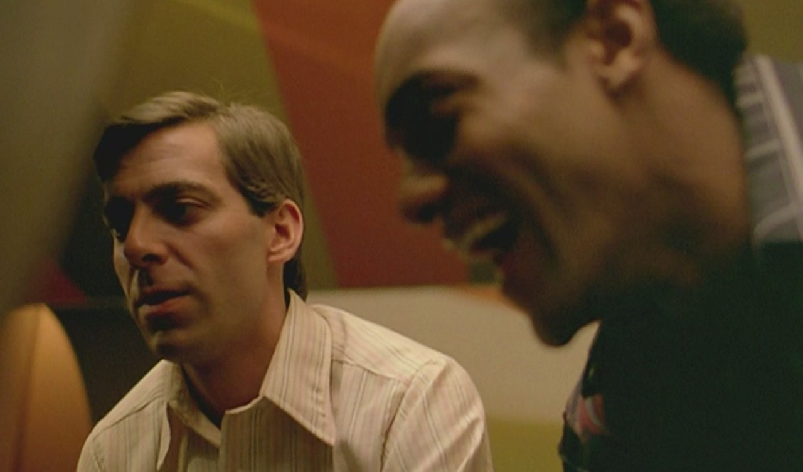

　２人のガンマンが撃ち合う対戦ゲームで、MIDWAYが新開発したi8080搭載基板を使用したゲームである。MPUを搭載したTVゲーム機としては世界初である。

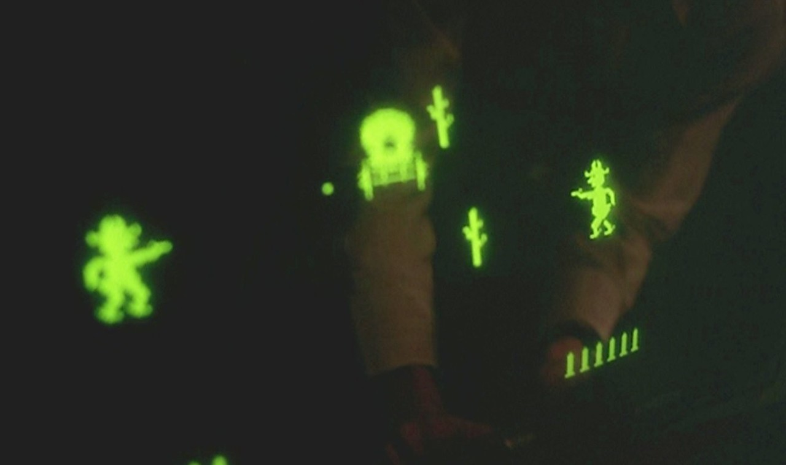

　**『GUN FIGHT』**はTTL回路で動いていたタイトーの**『ウェスタンガン』**を、MIDWAYが許諾を受けてMPU基板上でリメイクしたゲームである。画面のデザインは異なるが、ゲームとしてはほぼ同一の内容になっている。  

[https://www.arcade-museum.com/game\_detail.php?game\_id=10420](https://www.arcade-museum.com/game_detail.php?game_id=10420)

　なんとも懐かしい、スクリーンに映像を投影するタイプのレースゲームは、中村製作所の**『F1』**(1976)だ。  

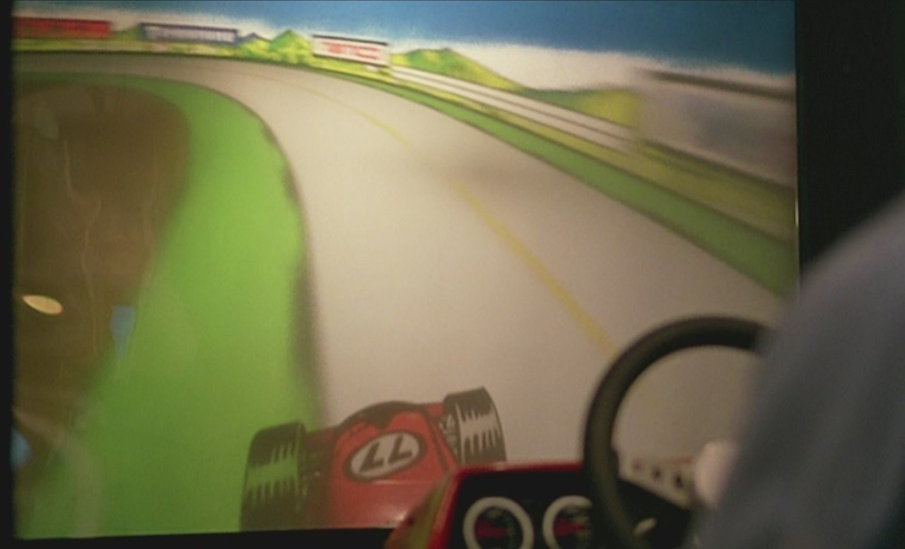

　もっとも、映画に登場する筐体には、すでに「namco」のロゴが入っていることが確認できる。生産された時期的な違いによるのかもしれない。

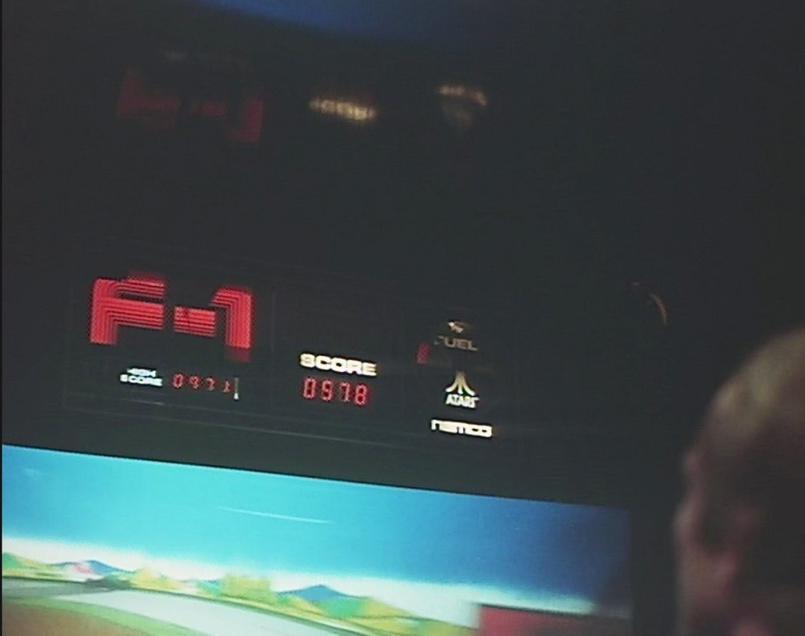

　堅牢な感じのステアリングが、この手のゲームの臨場感を増していたのは言うまでもない。  

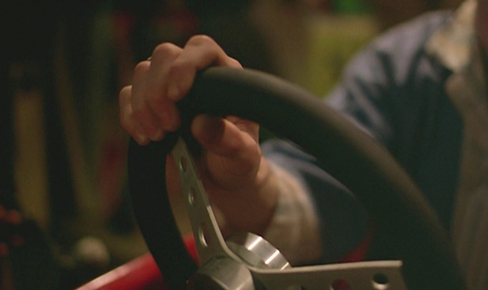

　実際に動いている様子は、今見てもそのスピード感に驚かされる。  

[https://www.youtube.com/watch?v=i1WSYdn1b8I](https://www.youtube.com/watch?v=i1WSYdn1b8I)

　そして、劇中に筐体こそ姿を現さないものの、時折挿入されるシンプルな映像は、間違いなくATARIの**『NIGHT DRIVER』**(1976)である。  

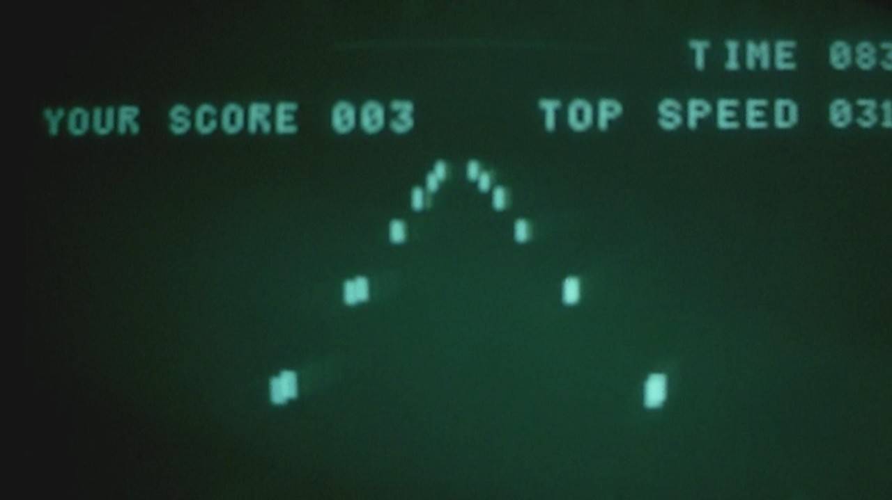

　簡素なグラフィックながら立体感とスピード感にあふれた滑らかな動きで、本当に深夜に車を走らせているような画面に仕上がっている逸品だ。  

[https://www.youtube.com/watch?v=5cPqz63Lfts](https://www.youtube.com/watch?v=5cPqz63Lfts)

　さて、画面にちょっと映っただけのアーケードゲームこだわって、その正体を探ってきたが、実はこのショッピングモールは実在の店である。おそらく、このゲームセンターも当時ショッピングモールに入居していたのかもしれない。  

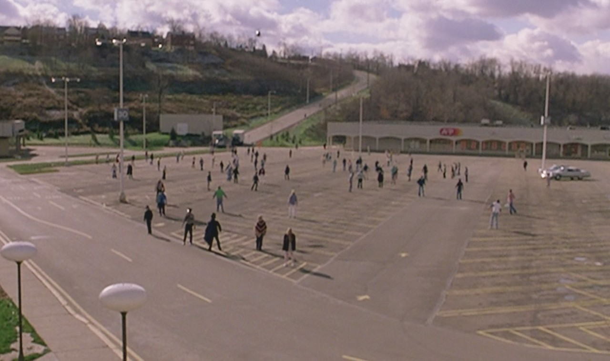

　映画**『ゾンビ』**は、ペンシルバニア州のショッピングモール**『モンローヴィル・モール』**で撮影され、素晴らしいことにモールは今も営業しているそうだ。ストリートビューで確認すると、映画に登場した場所らしき建物も残っている。  

[https://www.google.com/maps/@40.4272176,-79.7944768,3a,60y,179.94h,87.02t/data=!3m6!1e1!3m4!1sEImcMuGiBcshaPlD71nArQ!2e0!7i3328!8i1664?hl=ja](https://www.google.com/maps/@40.4272176,-79.7944768,3a,60y,179.94h,87.02t/data=!3m6!1e1!3m4!1sEImcMuGiBcshaPlD71nArQ!2e0!7i3328!8i1664?hl=ja)

　なお、この**『モンローヴィル・モール』**は、2018年にジョージ・A・ロメロ監督の彫像が置かれたそうだ。

[https://archive.triblive.com/local/monroeville/george-romero-father-of-zombies-rises-as-a-sculpture-for-monroeville-mall/](https://archive.triblive.com/local/monroeville/george-romero-father-of-zombies-rises-as-a-sculpture-for-monroeville-mall/)

[https://www.atlasobscura.com/places/george-romero-bust](https://www.atlasobscura.com/places/george-romero-bust)

参考文献：赤木真澄 (2005) **『それは「ポン」から始まった-アーケードTVゲームの成り立ち』** アミューズメント通信社, 治郎丸慎也編(2014)**『ROMAN ALBUMゾンビ・マニアックス−ジョージ・A・ロメロとリビングデッドの世界−』**徳間書店.
