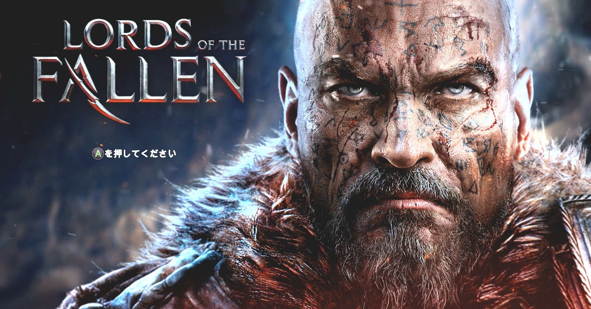
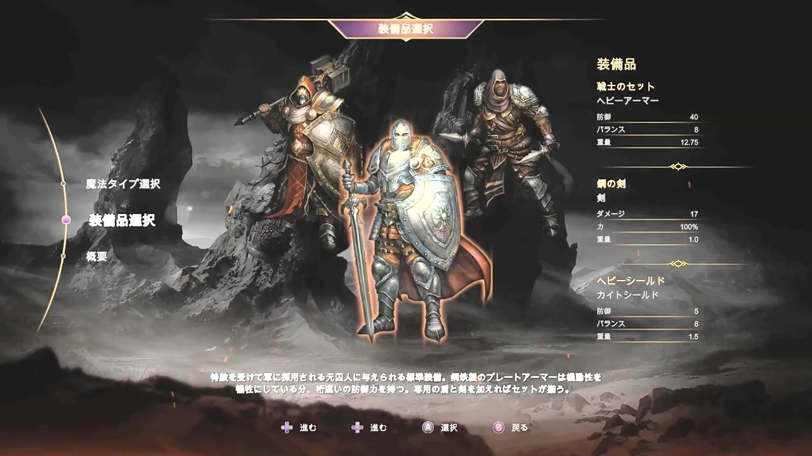
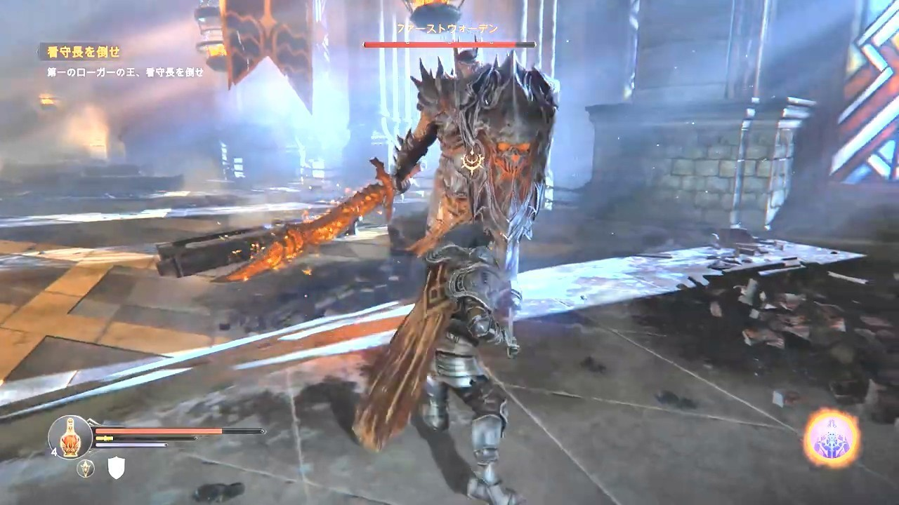
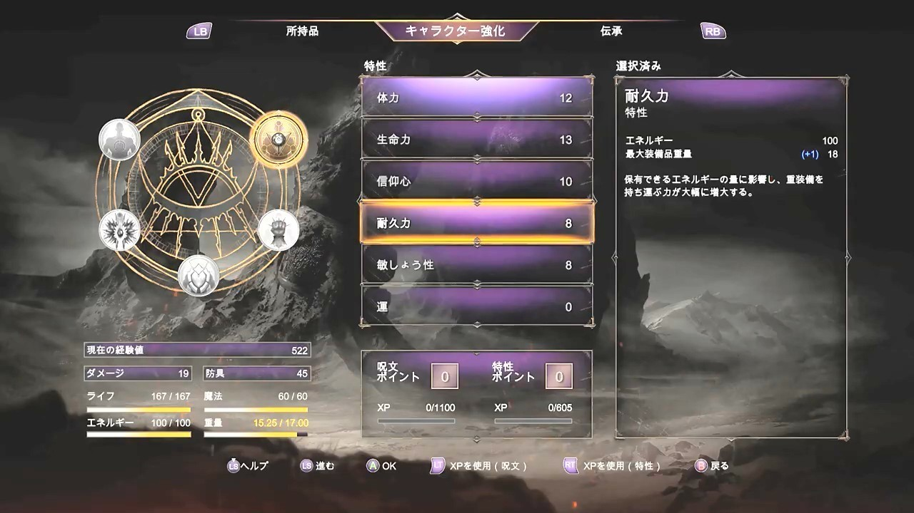
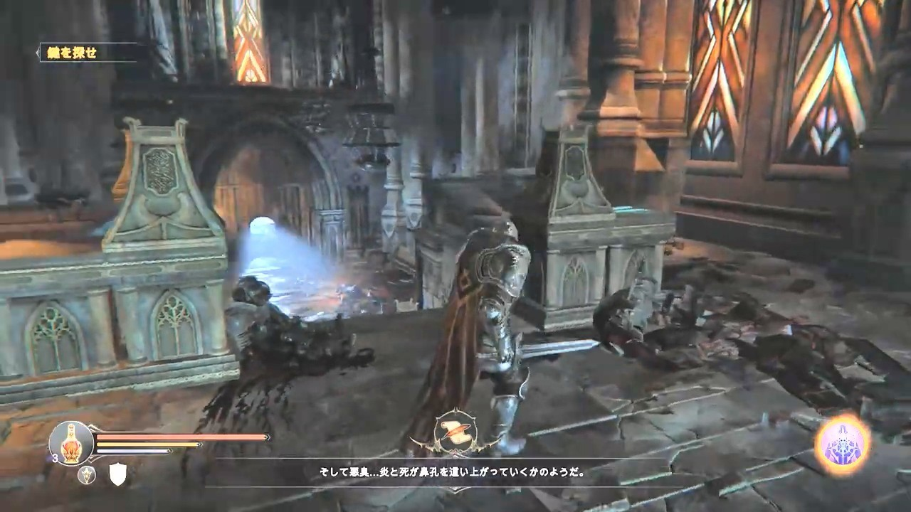
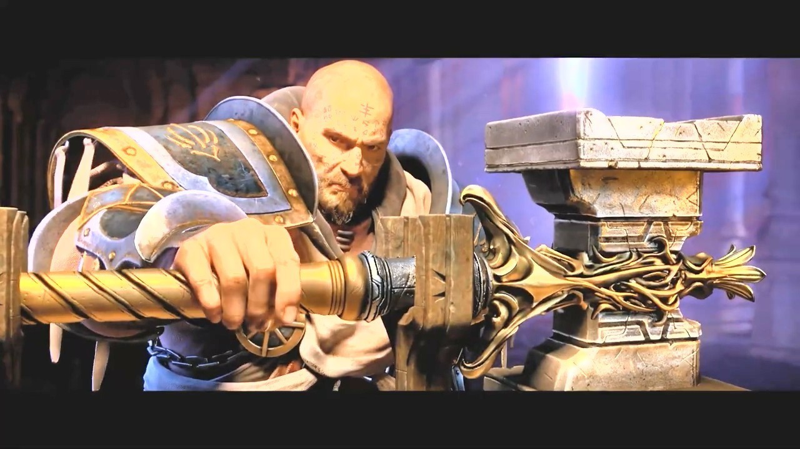

<figure>

</figure>

　**『LORDS OF THE FALLEN』**は、**『ダークソウル』**似のゲームシステムと外観を持った、ダークファンタジーアクションゲームだ。ポーランドのCI GamesとドイツのDeck 13による開発で、2014年に発売された。

　ダークソウル好きの僕としては、ちょっと気になっていたゲームなのだが、ずっと遊ぶ機会がなかった。というのも、国内ではPS4版がユービーアイソフトから2015年に発売されたものの、Steamではなぜか日本向けの販売がなかったのが原因だ。どうせならPC版を遊びたいと思っているうちに、その存在をすっかり忘れてしまったというわけだ。（こうやって、購入に至らないゲームのなんと多いことか）

　そんな**『LORDS OF THE FALLEN』**だが、最近ゲームバンドルサイトのFanaticでおすすめされて、急に思い出した。日本から購入できないソフトなので事前に調べてみたのだが、どうやらキーさえ手に入れれば、日本のSteamから有効化できるらしいことがわかった。さらに、ちょっと設定をいじると、日本語字幕で遊べることもわかった。ここまでやっておいて、日本での発売がなかったとは。ユービーアイソフトとの力関係というか大人の事情なのだろうか。それはともかく、難しいこともなく、ゲームは無事起動することができた。

　**『ダークソウル』**に似ているとは言え、**『LORDS OF THE FALLEN』**は自由なキャラクタークリエイトはできない。プレイヤーは、強制的に罪人ハーキンというガチムチのおっさんを操作させられる。その代わり、使える魔法の系統と、最初の装備品を選択して、スタート時のキャラクター特性を決めることができる。この辺りの不自由さは好き嫌いが分かれるところかもしれないが、個人的には、硬派なファンタジーを地で行くようなグラフィックと、設定が気に入った。

　ゲーム画面には、体力、スタミナ、魔力が表示され、なるほど**『ダークソウル』**に似ている。体力回復のポーションが、使用回数とともに表示されているが、これは休憩すると使用回数が復活するんだよね？　と思えば、その通りだし、散々遊んで体に馴染んだシステムだ。

　操作も**『ダークソウル』**に準じると言ってしまえば身も蓋もないが、小攻撃、大攻撃を使い分け、ローリングして敵の攻撃を避ける。武器と盾を両手に持ち、ボタンによって、武器の両手持ちも可能。すごくわかりやすいのだ。

　ついでに言えば、敵の背後から近づいて攻撃すればバックスタブを取れるし、走りながらジャンプ攻撃を繰り出せるところも同じだ。

　もちろん、このゲームオリジナルの要素もある。「篭手」が主人公ハーキンの左腕に装備されているのだが、これを構えることで魔法の弾丸を敵に向かって発射できる。魔法弾は、物理攻撃では歯が立たない硬い敵や盾持ちに非常に有効なのだ。

　ゲームは、序盤から巨大なボスが現れる。この辺の展開も、開発者のダークソウル好きを窺わせる。ただし、**『ダークソウル』**をプレイしたことのある人なら、割と避けやすい攻撃を繰り出してきたり、えげつなく体力を削りに来なかったり、難易度的にはだいぶ優しい。初めて見るボスも、そのパターンを読むことが簡単で、非常に気楽にゲームの世界に入り込める印象だ。

　ゲームのレベルデザインや、そもそも**『ダークソウル』**ほどシビアでない難易度設定には、もしかしたら賛否両論あるかもしれないが、個人的に概ね好印象。世の中に、**『ダークソウル』**みたいなマゾゲーがゴロゴロしていてたまるかってんだ、という気持ちはある。

　一方で、主人公の成長要素の複雑さには、洋ゲーらしいこだわりが感じられる。取得した経験値を、ステータスアップに使用するか、魔法レベルに使用するかを割り振り、その上で、各ステータスや魔法を選んでアップするという、なんだかよくわからない凝り方をしている。ステータス画面も、最初は何が表示されているのかよくわからなかった。でも、理解してくると、凝っていて面白いのかもしれない。

　今のところ、2時間半程度遊んだところだが、**『ダークソウル』**と似ているところ、違っているところを見つけながら、でもそれなりに楽しく遊べているというのが率直な感想だ。何よりも、**『ダークソウル』**みたいに死にゲーではないところが、気楽でいい。こう言ってはなんだが、本気を出さなくても遊べる、「ジェネリックダークソウル」のような感覚だ。

　しかし、後発のゲームだけあって、グラフィックは本当に素晴らしい。荘厳な寺院の造形。美しく輝くステンドグラス。重厚かつ壮麗な騎士たちの鎧姿。そのすべてが高精細なグラフィックで描かれるのは、プレイしていて気持ちいい。

　また、ストーリーは**『ダークソウル』**のような、よく意味がわからないけど滅びゆく陰鬱とした世界観とは違い、もっとヒロイックファンタジー寄りの味付けが為されているのが特徴的だ。もちろん好みの問題だが、人間を支配しようとする神と、それに立ち向かう人間の物語という設定は、西洋的な発想を感じさせつつ、気持ちよく戦いを繰り広げられそうだ。

　そう言えば、数年前まで**『LORDS OF THE FALLEN 2』**の開発が中止になったとか、別会社が開発を引き継ぐとか噂があったのだが、今はそれも聞かなくなってしまった。初代のPC用が日本で日の目を見ず、さらに続編も開発立ち消えとなってしまうのは、実に残念なのだが、どこかでまた復活してこないだろうか。ちょっと期待しているのだが。

[https://www.youtube.com/watch?v=1M6fEck5LwY](https://www.youtube.com/watch?v=1M6fEck5LwY)
